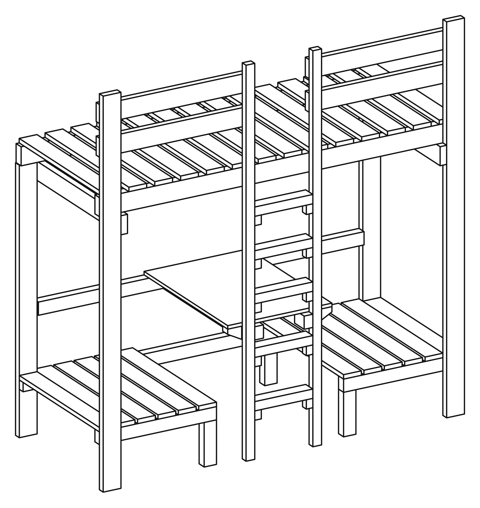

# snekkerbua

[](https://github.com/Starefossen/snekkerbua/actions/workflows/check.yml)

*der Hans gjør ting han (ennå) ikke kan*

Et verkstedrepo, én katalog per prosjekt. Alle prosjektene her er bygd på samme
måte: modellen er parametrisk og er den eneste kilden, manualen genereres ut av
solidene i stedet for å skrives ved siden av dem, og ingenting får finnes før
maskinen har sjekket det.

## Prosjekter

| | | |
|---|---|---|
| <a href="prosjekter/hanna/"></a> | **[HANNA](prosjekter/hanna/)** — en loftseng med sofa, bord og ekstraseng under, bygd for én nisje på 199 cm. 63 trestykker, 180 festemidler modellert som solider, og en trykkeklar monteringsmanual kompilert av modellen. |  |

## Felles

* **[PRAKSIS.md](PRAKSIS.md)** — reglene som gjelder på tvers av prosjektene.
* **[UTSTYR.md](UTSTYR.md)** — verktøyparken og innkjøpsplanen. Ett verksted, én
  beholdning, uansett hvor mange prosjekter som står i det.

Kortversjonen av PRAKSIS:

* **Én kilde.** Hvert tall i dokumentasjonen *kommer fra* modellen — ikke «er
  kopiert fra». Må to filer være enige om et tall, er tallet på feil sted.
* **En assert er et forhold**, utledet av fysikk eller en standard, aldri en
  gjentakelse av en konstant — og den sier hvor man retter det når den ryker.
* **Regler, ikke tilfeller.** Hvordan en ting behandles er en egenskap ved
  tingen, definert ett sted. Ingen `if` på et navn, ingen bryter noen må huske å
  skru på.
* **Et tegnet valg måles, det argumenteres ikke.** Prøven klippes ut av den
  ferdige siden, og en snubletråd-assert måler blekket etterpå.
* **Alt utledet er sjekket inn**, så `git diff --stat` etter et bygg *er*
  konsekvensanalysen.
* **Determinismen er en assert, ikke en forventning.** `mise run check` kjører
  hele kjeden to ganger og krever byte-identisk resultat.

## Kom i gang

Krever [`mise`](https://mise.jdx.dev/). Det er én oppgavefil, `mise.toml`, her på
rota, og hver oppgave kjører med sitt eget prosjekt som arbeidskatalog — så en
kommando er den samme kommandoen uansett hvor i treet du skriver den:

```bash
mise run build      # modellen + hver generert tabell og dokument
mise run montering  # tegn strektegningene på nytt
mise run check      # kjør hele kjeden to ganger, krev byte-identisk resultat
mise run pdf        # den trykkeklare manualen
```

Hele runden for HANNA er `mise run build && montering && check && pdf && usdz &&
film-check`. Forutsetningene for hvert prosjekt og resten av oppgavene står i
prosjektets egen README.

## Sjekk selv

Ikke ta badgen på ordet — tre kommandoer, fra ingenting:

```bash
git clone https://github.com/Starefossen/snekkerbua.git && cd snekkerbua
mise trust && mise run install   # python 3.11 + requirements.txt
mise run build && mise run montering && mise run check
```

`check` bygger hele kjeden to ganger og sammenligner SHA-256 av hver innsjekket,
utledet fil — tabellene, `docs/MONTERING.md`, hver eneste tegning, `parts.tsv`.
*Byte-identisk* betyr nøyaktig det: ikke «ser like ut», ikke «samme tall», de
samme bytene. Kan en kjøring gi to svar på det samme spørsmålet, er en diff på
tegningene ikke bevis på noe som helst, og resten av dette repoet er en
fortelling i stedet for et bevis. Den samme porten kjører på hver push —
[`.github/workflows/check.yml`](.github/workflows/check.yml). Å pushe en
`<prosjekt>-v*`-tag kjører i tillegg
[`release.yml`](.github/workflows/release.yml), som bygger
manualen og 3D-modellene på macOS (`.usdz`-kjeden går bare med Xcode) og legger
dem ved releasen.

Du trenger også `rsvg-convert` til PNG-ene (`brew install librsvg`, eller
`apt install librsvg2-bin`); workflow-fila er den nøyaktige lista. `mise run
pdf` vil ha to til: en Chrome å skrive ut med og poppler til å lese resultatet
tilbake med.

`git log --oneline` er designdagboka — hver commit er én beslutning, med
begrunnelsen i brødteksten.

## In English

**snekkerbua** is a workshop repo — one directory per project, each of them a
piece of furniture built from a parametric model. The model is the only source
of truth: every drawing, every table and every page of the printed assembly
manual is generated from the solids and machine-checked before it is allowed to
exist. The documentation is written in Norwegian, because that is the language
of whoever is standing at the saw. The proofs, on the other hand, run in CI:
`mise run check` builds the whole chain twice and demands byte-identical output,
and the badge at the top of this page is that gate.
