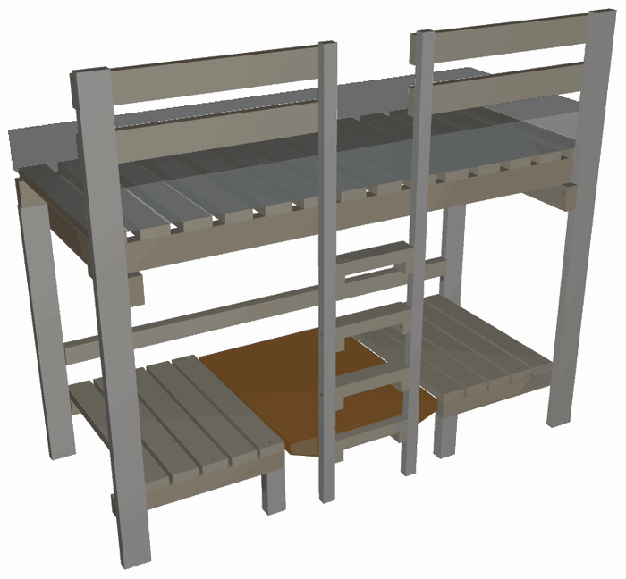

# HANNA — loftseng, byggeveiledning

HANNA er en loftseng med sofa, bord og ekstraseng under. Den er bygget på mål
for en nisje mellom to vegger og står **inntil bakveggen og inntil begge
sideveggene**. Den bygges på plass.

> **Denne sengen er ikke reversibel.** Den lange baksiden skal stå mot vegg og
> skal skrus fast i veggen. Det er ikke rekkverk på baksiden — der er veggen
> sperren. Snur du sengen, mangler den et rekkverk.

---

## Sånn henger papirene sammen

Alle mål er regnet ut fra modellen `generate_loftbed.py` og skrevet ut av
`mise run build`. Ingen mål er skrevet inn for hånd noe sted. Endrer du
modellen, endrer tabellene seg med den.

| Fil | Hva du finner der |
|---|---|
| [generated/kappliste.md](generated/kappliste.md) | Hver del: dimensjon, lengde, antall, hvor den sitter |
| [generated/innkjopsliste.md](generated/innkjopsliste.md) | Hva du skal kjøpe, og hvilke deler som kappes av hvert bord |
| [generated/nokkelmal.md](generated/nokkelmal.md) | Ytre mål, alle høyder, alle dybdeplan, stige- og rekkverksmål, skruerader, madrassmål, sikkerhetsmål |
| [generated/beslagliste.md](generated/beslagliste.md) | Alle beslag og skruer, hvor de går, hva som forbores, hvilken side du driver fra |
| [generated/byggesteg.md](generated/byggesteg.md) | Steg for steg i tekst |
| [MONTERING.md](MONTERING.md) | Steg for steg i bilder, samme nummer |
| [schematics/](schematics/) | Tegninger |

**Denne fila gjentar ingen av de målene.** Står et mål i en tabell der, står
det ikke her. Her står det hvorfor, og hvordan. Der et tall likevel dukker opp i
teksten, er det fordi tallet *selv* er begrunnelsen — og da står det alltid med
en henvisning til fila som eier det. Regnedelen i vedlegg A henter spennene sine
fra kapplista og nøkkelmålene.

---

## 1. Verktøy

| Verktøy | Til hva |
|---|---|
| Batteridrill, 18 V eller mer | Rammen er skrudd, ikke boltet — men det er mange 6 mm skruer i heltre, og de vil ha moment |
| Trebor ⌀6 og ⌀4 | Rammeskruene: gjennomgangshull i den ene delen, styrehull i den andre. Se forboringskolonnen i [beslaglista](generated/beslagliste.md) |
| Trebor i flere små diametre til forboring | Se forboringskolonnen i beslaglista. Forbor **alltid** i bordbærelekta, i bordene og i all endeved |
| Forsenker (kjeglesenker) | Alle skruehoder i flater man tar på: benkespiler, køyespiler, trinn |
| Forstnerbor ⌀18 og ⌀12 | ⌀18: setet under hvert skråskruehode (J8-B og J10) — vinkelklossen styrer vinkelen, se J8-B. ⌀12: kontraborene i lektene og kilene under platen (J13a/J13b) |
| Fres med V-spor eller avrundingsfres — eller høvel, blokkhøvel, pussekloss | Kantbrytningen, avsnitt 3. Ingenting her krever fres |
| Bits Torx T20 / T25 / T30 | Etter skruestørrelse |
| Sirkelsag eller håndsag + anlegg | Alle kutt er 90°, med ett unntak: de to kilelektene sages på skrå i ett langsgående snitt (J13b). Ingen gjæring i hele sengen |
| Vinkelhake, minst 300 mm | Rett vinkel i bakrammen og i sengeflaten — mål diagonalene |
| Vater, minst 600 mm | Endebjelker og vanger |
| Tommestokk og målebånd | |
| To skrutvinger, minst 300 mm | Holder deler mens du borer gjennom begge samtidig |
| Blyant og syl | Merking av borsentre |
| To personer | Bakrammen skal reises, og de øvre vangene skal opp i høyden |

---

## 2. Trevirke og beslag

Kjøp: [innkjøpsliste](generated/innkjopsliste.md).
Kapping: [kappliste](generated/kappliste.md).
Beslag og skruer: [beslagliste](generated/beslagliste.md).

Alt trevirke er høvlet konstruksjonsvirke C24. Alle beslag og skruer er
elforsinket eller varmforsinket.

**Det går ikke én bolt inn i en stolpe i denne sengen.** Stolpene er tynne på
tvers av rommet, og på den tykkelsen får en M8 ikke den kantavstanden en bolt
krever — den ville sprenge stolpen på langs. Hvert eneste ledd inn i en stolpe
er derfor **forborede treskruer i 6 mm** — det samme mønsteret som stigevangene
bruker. For en 6 mm skrue er kravet til kantavstand nøyaktig det en
stolpetykkelse gir på midtlinjen.

Det er ikke en nødløsning. **Tre bærer på tre der tre kan bære på tre.** Hver
eneste lange del hviler på noe: sidevangene på endebjelkene, den bakre
sidevangen rett på stolpetoppene, benkevangene på stubbeføttene. Ingen av *de*
skruene er opplegg.

Tre hjørner har ikke noe å hvile på, og der går den loddrette reaksjonen
gjennom stål. Det står her, rett ut, fordi det er der antallet skruer betyr
noe:

* **J1**, endebjelken mot stolpen: to 6×90 i skjær ≈ 4,0 kN mot ≤ 1 kN
  hjørnereaksjon — utnyttelse **0,25**.
* **J8**, den fremre benkevangebiten mot stolpen: to 6×80 ≈ 4,0 kN mot
  0,5 kN — **0,13**.
* **J8-B**, den bakre benkevangen mot stolpen: to skrå 6×90 ≈ 4,0 kN mot
  0,5 kN — **0,13**. Skruene står skrått i planet, men lasten står loddrett
  på dem uansett, så skråstillingen koster ingenting.

**Her sto det åtte bæreklosser før, og de er tatt bort.** Argumentet for dem
var at delen skulle *bære på tre* i stedet for å henge i skruer. Følg det ett
skritt til, og det spiser seg selv: klossen står ikke på noe heller. Den
henger på stolpen i **én** 6 mm skrue — 2,0 kN mot inntil 1 kN, utnyttelse
0,50, den høyeste skrueraden i hele sengen. Klossen tok ikke lasten ut av
stålet; den halverte stålet leddet ellers hadde hatt.

Sprekkfaren klossen ble kjøpt mot er også målt nå. Skruene i bjelkeenden står
18 mm (3 × skruediameteren) fra bjelkens ende langs fiberretningen og 27 mm
(4,5 ×) fra kanten i den retningen lasten virker, i 48 × 98 mm C24. Det er et
helt vanlig omlegg, med bedre kantavstand enn regelen krever — ikke en sprø
endeskjøt.

**Det klossen egentlig var, var en jigg:** en hylle å legge delen på mens du
skrudde den fast. Den jobben gjør nå hullene. Alle gjennomgangshull bores i
steg 0, gjennom begge deler samtidig med delene tvunget sammen, og et
hullmønster har nøyaktig én stilling der det står over seg selv. Delen kan
ikke settes i feil høyde.

Alt dette står i lasttabellen i vedlegg A, rad for rad. Bolten er fortsatt
borte, og det er fortsatt riktig.

**Og én ting til, som ikke er statikk:** ingen skruehoder står på sengens
front. Alt fra vangenes ytterflate og fram til stolpeplanet er den eneste
flaten noen ser på, og J2, J3 og J8 skrus derfor **innenfra og ut** — gjennom
den 48 mm tykke vangen og inn i den 36 mm tykke stolpen eller stigevangen, i
stedet for omvendt. Begge veier holder målene like godt (36 + 48 er det samme
som 48 + 36, og spissdekningen er 4 mm uansett vei), så det er utseendet som
avgjør, og modellen har en assert som sier det: ingen festemiddelhoder på en
romvendt flate. Rekkverksbordene har vært skrudd slik hele tiden.

**Og du kommer til.** Bak hvert eneste av de hodene står det over 700 mm åpen
luft — inn i den tomme sengerammen for J2 og J3, inn i det åpne benkerommet
for J8 — på det tidspunktet i rekkefølgen leddet skrus, og faktisk også i den
ferdige sengen. Alle tre skrus før spilene går på. En drill med bits er en
kvart meter.

**Én konsekvens til, og den er god:** ingenting i rammen festes lenger fra en
flate som ender mot vegg. Da finnes det heller ingen skruehoder som må senkes
ned under en monteringsflate — ingen forsenkte boltehoder, ingen store
forsenkingshull, og ingen deler som må boltes ferdig før de får møte veggen.

Stål brukes bare to steder: vinkelbeslagene under stubbeføttene og
vinkelbeslagene under bordbærelektas ender. Platemekanismen er ren tre —
lektene gjør hele jobben, se J13.

**Det står ingen lås i beslaglista, og det er ikke en glipp.** Låsen i
sengestilling var det siste åpne valget i platemekanismen. Valget er tatt: det
blir ingen lås. Begrunnelsen står i vedlegg B, avvik 4, og treverket den ville
tatt tak i står der det sto — se J13.

## 3. Byggerekkefølgen — og hvorfor den er som den er

Sengen står i en nisje. Tre av flatene er vegg. Det bestemmer alt.

**Hele baksiden av sengen er ett flatt lag.** Bakre sidevange, de to bakre
stolpene, bakre benkevange, bakre bordbærelekt, endene av begge endebjelker og
bakkanten på hver eneste spile ligger i ett og samme plan — og det planet er
monteringsflaten mot veggen. Ingenting stikker bak det.

Det gir to konsekvenser som styrer rekkefølgen:

* **Baksiden er en ramme, så bygg den som en ramme.** De bakre delene henger
  sammen i ett plan. Legg dem ut på gulvet, skru dem sammen der, og reis
  bakrammen som ett stykke. Da får du gjort alt som skal gjøres fra flater som
  senere ender mot vegg.
* **Veggfestet er den bakre sidevangen selv.** Vangen ligger flatt mot veggen i
  hele sin lengde, så sengen skrus fast rett gjennom den og inn i stenderne. Det
  trengs ingen brakett og ingen kloss. De samme skruene støtter dessuten vangen
  på midten, så det lange spennet den ser ut til å ha på papiret er ikke det
  spennet den faktisk får.

Og det som *ikke* går an, hvis du bygger i feil rekkefølge:

* **De bakre delene er fanget mellom stolpene.** Den bakre benkevangen og den
  bakre bordbærelekta er kappet til å fylle nøyaktig fra stolpe til stolpe. Står
  begge stolpene først, får du dem aldri inn — de er akkurat for lange til å
  vippes på plass, og det er meningen: det er slik de får endefeste i begge
  ender. De må legges inn mens rammen ligger flat.
* **Fronten stenger.** Alt som skal inn bakfra må være inne før den fremre
  sidevangen går på.

Derfor:

1. **Bakrammen bygges liggende, midt på gulvet** — to korte stolper og de tre
   vannrette bakre delene, som ikke kan settes inn senere.
2. **Bakrammen reises og skrus fast i veggen.** Nå står baksiden, i lodd og i
   vater, og resten bygges framover fra den.
3. **Endene bygges ut:** fremre stolpe, så endebjelke. Én ende av gangen.
   Det står ingen kloss under bjelkeenden — de forborede hullene er jiggen.
4. **Fronten lukkes:** fremre sidevange, så de to fremre benkevangene og alle
   fire stubbeføtter.
5. **Resten kommer forfra og ovenfra:** stige, benkespiler, køyespiler,
   rekkverk, plate, madrass.

Den samme rekkefølgen, med sjekkpunkter for hvert steg:
**[byggesteg.md](generated/byggesteg.md)**. Med bilder:
**[MONTERING.md](MONTERING.md)**. Oversiktstegning:
[schematics/byggerekkefolge.svg](schematics/byggerekkefolge.svg).

**Og før steg 1: bryt kantene.** Det gjøres i steg 0, mens delene ennå er løse
på bukken. Kravet står rett under.

### Kantbrytning — alle kanter et barn kan nå

**Alle kanter et barn kan nå skal brytes.** Kravet er *brutt kant*, ikke én
bestemt metode: 45° fas eller avrunding (R6,35 eller R9,5), byggerens valg
kant for kant. Skarpkantet høvlet C24 er skarpt nok til å skjære, og det blir
ikke rundere av at noen maler det.

Tre steder er verdt å nevne ved navn:

* **Plateenhetens underside** — styrelektenes nedre kanter og kilelektenes kanter.
  Dette er kanten ingen ser: den sitter under bordplaten, i knehøyde for den
  som sitter ved bordet. 73 mm skarpkantet lekt mot et kne er det eneste
  stedet i denne sengen der en kant treffer noen som ikke ser den komme.
* **Platens egne kanter, alle fire.** Den håndteres hver gang stillingen
  skiftes, og et kappet finérdekke gir flis.
* **Alt man allerede tar på:** stolper, rekkverksbord, trinn og
  stigevangenes kanter.

Verktøy: fres med V-spor eller avrundingsfres for den som har fres. Har du det
ikke, gjør en håndhøvel, en blokkhøvel eller en pussekloss nøyaktig samme
jobb. Det er noen millimeter tre som skal bort, ikke en profil som skal
lages — ingenting her krever fres.

Det er lettest mens delene er løse, altså i steg 0. En kant som bare er
tilgjengelig fra én side etter at delen står i rammen, tar dobbelt så lang tid
og blir halvparten så pen.

**Modellen tegner fortsatt hver del firkantet.** Kantbrytningen er en instruks,
ikke geometri, og den flytter ingen mål: ingen lengde, ingen klaring og ingen
skruerad endrer seg av at en kant er brutt.

### Tre ting du skal kontrollere hele veien

* **Vater.** Den bakre sidevangen først — den er referansen for alt annet. Så
  hver del etter hvert som den går inn. En vange som ikke er i vater tar du ikke
  igjen senere.
* **Vinkel og diagonal.** Mål diagonalene i bakrammen før den reises, og i
  sengeflaten når begge sidevanger står.
* **Veggklaringen.** De gjennomgående delene er med vilje kappet kortere enn
  veggavstanden, slik at de kan svinges inn. Klaringen er liten. Sjekk at ingen
  del blir stående i spenn mot en vegg, og at ingen spile eller skruehode
  stikker ut i veggplanet.

### Forboring — kort regel

* **Bor gjennomgående hull gjennom begge deler samtidig**, med delene tvunget
  sammen. Bores de hver for seg, treffer de ikke.
* **Forbor hver eneste treskrue.** Ingen unntak i bordbærelekta, i
  bordene og i endeved.
* **Ingenting i rammen er boltet.** Hele rammen er skrudd, med forborede
  6 mm treskruer. Se J1, J2, J3 og J8.
* Diameterne står i forboringskolonnen i
  [beslaglista](generated/beslagliste.md).

---

## 4. J — leddene

Antall, skruetype, forboring og hvilken side du driver fra står i
[beslaglista](generated/beslagliste.md). Skrueradenes høyder står i
[nøkkelmål](generated/nokkelmal.md). Her står hva leddet er og hva som er
poenget med det.

### J1 — Endebjelke → hjørnestolpe

Endebjelken støter mot stolpens innside og skrus gjennom bjelken og inn i
stolpen. Skruene går på tvers av fiberretningen i begge deler, ikke inn i
endeved.

**De to skruene er hele festet.** Det står ingen kloss under bjelkeenden — den
sto der til denne runden, og den er tatt bort, fordi en kloss som selv henger i
én skrue gir leddet halvparten så mye stål som bjelkens egne to. Se avsnitt 2
og lasttabellen: 4,0 kN mot en hjørnereaksjon på høyst 1 kN, utnyttelse 0,25.

Skruene står 18 mm fra bjelkens ende og 27 mm fra over- og underkant. Begge er
over minstekravet for en 6 mm skrue, og den som betyr mest her — kantavstanden
i lastretningen — har halvannen gang så mye.

**Hullene er jiggen.** Gjennomgangshullene i bjelken og styrehullene i stolpen
bores i steg 0, gjennom begge deler samtidig. Da har bjelken nøyaktig én høyde
der hullene står over hverandre, og du kan ikke montere den skjevt. Bygger du
alene: klem en list på stolpens innside i høyde med bjelkens underkant, legg
bjelken på den, skru, og ta listen av igjen.

Skruene drives inne fra sengen. Du kommer til dem når som helst, både under
byggingen og når du skal ettertrekke.

### J2 — Fremre sidevange → fremre hjørnestolpe

Vangen ligger flatt mot stolpen. **Skruene drives innenfra og ut:** du står
inne i sengerammen — den er tom, spilene kommer flere steg senere — og skrur
gjennom vangens innside, gjennom vangen og inn i stolpen.

Det er en utseendebeslutning, og den er tatt bevisst. Stolpens forside er en
av de flatene rommet faktisk ser, og der skal det ikke stå skruehoder. Begge
retninger holder målene like godt: 48 mm vange pluss 36 mm stolpe er det
samme stykket tre som 36 pluss 48, og spissen har 4 mm tre bak seg uansett vei
— så det er ikke statikken som velger. Se avsnitt 2.

Vangen bærer ikke i skruene — den ligger på begge endebjelker.

Merk skruelengden: skruen skal **ikke** komme ut på stolpens forside. Bruk
lengden som står i beslaglista, ikke den lengste du har i esken.

### J2-B — Bakre sidevange → bakre hjørnestolpe

Dette leddet er annerledes, og det er meningen. Den bakre stolpen står **i
vangens eget plan** og er kappet slik at den slutter akkurat under vangen.
Vangen **hviler rett på stolpens endeved**. Hjørnereaksjonen går vange → stolpe
→ gulv som ren trelagring, uten et eneste festemiddel i lastens vei.

Festet er derfor bare et bånd som holder de to sammen mot vridning og løft. To
kraftige skruer settes rett ned gjennom vangen i stolpens endeved, mens
bakrammen ennå ligger flatt på gulvet. Forsenk hodene godt — køyespilene skal
ligge flatt over dem.

Et rett beslag over skjøten ville vært det opplagte, og det går ikke: vangen er
dypere enn stolpen, så den står et lite stykke proud av stolpens romside, og en
rett plate ville bare ligget an mot den ene av dem. Skruer ned i endeveden er
svakere i uttrekk enn et beslag, men her holder de bare igjen — lasten står på
tre, og veggfestet sitter i den samme vangen noen centimeter unna.

**Ikke sett noe på veggsiden.** Den flaten skal være helt plan.

### J3 — Stigevange → fremre sidevange

Tre kraftige treskruer gjennom sidevangen og inn i stigevangen. Leddet er
skrudd, ikke boltet — samme mønster som resten av rammen bruker, se J1, J2
og J8. Tre og ikke fire: omlegget er 48 × 98 mm, og fire 6 mm skruer i én rad
ville krevd 108 mm der det er 98. Fire i to par ville krevd 60 mm på tvers der
det er 48.

**Retningen er innenfra og ut**, som J2 og av samme grunn: stigevangens
forside står i sengens front, og der skal det ikke stå skruehoder. Klem stigen
fast mot sidevangen først — du står på den andre siden når du skrur.

Stigevangen står med den tynne siden mot rommet, så skruene treffer den på
midtlinjen med akkurat den kantavstanden en 6 mm skrue skal ha.

Forbor gjennomgående i sidevangen, og forbor i stigevangen også. Skruene sitter
i én loddrett rad, én over og én under vangens midtlinje med den tredje midt
imellom, slik at leddet tar moment.

### J4 — Rungetrinn → stigekloss og stigevange

Trinnet ligger på klossen og er skrudd ned i den ovenfra. I tillegg går én
kraftig skrue fra utsiden av stigevangen inn i trinnenden.

Skruen i trinnenden bærer **ingen** vertikal last — den holder bare trinnet på
plass sideveis. Vekten din går rett ned i klossen og videre inn i vangen. Det er
riktig utformet, og det er grunnen til at trinnet ikke kan glippe selv om skruen
i endeveden skulle løsne.

Trinnene stikker **bakover**, ikke framover: forkanten ligger i flukt med
stigevangens forkant, og det som blir liggende bak vangeplanet er hylla den løse
platen hviler på.

**Klossen følger ikke trinnet bakover.** Den er 36 mm dyp — nøyaktig så dyp som
stigevangen — og står i vangens eget dybdebånd, ikke i trinnets. Klossen har
aldri rørt mer av vangen enn de 36 millimeterne, så de 37 som er kappet vekk
(K1) bar ingenting; de sto derimot rett i veien for den løse platen når den
skal bæres fra det ene setet til det andre. Se J13. Det betyr også at trinnets
bakre 37 mm står **fritt** ved endene: det er en 48 mm tykk kloss tre som
stikker 37 mm ut, ikke et spenn.

### J5 — Stigekloss → stigevange

Én skrue per kloss, inn i vangens innside. Klossen dekker bare 36 × 48 mm av
stigevangen, og to 5 mm skruer trenger 50 mm av de 48. Klosshøyden er
trinnhøyden. Mål to ganger.

**K1 endret ingenting i dette leddet.** Klossen ble kappet 73 → 36 mm, men de
36 × 48 millimeterne mot vangen er de samme — det var alt klossen noen gang
rørte, siden vangen bare er 36 mm dyp. Det ene som ble bedre er hvor skruen
lander: før satt den på Y 751,5, altså en halv millimeter **utenfor** vangens
bakplan, fordi den ble sentrert i en 73 mm lang kloss. Nå sitter den på Y 770,
midt i vangen.

Klossen er ikke overlatt til den ene skruen: trinnet ligger på klossen og er
skrudd ned i den ovenfra (J4), og trinnenden er i tillegg skrudd til
stigevangen med en 6×120 gjennom vangen. De tre festene deler samme hjørne, og
klossen kan ikke rotere om skruen sin så lenge trinnet står.

### J6 — Køyespile → sidevange

Spilene ligger **oppå** begge vanger, ikke i et spor og ikke på en lekt. Én skrue
ned i hver vange per spile. Forsenk hodet under flaten — det ligger madrass over.

Alle 14 køyespilene er nøyaktig like lange — 800 mm, samme stykke som
benkespilen. Den første ligger på X 20 og den siste på X 1970; delingen står i
[nøkkelmål](generated/nokkelmal.md).

### J7 — Rekkverksbord → hjørnestolpe og stigevange

Rekkverksbordene ligger på **innsiden** av stolpene og stigevangene, mot sengen.
Hvert bord tar tak i en hjørnestolpe i den ene enden og i en stigevange i den
andre, med full flate mot begge. Skruene drives fra sengesiden.

Bordene stopper i flukt med stigevangenes innside, slik at klatreåpningen
fortsetter rett opp forbi rekkverket. Man klatrer **gjennom**, ikke over.

Det er ikke rekkverk på baksiden. Se sikkerhetsavsnittet.

### J8 og J8-B — Benkevange → hjørnestolpe

To ulike ledd, ett foran og ett bak.

**J8, foran:** vangebiten ligger flatt mot stolpen, og skruene drives
**innenfra og ut**, fra vangens innside og inn i stolpen — samme detalj som
J2, og av samme grunn: stolpens forside skal stå uten skruehoder. Du kommer
til ovenfra så lenge benken er åpen, altså før benkespilene går på.

De to skruene er hele endefestet: 4,0 kN i skjær mot en endereaksjon på
0,5 kN. Det sto en bærekloss under denne enden til denne runden; se avsnitt 2
for hvorfor den er borte.

**J8-B, bak:** den bakre benkevangen går fra stolpe til stolpe og støter mot
stolpens sideflate med enden. Her går skruene **skrått** fra vangens forside inn
i stolpen. Forbor hele veien — en skråskrue nær en ende er den letteste måten å
sprekke en vange på.

**Hver skråskrue får et sete, og setet bores først.** Et 90° forsenk som møter
flaten i 25–30° kan ikke ligge i plan, og har aldri kunnet det. Det som ligger i
plan er et **flatbunnet sete boret langs skruens egen akse**: ⌀18 forstner,
18 mm dypt målt langs aksen. Bunnen står vinkelrett på skruen, og dermed
vinkelrett på hodet, så hodet legger seg flatt og ender **helt under treet** —
2,3 mm tre over hodets høyeste punkt her, 4,9 mm på J10. Begge tallene er målt
på kroppene i modellen. En skråskrue er nå like fullt inne i treet som hver
eneste andre skrue i sengen — ingenting av den står utenfor treet.

Setet koster lengde: 18 mm av skruen går med i lomma, så J8-Bs 6×90 begraver
72 mm og J10s 5×70 begraver 52. Begge er kjørt gjennom de vanlige
spiss-inne- og spissdekningsasertene på nytt.

**Vinkelklossen — borjiggen.** Et skrått hull startet på frihånd vandrer, og det
vandrer verst akkurat her: nær en ende, i en flate som boret møter på skrå. Jiggen
er en avkapp av sengens egen 48×73, 160 mm lang, med en rampe saget i hver ende
på kappsagen med bladet vippet — **25° i den ene enden (J8-B) og 30° i den
andre (J10)**. Den klemmes flatt mot flaten med rampa over merket, og boret
ligger **på** rampa, både forstnerboret og forboret etterpå. Da får hullet den
vinkelen leddet er regnet på. Klossen kappes i steg 0 og er et
verkstedhjelpemiddel, ikke en del av sengen — den skal ikke bygges inn noe sted.

I begge tilfeller er de to skruene hele endefestet. Det står ingen kloss under
noen av dem — de to skruene i hver ende tar reaksjonen i skjær med utnyttelse
0,13, og hullene fra steg 0 holder vangen i riktig høyde mens du skrur. Legg
gjerne en list eller en tvinge under enden hvis du er alene.

Vangen vipper ikke av at klossen er borte: den er festet i to punkter i hver
ende, over 73 mm høyde, og den andre enden står på en stubbefot.

### J10 — Benkevange → stubbefot

Foten står under vangen med hele endeflaten mot gulvet og hele toppflaten mot
vangen.

Vinkelbeslaget sitter i **hjørnet mellom fotens ytterside og vangens
underside**, og det er en ekte vinkel: den ene fliken ligger loddrett på foten
og skrus vannrett inn i den, den andre ligger vannrett under vangen og skrus
rett opp i den. To skruer i hver flik — det er det en 90 mm flik har lovlig
plass til. Beslaget er 40 mm bredt og ikke 65: en 65 mm flik ville stukket
17 mm ut av en 48 mm vange.

I tillegg går **én** skråskrue nedenfra opp gjennom foten og inn i vangen, fra
den fotsiden som vender inn mot benkeåpningen. Én og ikke to: foten er 48 mm
dyp — like dyp som vangen den bærer — og to 5 mm skråskruer ved siden av
hverandre trenger 50.

Skråskruen får **samme sete som J8-B**: ⌀18 forstner, 18 mm langs skruens egen
akse, boret med vinkelklossen — den andre enden av den, den som er saget 30°.
Hodet ligger flatt i en flat bunn og står 4,9 mm under treet. Setet spiser
18 mm av lengden, så 5×70-skruen begraver 52 mm. Se J8-B for hele detaljen; den
står bare ett sted.

De **fremre** føttene står akkurat der vangebiten slutter. Vangebiten skal ikke
stikke ut forbi foten i det hele tatt — den ender på den.

### J11 — Benkespile → benkevange

Én skrue i hver ende, ned i vangen. Forsenk. Dette er en sitteflate.

### J12 — Bordbærelekt → bakre hjørnestolpe

Lekta går fra stolpe til stolpe og støter mot stolpenes sideflater med endene,
akkurat som den bakre benkevangen. Men den bærer et bord, ikke bare seg selv,
og den skal kunne belastes rett ned uten å hvile på skruer i uttrekk — så hver
ende får et lite vinkelbeslag å hvile på. Beslaget står med den loddrette
fliken på stolpens innerflate og den vannrette fliken **under lektas ende** —
det er den veien rundt, og bare den veien: snudd andre veien ville den
vannrette fliken pekt ut i lufta over lekta og ikke båret noe som helst. Lekta
henger ikke i skruer — den ligger på beslaget.

Beslaget er 20 mm bredt, ikke 40. Stolpeflaten det ligger på er bare 36 mm
dyp; et 40 mm bredt beslag ville stukket ut av den — ut i **veggplanet**, som
skal være helt flatt. Én skrue i hver flik — en 40 mm flik har ikke lovlig
plass til to 5 mm skruer.

Lekta står **på høykant**. Legger du den flatt, ender overkanten 25 mm for
lavt, og platen når ikke det bakre opplegget sitt i bordstilling. Forbor.

Lekta må inn mens bakrammen ligger flat, av samme grunn som benkevangen: den er
kappet til å fylle nøyaktig mellom stolpene.

Lekta er det bakre opplegget for platen i bordstilling, og overkanten skal ligge
i nøyaktig samme høyde som trinn 2. Da ligger platen rett på begge to, uten
beslag og uten kile.

### J13 — Den løse platen

Platen er ikke et løst bord. Den er en liten enhet som **senkes rett ned** i den
stillingen den skal stå i, og løftes rett opp igjen. Alt annet i dette avsnittet
følger av den ene setningen: platen har null vandring i dybderetningen —
bakkanten *er* veggplanet og forkanten står 2 mm fra stigevangene — så den
eneste bevegelsen den har, er loddrett. Det gjelder platen **i setet**. Selve
byttet mellom de to setene er en annen sak, og den står nederst i avsnittet.

Vekten hviler på **tre**, ikke på stål: bakkanten på den bakre benkevangen
(sengestilling) eller på bordbærelekta (bordstilling), forkanten på trinnet.

**Og styringen er også tre.** Det står ikke ett vinkelbeslag i denne
mekanismen — den jobben gjør de to lange lektene — og det står ingen lås i den
(vedlegg B, avvik 4). Ikke én ståldel.

**J13a — avstivningslekter, som også er styrelekter.** To 48×73-lekter på
høykant under platen, fra det bakre opplegget og helt fram til platens egen
forkant (750 mm). To ting på én gang:

* **de gjør platen stiv.** Uten dem holder ikke den 18 mm plata når noen setter
  seg på den; med dem er platen to T-bjelker. Se lasttabellen i vedlegg A.
* **de er hele sidestyringen.** De ligger 77 mm inn fra hver sidekant, som er
  nøyaktig **2 mm utenfor trinnenden**. De siste 35 mm av hver lekt står i den
  frie sjakten ved siden av trinnet — 48 mm høy og 37 mm dyp, den biten av
  trinnet som stikker bak stigevangen — så det er 48 × 35 mm tre mot endeved
  som stopper platen sidelengs, ikke en 2 mm stålflik.

Trinn 1 og trinn 2 ender på nøyaktig samme sted i lengderetningen, så det samme
lektparet finner trinnenden i **begge** stillinger. De stopper platen begge
veier (den ene mot venstre trinnende, den andre mot høyre), og de stopper den i
å vri seg, fordi en vridning drar begge to samme vei — den ene kiler seg
uansett hvilken vei den vris. De 2 millimeterne er ikke slark: det er passingen
som gjør at platen kan senkes ned i det hele tatt.

**J13b — kilelektene under forkanten.** Trinnet er 320 mm langt og platen 574
bred, så 77 mm av forkanten utenfor hver styrelekt har ingenting under seg. To
korte kilelekter i flukt med forkanten bærer det hjørnet innover til
styrelekta.

**Hvorfor de finnes, og det er uendret:** dette er hjørnet et barn kneler på når
det klatrer opp fra benken, og det blir **ikke** bedre av at lektene flyttes
nærmere. En punktlast på et fritt platehjørne gir σ = 6P/t² = 18,5 MPa i 18 mm
plate uansett hvor nær nærmeste lekt står. Bare tre under hjørnet hjelper. Se
vedlegg A.

**Men de er kiler nå, ikke klosser.** Hver vinge er full 73 mm dyp ved **roten**,
der den støter mot styrelekta, og skråkappet i ett rett sagsnitt ned til **27 mm**
ved **spissen**, ute på platens egen ytterkant. Det lave ytterhjørnet — hele det
du så nedenfra — er borte, og det som står igjen følger momentet: en utkraging
har momentet sitt ved roten og ingenting ved spissen.

**27 er ikke et tall noen likte.** Det er oppskruens eget sete. Hver J13-skrue
har hodet 27 mm under platens underside — det er nøyaktig det «⌀12 kontrabor
46 mm opp i en 73 mm lekt» betyr — så vingen må være minst så dyp overalt der en
skrue går gjennom den. På akkurat 27 er kontraboret gått i null, og hodet ligger
i flukt med kilens egen underside. Boreregelen er derfor **den samme for alle
fire delene** og leses slik: *bor ⌀12 opp til det står 27 mm igjen.* I styrelekta
er det de 46 millimeterne; i kilen er det 34,9, 23,0 og 11,1 mm ved de tre
hullene, dypest ved roten.

**Tallene.** Kilen er 184 800 mm³ mot 269 808 for den hele klossen — 32 % mindre
tre, og hele det lave ytterhjørnet vekk. Det verste bøyesnittet er **ikke**
roten: når h(x) smalner mot spissen, topper σ seg 45 mm fra spissen, der
h = 54 mm. Der er den 1,94 MPa mot fm,d = 16,6 for C24, altså
utnyttelse **0,12**; roten selv ligger på 1,81 MPa og 0,11. Skjæret sitter i den
andre enden: i 27 mm-spissen er τ = 1,16 MPa mot fv,d = 2,77, altså
**0,42**. Det er det høyeste tallet på delen, og det er det tallet som sier at
spissen ikke skal bli tynnere. *K2 gjorde kilen kortere (116 → 77 mm) da platen
ble smalere, og bøyningen falt med den; skjæret i spissen er uendret, og det er
fortsatt det som styrer.*

*Den elegante løsningen tapte på et tall:* **18 mm kryssfinér-doblere** limt
under hvert forkanthjørne — ingenting som henger ned, usynlig, og
innsettingsveien merker dem ikke engang. Med **fullt samvirke** over limfugen er
det en 36 mm laminat: 6·1000/36² = 4,63 MPa, utnyttelse 0,67. Den går. **Uten
samvirke** deler de to 18 mm platene lasten hver for seg: 6·500/18² = 9,26 MPa,
utnyttelse **1,33**. Den stryker. Limfugen selv er ikke problemet — den ligger i
nøytralaksen, der langsgående skjær er størst, og der er τ = 1,5·1000/(77·36) =
0,54 MPa. Det er under D3-limet med god margin, men bare så vidt under finérens
egen rullskjær (~0,6–0,8 MPa design) — kortere dobler, samme last, høyere skjær;
K2 gjorde den avviste løsningen dårligere, ikke bedre. Det som avgjør er at **ingenting kan sikre den limfugen**. Hver eneste
andre limte fuge i denne platen har skruer som klemmer; her finnes det ingen
skrue som passer. 18 mm dobler under 18 mm plate er 36 mm materiale, og den
korteste skruen i denne sengen er en 5×40 — 4 mm av den ville kommet ut gjennom
platens overside, den ene flaten som aldri skal brytes — og et kontrabor får ikke
plass i 18 mm og fortsatt la det stå kjøtt igjen. Doblerne ville altså vært lim
alene, med 1,33 som nedre grense. En detalj hvis fallback er 1,33 går ikke under
et barns kne.

*Slankere lekter, 48×48, ble veid og lagt bort:* utnyttelsen blir 0,37, som er
helt greit. Men 48×48 er en profil sengen brukte to revisjoner (W3 og U5) på å
bli kvitt, og hvert eneste kutt i denne sengen er 90° på kappsag. Et kløyvkutt
for to 77 mm biter er ikke verdt en foreldreløs profil.

**Ingen skruer i bordplata.** Platen er bordplate halve livet, og tolv
skruehoder — eller tolv propper — midt i den er tolv merker. Lektene **limes**
(D3) og skrus **nedenfra**: ⌀12 kontrabor 46 mm opp i lektas underside, så en
5×40 gjennom de siste 27 mm av lekta og 13 mm inn i den 18 mm plata, med 5 mm
plate igjen over spissen. Kontraboret er ikke pynt — det er den eneste måten å
sikte gjengelengden på: rett gjennom 73 mm lekt ville en 5×80 tatt 7 mm og en
5×90 sytten av de atten. De 46 millimeterne er den samme regelen som gjelder i
kilene, bare i tykkere tre: bor opp til det står 27 mm igjen. Se J13b.

I bruk står fugen uansett i trykk: platen *hviler* på lektas overkant, så
2 kN-lasten går aldri gjennom et festemiddel. Skruene har én lastsituasjon —
at enheten løftes etter et hjørne — og der er 64 N egenvekt (6,5 kg,
regnet av kroppene) mot 18 skruer.

*De to alternativene, og hvorfor de tapte:* skråskruer gjennom lektas side
treffer bare 18/cos30 = 21 mm plate før spissen bryter ut i overflaten. Hodet
kunne fått et flatbunnet sete, slik J8-B og J10 nå får, men et sete gjør
ingenting med de 21 millimeterne. Proppede topskruer er det
klassiske svaret og nesten usynlig i massiv furu — men denne plata er
**kryssfiner**, og en propp i et finérdekke er en skive endeved i en ubrutt
flate.

*Og her har K2 tatt fra oss et argument uten å gi oss et nytt.* Fram til v12 var
platen 652 mm bred — bredere enn de 600 mm limtre furu stopper på i hylla — og
kryssfiner var rett og slett det eneste som fantes i den bredden. 574 går inn i
en 600 mm limtreplate. Materialet står likevel: lasttabellen, uttrekket for
oppskruene og propp-argumentet over er alle regnet på kryssfiner, og et
materialvalg tas ikke om i en komfortrunde. Men det er et **valg** nå, ikke en
tvang, og det er ført opp som åpent punkt i innkjøpslista i stedet for å bli
stilltiende stående på en begrunnelse som er utløpt.

**Det som IKKE er låst: platen kan løftes rett opp.** Det er meningen — det er
slik den skifter stilling. **Valget er tatt, og det er ingen lås.** Begrunnelsen
står i vedlegg B, avvik 4, og den skal leses før noen bygger dette.

Treverket en lås ville tatt tak i, står der det sto: **tre mot tre** —
kilelektas endeved mot enden av den fremre benkevangen, tvers over de 63 mm i
sideklaringen. De to flatene ligger side om side i sengestilling og i samme
høydebånd; i bordstilling står kilelekta 223 mm høyere, så en lås ville ikke
hatt noe å ta i. Den kan altså ikke stå på i feil stilling, og det følger av
geometrien og ikke av en instruks. Alle tre alternativene i
`docs/preview/laasvalg.png` virker over nettopp de 63 millimeterne og passer det
treet uendret, så dette er et **ettermonteringspunkt**: skulle låsen komme, er
det en skrue som dukker opp, ikke en trebit som endres. Det arket er historikk,
ikke en bestilling — det lages for hånd med `mise run mekanisme` og er ikke med
i byggeporten.

**Innsettingsveien er målt, ikke antatt.** Modellen sveiper hele enheten — plate,
to styrelekter, to kiler og atten skruer — rett opp fra begge seter og krever at
ingenting treffer noe: **132 mm** fri vei i sengestilling og **172 mm** i
bordstilling. Det skal 48 mm til for å løfte styrelektene fri av trinnenden, så
det er nesten tre ganger så mye vei som mekanismen trenger. Taket er
bordbærelekta i sengestilling og trinn 3 i bordstilling — begge deler er tre som
*må* være der. (Fram til K1 var det en stigekloss i begge tilfeller, med 109 og
124 mm; de klossene var 37 mm for lange og hang inn i veien uten å gjøre noen
nytte. Se K1 i modellen.)

**Men stillingsbyttet er ikke ett langt loddrett løft — og det er verdt å lese
før du prøver.** De to fri veiene over gjelder *setet*: hvordan platen kommer
ned i det og opp av det. Selve byttet mellom de to setene må utenom stigen, for
over sengesetet er det stigen som er taket. Veien er målt på solidene, ramme for
ramme (`mise run film-mekanisme`), og filmen under **er** den prøven — ikke en
tegning av den:

1. **Løft rett opp**, ca. 12 cm, til enheten står midt i overføringssjakten.
2. **Skyv platen sidelengs** inn over benken, til den er klar av stigen —
   **vannrett hele veien**. Sjakten mellom benkespilenes overkant (295) og
   undersiden av bordbærelekta (409) er 114 mm høy og enheten er 91: det står
   11,5 mm luft over og under den under hele bæringen.
3. **Trekk den litt fram**, så bakkanten står av bordbærelekta.
4. **Løft den opp** forbi lekta og trinn 2 — der er banen fri.
5. **Skyv den inn igjen** til bakkanten står over setelinjen.
6. **Skyv den sidelengs tilbake** over stigen, nå i båndet over trinn 2.
7. **Senk den ned** i bordsetet.

Veien tilbake er den samme baklengs.

**Etappe 3 og 5 ser ut som fikling, og er det ikke.** Bordbærelekta går tvers
gjennom hele sengen på Y −48…0, altså akkurat der platens bakkant ligger, så
bakkanten *må* av linja dens før den kan gå opp — uansett hvor i lengden du
står. Alt det andre er ett løft, én bæring bort, én bæring tilbake og én
nedsenking.

*Slik var det ikke før.* Fram til K1 var sjakten 91 mm høy for en 91 mm høy
enhet — null klaring — og den eneste veien gjennom var å **vippe** den ene
langsiden tre grader opp og holde vippen gjennom hele bæringen, over en benk,
over hodehøyde. Det var ni grep og et to-personers løft. De 37 millimeterne som
ble kappet av hver stigekloss er hele forskjellen.

Den trangeste passeringen på hele veien er **2 mm** — nøyaktig den passingen
platen er tegnet med, mot stigevangen. Og platen kommer aldri *ut* av sengen:
den er bredere enn åpningene ved siden av stigen, så den blir i underetasjen
hele veien. Skal den helt ut, må den ut på høykant gjennom fronten.

*Stillingsbyttet, sju etapper, flatt. Ingen ramme i filmen har tre inne i tre —
det er en assert, ikke en påstand: `tools/render_animasjon.py` legger hver
stilling gjennom en separerende-akse-prøve mot hver eneste faste del i sengen og
nekter å lage filmen hvis noe kolliderer.*

### J14 — Veggfeste (obligatorisk)

**Sengen skal skrus fast i veggen. Dette er ikke valgfritt**, av tre grunner:
veggen er rekkverket på baksiden, stigefoten regner med at rammen ikke gynger,
og skruene bærer sin del av den bakre sidevangen.

Festet er så enkelt som det kan bli: **den bakre sidevangen ligger flatt mot
veggen i hele sin lengde**, så du skrur rett gjennom vangen og inn i veggen.
Ingen brakett, ingen kloss, ingen kile.

Finn stenderne og merk av senterlinjene på vangen før du skrur. Ta et feste i
hver stender du treffer, og minst i begge ender og på midten. Er veggen mur
eller betong, bruk plugg eller betongskrue.

**Treff noe som holder.** En plateplugg i gips er ikke et veggfeste for en seng
noen sover i.

### J15 — Filtknotter

Under alle fire hjørnestolper og alle fire stubbeføtter. Slå dem i før du reiser
noe.

---

## 5. Madrass og puter

Mål på madrass og puter: [nøkkelmål](generated/nokkelmal.md#madrass-og-puter).

### Overkøyen

**Sengen er dimensjonert rundt en standard madrass på 80 × 200 cm.** Det er
ikke et spesialmål, og madrassen skal ikke bestilles etter sengen — det er
sengen som er bygd etter madrassen. Rommet er noen millimeter smalere enn
200 cm, så madrassen presses de siste millimeterne inn mellom veggene. Det er
meningen: da ligger den i ro.

**Tykkelsen har BEGGE grenser, og de trekker hver sin vei.** Rekkverksbåndene
sitter i faste høyder, og madrassens overflate er det de måles fra:

* **For tynn** madrass senker liggeflaten, og spalten mellom madrassen og det
  nederste rekkverksbordet blir større enn EN 747 tillater.
* **For tykk** madrass hever liggeflaten, og rekkverket står ikke lenger høyt
  nok over den som ligger der.

Begge tallene regnes ut av modellen av de to faste høydene — spilebunnen og
rekkverket — og står i [nøkkelmålene](generated/nokkelmal.md#madrass-og-puter).
Skriv dem BEGGE med tusj på innsiden av en fremre stolpe. Panelet på siste side
i monteringsanvisningen tegner de to grensene med en pil hver.

### Underetasjen — tre puter

Underetasjen er sofa, bord og ekstraseng i én. Sengeflaten er tre soner: to
benker og platen mellom dem. Derfor tre puter, ikke én madrass.

Platen ligger med vilje litt lavere enn benkeflaten. Midtputen skal være
tilsvarende tykkere, slik at de tre putene ender i samme høyde og
sofaputene har et spor å folde seg ned i.

**Midtsonen er 700 mm bred, men platen er 574.** Etter K2 står det derfor en
**63 mm åpen stripe** langs hver side av platen, hele 798 mm fra veggen og fram
til stigen — samme forsenkning, bare 18 mm dypere, og åpen ned mot den bakre
benkevangen bakerst og gangsonen ellers. **Midtputen skal måles etter SONEN, 700
mm, ikke etter platen**, så den bygger stripene ut sammen med forsenkningen.
Skum bygger 63 mm ut uten videre — sengens egen spilebunn over ligger på 44,5
mm mellom spilene, og benkene på 14,25.

Stripene er der med hensikt og ikke ved uhell: 63 mm ligger i EN 747-båndet
60–75 mm, der hele lemmet går fritt, og de er prisen for at platen skal kunne
senkes ned i bordstillingen uten å treffe blindt. Se tabellen over lovlige
platebredder i [nøkkelmål](generated/nokkelmal.md#platebredden-er-kvantisert--lovlige-vinduer)
— bredden er kvantisert, ikke en skrue man vrir på.

### Tre måter å skaffe dem på — valget er åpent

| | Hva | Ca. pris | Merknad |
|---|---|---|---|
| **a** | Industrisøm, skumplate 12 cm kvalitet 35P, 120 × 200, kappes til | ≈ 2 590 kr | Én plate dekker alle tre putene. Fastest og mest «møbelaktig». Du kapper selv, eller får det kappet |
| **b** | Billig skummadrass 80 × 200 × 10 fra en møbelkjede, kappes til | ≈ 450 kr | Klart billigst. 10 cm er i tynneste laget som sitteunderlag — legg en fastere topper på de to benkeputene |
| **c** | Kaldskum 39K, eller mål-tilpasset fra maaho.com | ≈ 4 299 kr | Dyrest, men du får riktig mål og riktig fasthet levert, uten å kappe |

**Alle tre trenger trekk.** Skum uten trekk smuldrer og blir skittent. Regn med
trekk som en egen post uansett hvilken vei du går.

**Skjøt putene til hverandre** med borrelås eller trykknapper i trekkene. Ellers
sklir de fra hverandre den første natta noen sover der.

---

## 6. Notater til butikkturen

* **Hovedbordet må bestilles.** Ring før du drar. Det aller meste av sengen er
  det samme bordet, og butikken har sjelden nok av det på lager. Får du bare
  nærmeste nabo-dimensjon, er det mulig — men da er det én konstant i
  `generate_loftbed.py` som endres, og hele modellen må kjøres på nytt og
  kapplista regnes om. Ikke improviser på sagbenken.
* **Hovedbordet finnes bare i 4,8 m.** 36×98 C24 selges som fast lengde bare
  på 4800 mm; 4200 og 3600 finnes ikke i denne dimensjonen. Kappeplanen i
  innkjøpslista er lagt på 4,8 m-bord alene.
* **Kjøp alt konstruksjonsvirke som C24.** Det gjelder også lektdimensjonene
  36×48 og 48×73, som mange steder står i hylla bare som «klasse 1 lekt/rekke
  — ikke-bærende». Spør i skranken: stigevangene (36×48), rungetrinnene og
  stubbeføttene (48×73) er alle bærende, og lasttabellen i vedlegg A regner
  C24.
* **Platen kappes av 18 mm kryssfiner.** Etter K2 er den 574 mm bred og ville
  gått inn i en 600 mm limtreplate — men lasttabellen, uttrekket for
  oppskruene og propp-argumentet i J13 er alle regnet på kryssfiner, så
  materialet står. Det er et valg nå, ikke en tvang; se innkjøpslista.
* **Vil du kunne bygge om til frittstående seng senere?** Da trenger du to
  rekkverksbord til på baksiden og to bakre stolper i full høyde. Kjøp dem gjerne
  nå, og — viktigst — **forbor de bakre stolpene for rekkverket mens de ligger på
  bukken**. Resten av sengen er uendret; det er bare de fire delene.
* Kjøp litt ekstra av alle skruestørrelsene. De koster ingenting, og en tur
  tilbake koster en kveld.

---

## 7. Sikkerhet

Kravene er fra **EN 747** (køyesenger og loftsenger). Tallene sengen faktisk
har, og kravet ved siden av, står i
[nøkkelmål](generated/nokkelmal.md#sikkerhetsmål-en-747). Alle er innenfor.

**7.1 Baksiden har ikke rekkverk — veggen er sperren.** Det er derfor sengen må
skrus fast i veggen (J14), og det er derfor den ikke kan snus. Madrassen er
**klemt fast** mellom veggen og de fremre stolpene: den fyller hele dybden, den
kan ikke skyve seg, og det står ingen spalte igjen langs noen av de to lange
kantene. Klemspalte-spørsmålet på den siden er dermed ikke i spill i det hele
tatt.

**7.2 Rekkverket foran har en klatreåpning.** Man klatrer gjennom, ikke over
toppbordet. Åpningen er like bred som stigen og ligger rett over den.

**7.3 Madrasstykkelsen skal ligge innenfor BEGGE grensene.** For tynn åpner
spalten under nederste rekkverksbord; for tykk senker rekkverket over den som
ligger der. Se avsnitt 5 og nøkkelmålene.

**7.4 Ikke hopp på bar spilebunn.** Med madrass fordeles lasten over flere
spiler og alt er greit. Uten madrass, med full dynamisk last rett på én spile,
er spilen overbelastet. Legg madrassen på før noen går opp.

**7.5 Den løse platen skal alltid ligge i.** Den står som en stiver mellom
veggen og stigevangene: med platen i kan ikke stigefoten gå bakover. Skal du ha
den ut, ta stigen med i vurderingen — og ikke la noen klatre mens platen er
ute. **Byttet mellom de to stillingene er sju håndgrep, ikke ett loddrett
løft** — men det er sju *flate* håndgrep etter K1: enheten bæres vannrett, med
11,5 mm luft over og under, og skal ikke vippes. Rekkefølgen og hvorfor den er
slik står i J13, med film.

**7.6 Ikke sett deg på platens kant, og ikke bruk den som trinn.** Den er
sikret mot å vippe, men den er ikke en avsats.

**7.7 Ettertrekk.** Ettertrekk rammeskruene etter fire uker og deretter en
gang i året. Sengen vibrerer hver gang noen snur seg.

**7.8 Aldersgrense.** Loftsenger og overkøyer anbefales ikke til barn under
**6 år**.

**7.9 Sjekk sengen når du flytter noe.** Blir sengen dratt ut fra veggen, mister
den både rekkverket sitt og stivheten sin.

**7.10 Alle kanter et barn kan nå skal være brutt.** Også de du ikke ser —
undersiden av plateenheten står i knehøyde for den som sitter ved bordet.
Kravet, stedene og verktøyet står i avsnitt 3.

---

## Vedlegg A — lastbane

Regnedelen. Du trenger ikke lese dette for å bygge sengen.

Spennene i tabellene er delenes frie spenn, som følger av kapplista og
nøkkelmålene.

**Materiale:** C24 gran. fm,k = 24, fc,0,k = 21,
fc,90,k = 2,5, fv,k = 4,0 MPa, Emean = 11 000
MPa. γM = 1,3. Bøyningen regnes med kmod = 0,9
(korttids- og dynamisk last), så fm,d = 24 × 0,9 / 1,3 =
**16,6 MPa**. Trykket regnes med kmod = 0,8 (middels lang lastvarighet
— egenvekt og vedvarende opplegg), så fc,0,d = 21 × 0,8 / 1,3 =
**12,92 MPa** og fc,90,d = 2,5 × 0,8 / 1,3 = **1,54 MPa**. Trykk på
tvers av fiberretningen med kc,90 = 1,5 gir **2,31 MPa**.

**Festemidler**, konservative erfaringstall: treskrue 5 mm i skjær ≈ **1,5 kN**,
6 mm ≈ **2,0 kN**. Det finnes ikke en bolt i denne sengen — alt er forborede
treskruer og to slags vinkelbeslag.

**Designlaster:** overkøye 100 kg + madrass, dynamisk faktor 2 → **2 kN**
punktlast. Trinn **1 kN**. Benk **1 kN**. Plate **2 kN** dynamisk (noen setter
seg eller kneler på den). Rekkverk **0,5 kN** vannrett.

### A.1 Overkøyen

| Ledd | Bæremåte | Spenn / flate | Last | Utn. | Dom |
|---|---|---|---|---:|---|
| Køyespile 36×98 | Bøyning | 800 mm | 1 kN på én spile | **0,57** | ✓ σ ≈ 9,5 MPa |
| Køyespile, **bar bunn** | Bøyning | 800 mm | 2 kN dynamisk på én spile | **1,14** | ✗ Se 7.4 — madrassen fordeler lasten |
| Spile → sidevange | Trelagring, full vangebredde under hver spile | 48 mm opplegg | 0,7 kN | 0,05 | ✓ |
| Bakre sidevange, regnet som fritt spenn mellom hjørnestolpene | Bøyning | 1794 mm | 2 kN | **0,73** | ✓ Konservativt — se raden under |
| Bakre sidevange **som bygget** | Bøyning, men vangen er skrudd til veggen i hver stender den treffer, så den er understøttet flere ganger på veien | ≈ 331 mm mellom veggfestene (6 fester over 1984 mm, 165 mm inn fra hver vegg) | 2 kN | ≈ **0,08** | ✓ Dette er grunnen til at veggfestet ikke er valgfritt |
| Fremre sidevange 48×98 | Bøyning, avstivet av de to stigevangene | 1794 mm | 2 kN | < 0,73 | ✓ |
| Vange → endebjelke | **Trelagring** | ≈ 5,3 kN | ≤ 1 kN | 0,19 | ✓ Vangen hviler, den henger ikke |
| Bakre vange → bakre stolpetopp | **Trelagring** på stolpens endeved, 95 × 36 mm | ≈ 7,9 kN | < 1 kN | 0,13 | ✓ Ingen festemidler i lastens vei. Hele stolpetoppens endeved er opplegg |
| Endebjelke 48×98 | Bøyning | 836 mm | 2 kN | **0,26** | ✓ |
| Endebjelke → hjørnestolpe (J1) | Skruskjær, 2 × 6 mm — hele endefestet, det står ingen kloss under | 4,0 kN | ≤ 1 kN | **0,25** | ✓ Med hele designlasten stående rett over hjørnet: 0,50 |
| Samme ledd, **kantavstander** | 18 mm (3d) til bjelkens ende langs fiberretningen, 27 mm (4,5d) til kanten i lastretningen, i 48 × 98 C24 | krav 3d = 18 mm | — | — | ✓ Et vanlig omlegg, ikke en sprø endeskjøt. Målt på modellen |
| Fremre hjørnestolpe 36×98 | Knekking om svak akse, verste frie lengde 708 mm | Nc,Rd ≈ **26,4 kN** | ≈ 1 kN | **0,05** | ✓ Svak akse er dimensjonerende, og margin er likevel svært god |
| Bakre hjørnestolpe 36×98 | Knekking, kortere stolpe, avstivet av benkevange og bordbærelekt | ≫ 26 kN | ≈ 1 kN | < 0,05 | ✓ |
| Stolpe → gulv | Endeved mot gulv | 45 kN i treet | 1 kN | 0,02 | ✓ |

### A.2 Stigen

| Ledd | Bæremåte | Spenn / flate | Last | Utn. | Dom |
|---|---|---|---|---:|---|
| Rungetrinn 48×73 | Bøyning | 320 mm | 1 kN | **0,17** | ✓ σ ≈ 2,9 MPa. Trinnet kjennes helt stivt |
| Trinn → stigekloss | **Trelagring** 36 × 36 | 1296 mm² → 3,2 kN | 0,5 kN | 0,15 | ✓ K1 kappet klossen 73 → 36 mm; flaten halveres, tallet fordobles og ligger fortsatt lavt |
| Stigekloss → stigevange | Skruskjær, 1 × 5 mm — klossflaten 36 × 48 mm tar ikke to | 1,5 kN | 0,5 kN | **0,33** | ✓ |
| Samme hjørne, **kombinert skjærvei** | Klossens skrue + trinnendens 6×120 gjennom stigevangen | 3,5 kN | 0,5 kN | 0,14 | ✓ Trinnet låser også klossen mot å rotere om sin ene skrue |
| Skrue i trinnenden | Bærer ingen vertikal last | — | ≈ 0 | — | ✓ Riktig utformet |
| Stigevange → gulv | Ren søyle helt ned til gulvet | — | 1 kN | — | ✓ Ingen festemiddel i klatrelastens vei nedover |
| Stigevange, knekking **ut av planet** | Fri lengde gulv → fremre sidevange | λ ≈ 102, kc ≈ 0,29 → 6,5 kN | 1 kN | **0,15** | ✓ men se vedlegg B, avvik 2. Vangen står med den tynne siden ut av planet |
| Stigevange → fremre sidevange (J3) | Skruskjær, 3 × 6 mm — 98 mm omlegg tar ikke fire i rad | 6,0 kN | < 1 kN | 0,17 | ✓ Samme detalj som hele rammen bruker |
| Stigens stivhet i eget plan | Rammevirkning: to vanger + fire trinn | — | — | — | ✓ |

### A.3 Underetasjen

| Ledd | Bæremåte | Spenn / flate | Last | Utn. | Dom |
|---|---|---|---|---:|---|
| Benkespile 36×98 | Bøyning — samme stykke som køyespilen | 800 mm | 1 kN på én spile | **0,57** | ✓ Ved vanlig sitting, 0,5 kN, er utnyttelsen 0,29 |
| Spile → benkevange | Trelagring 48 × 98 | 4704 mm² → 10,9 kN | 0,5 kN | 0,05 | ✓ |
| Bakre benkevange 48×73 | Bøyning over åpningen mellom stubbeføttene | 700 mm | 0,5 kN | **0,14** | ✓ Ved 1 kN: 0,28 |
| Fremre benkevangebit 48×73 | Bøyning, to opplegg, ingen utkraging | 584 mm | 0,5 kN | < 0,14 | ✓ Innerenden lander helt på stubbefoten — rent endeopplegg, null utkraging |
| Benkevange → stubbefot | **Trelagring** 48 × 73 | 3504 mm² → 8,0 kN | 0,5 kN | 0,06 | ✓ |
| Bakre benkevange → bakre stolpe (J8-B) | Skruskjær, 2 × 6 mm skråskruer — hele endefestet. Skruene står skrått i planet, lasten står loddrett på dem uansett | 4,0 kN | 0,5 kN | **0,13** | ✓ Ytre spenn stolpe → stubbefot ≈ 510 mm. Med hele kilonewtonen rett over hjørnet: 0,25 |
| Fremre benkevangebit → fremre stolpe (J8) | Skruskjær, 2 × 6 mm — hele endefestet | 4,0 kN | 0,5 kN | **0,13** | ✓ Samme sak, og med samme verste tall 0,25 |
| Stubbefot 48×73 | Knekking over 186 mm | λ ≈ 13 | 0,5 kN | ≈ 0 | ✓ Ikke en søyle, et opplegg |

### A.4 Plate og rekkverk

| Ledd | Bæremåte | Spenn / flate | Last | Utn. | Dom |
|---|---|---|---|---:|---|
| Plate 18 mm, **bar** | Bøyning over to opplegg | 750 mm | 2 kN dynamisk | **1,40** | ✗ Holder ikke alene. Denne raden er kalibrert på fm,d ≈ **6,95 MPa** for plata, og alle plateradene under bruker samme tall |
| Plate 18 mm **med to avstivningslekter 48×73 på høykant** | To T-bjelker med platen som flens, 1 kN på hver | 750 mm | 2 kN dynamisk | **0,26** | ✓ σ ≈ 4,4 MPa i C24. Dette er hele grunnen til at lektene finnes |
| **Styrelektas forende → trinnet, gjennom plata** (V3) | Lekta står 2 mm utenfor trinnenden, så forenden har ikke opplegg under seg: reaksjonen går 26 mm sideveis gjennom plata (lektas senterlinje X 809 → trinnets opplegskant X 835) | 26 mm arm, 100 mm effektiv bredde (konservativt) | 1 kN | **0,69** | ✓ σ ≈ 4,8 MPa. Dette er platas dimensjonerende rad nå — prisen for å legge styringen der styringen må skje |
| **Fritt platehjørne, bar 18 mm plate** (V3, kontrollregning) | Punktlast på et fritt hjørne: utkraget stripe med effektiv bredde = egen lengde, så σ = P·a/(a·t²/6) = **6P/t²** og lengden faller ut | uavhengig av avstand | 1 kN kne | **2,66** | ✗ σ = 18,5 MPa. Gjelder like fullt om lekta står 213, 116 eller 77 mm unna — **derfor ble kilelektene ikke fjernet** |
| **Kilelekt (vinge) under hjørnet, bøyning** (M5/V4/K2, 77 mm, 73 → 27 mm) | Utkraging fra styrelekta, med lasten på kilen selv. Med h(x) avtakende topper σ seg der h = 2 × spissen, altså 45 mm fra spissen — inne i delen, ikke ved roten | 77 mm, kritisk snitt h = 54 mm | 1 kN kne | **0,12** | ✓ σ = 1,94 MPa i C24. Roten selv: 1,81 MPa, 0,11. K2 gjorde vingen kortere og tallet falt med den (var 0,18 på 116 mm) |
| **Kilelekt (vinge), skjær i spissen** (M5/V4) | Tverrskjær i delens tynneste snitt, 48 × 27 mm: τ = 1,5·1000/(48·27) | 27 mm spisshøyde | 1 kN kne | **0,42** | ✓ 1,16 MPa mot fv,d = 2,77. Delens dimensjonerende tall, og det som sier at spissen ikke skal bli tynnere |
| Lekt → plate (J13a/J13b) | Limt fuge 48 × 750 mm + 6 skruer 5×40 opp fra kontrabor, 13 mm gjenge i plata | uttrekk ≈ 0,27 kN per skrue (halvert for kryssfiner) | 0,13 kN, enheten (6,5 kg) løftet etter ett hjørne med faktor 2 | **< 0,05** | ✓ I bruk står fugen i trykk — platen hviler på lekta, lasten går ikke gjennom et festemiddel |
| Bordbærelekt 48×73 **på høykant** | Bøyning om sterk akse | 1794 mm | 0,55 kN bordlast | **0,13** | ✓ W = 42 632 mm³ etter V2 (var 21×95 = 31 587) |
| Bordbærelekt → stolpe | Skruskjær, 1 × 5 mm per beslagflik — 40 mm flik tar ikke to | 1,5 kN | 0,13 kN | 0,09 | ✓ Lekta ligger dessuten PÅ den vannrette fliken; skruen holder den bare nede |
| Rekkverksbord 36×98 | Bøyning om svak akse, vannrett last | ≈ 760 mm | 0,5 kN | **0,13** | ✓ |
| Rekkverksbord → stolpe | Skruskjær, 2 × 5 mm per omlegg | 3,0 kN | 0,25 kN | 0,08 | ✓ |

### A.5 Global stabilitet

| Retning | Hva som holder igjen | Dom |
|---|---|---|
| Langs rommet | De to sideveggene, og de fire hjørnestolpene som står inntil dem | ✓ |
| I dybden, øvre nivå | Portalramme i hver ende — to stolper og en endebjelke, festet i begge hjørner — pluss veggfestet J14, som binder hele den bakre sidevangen til veggen | ✓ Veggfestet fjerner all gynging |
| I dybden, nedre nivå | Den gjennomgående bakre benkevangen, de ti benkespilene og platen danner en vannrett skive som binder alle stolper og føtter sammen | ✓ |
| Vipping forover | Fotavtrykket er grunnere enn sengen er høy, men tyngdepunktet ligger godt innenfor det. Veggfestet er uansett det som avgjør | ✓ |

### A.6 De høyeste utnyttelsene

| Ledd | Utn. |
|---|---:|
| Bakre sidevange regnet uten veggfestet | 0,73 |
| Plate, styrelektas forende gjennom plata inn i trinnet (V3) | **0,69** |
| Køyespile og benkespile, 1 kN på én spile | **0,57** |
| Kilelekt under platehjørnet, skjær i 27 mm-spissen | **0,42** |
| Stigekloss → stigevange, klossens ene skrue regnet alene | 0,33 |
| Endebjelke | 0,26 |
| Plate med avstivningslekter | 0,26 |
| Endebjelke → hjørnestolpe (J1), to skruer i skjær | **0,25** |
| Vange → endebjelke (trelagring) | 0,19 |
| Kilelekt under platehjørnet, bøyning i det kritiske snittet | 0,18 |
| Stigevange → fremre sidevange (J3) | 0,17 |
| Rungetrinn, bøyning | 0,17 |
| Stigevange, knekking ut av planet | 0,15 |
| Bakre benkevange over åpningen mellom stubbeføttene | 0,14 |
| Benkevangeendene → stolpe (J8, J8-B), to skruer i skjær | 0,13 |
| Bordbærelekt på høykant (48×73 etter V2) | 0,13 |
| Alle andre ledd | ≤ 0,13 |

**Kilelekta under platehjørnet er den ene delen i sengen der skjær, ikke bøyning, er
dimensjonerende:** 0,42 i spissen mot 0,12 i det verste bøyesnittet. Det er
skjærtallet som holder spissen på 27 mm, ikke utseendet.

**Den høyeste skrueraden i sengen er nå stigeklossens ene 5 mm skrue, 0,33** —
og den er regnet uten hjelp fra trinnet som ligger på klossen og er skrudd ned
i den, og uten hjelp fra trinnendens egen 6×120 gjennom stigevangen. Med den
kombinerte skjærveien er den 0,14.

Forrige utgave hadde 0,50 øverst blant skrueradene: bæreklossen J1-B, som
hang på én 6 mm skrue. De åtte bæreklossene er borte, og de tre hjørnene de
sto i tar reaksjonen på delenes egne endefester i stedet — 0,25 og to ganger
0,13. Å fjerne klossene senket altså den høyeste skrueutnyttelsen i sengen.

Ingen ledd i den ferdige sengen har utnyttelse over 1,0. De to tilfellene som
gjør det, er begge dekket av bruksreglene: bar spilebunn under hopping (7.4) og
platen uten avstivningslekter — som ikke er en tillatt byggemåte, lektene skal
monteres.

---

## Vedlegg B — aksepterte avvik

Her står de bevisste valgene som ikke er det lærebokrene, med begrunnelsen,
slik at den som bygger vet hva han går med på.

**Avvik 1 — veggen erstatter det bakre rekkverket.**
Sengen har rekkverk bare på framsiden. På baksiden er veggen sperren. Madrassen
ligger klemt mellom veggen og de fremre stolpene, uten spalte langs noen av de
lange kantene, så den klassiske seng/vegg-klemspalten finnes ikke her.
*Betingelser:* sengen **skal** stå inntil vegg og **skal** være skrudd fast i
den (J14). Sengen kan ikke snus og kan ikke stå fritt i rommet. Vil du gjøre den
frittstående, må to rekkverksbord og to fulle bakre stolper på plass — se
butikknotatene, og regn med at hele lastbanen på baksiden må sjekkes på nytt:
det er den bakre sidevangen som deler lasten med veggskruene.

**Avvik 2 — stigefoten er ikke bundet i dybderetningen.**
Gulvet foran stigen er med vilje helt fritt, og den fremre benkevangen krysser
det ikke. Prisen er at stigevangene ikke har noe hold i dybderetningen nede ved
gulvet. *Det som erstatter det:* den løse platen, som en **stiver** — den fyller
klaringen mellom veggplanet og stigevangenes bakside med 2 mm til overs, så
stigefoten ikke kan gå bakover. Veggfestet (J14) holder resten av rammen i ro.

*Det er fortsatt en énveis stivning, og det er uendret.* Den gamle U-braketten
omsluttet trinnet og bandt platen til stigen i **strekk**, altså begge veier;
den er borte, fordi et beslag som griper om baksiden av en del ikke lar seg
senke ned — se J13. Stigefoten er dermed bare holdt framover av skruene opp i
den fremre sidevangen (J3).

*Og nå er det målt hvorfor det ikke står en kloss der.* Avviket har siden V2
pekt på «et eget bånd fra stigefoten til rammen» som svaret. Denne runden lette
etter et sted å sette det. Modellen svarer nå, retning for retning ut av
stigevangens eget fotavtrykk (Z 0..259), med avstanden til nærmeste faste del
og hva som ligger imellom:

* **utover: 689 mm** til den fremre hjørnestolpen. Mellomrommet er D13s
  gangpassasje, som skal stå fri i 142 mm bredde fra gulvet og helt opp til
  Z 482.
* **innover: 1057 mm** til den andre fremre hjørnestolpen. Mellomrommet er
  stigeåpningen, 320 mm fri mot EN 747s minimum på 300. (Å binde de to
  stigevangene til hverandre gir dessuten ingenting i dybden — de er én ramme
  og flytter seg sammen.)
* **bakover: 752 mm** til den bakre benkevangen. Mellomrommet er D11s åpne bod,
  som skal stå fri opp til Z 259 — og over Z 186 er den samme søylen platens
  egen innsettingssjakt.
* **framover: INGENTING.** Det står ingen del foran stigen i det hele tatt, og
  det kan ikke stå noen: U3 fester forflaten i Y = 788, asserter at Y 788..800
  er tom, og spikrer den totale dybden til 836.

Grunnen til at det ikke er en avstivning der, er altså ikke at ingen har sett
etter. Det er at alle fire retningene ut av foten er volumer en annen regel
krever **tomme**. Skal båndet komme, må en av de reglene vike, og prisen er
kjent på forhånd:

* **(i) En terskelkloss tvers over gangpassasjen ved gulvet.** 48×73 lagt flatt,
  142 mm, fra stubbefotens innerende til stigevangens utside. Koster at
  gangpassasjen ikke lenger er fri fra gulvet: du får en 48 mm terskel å tråkke
  over, og D13 må endres.
* **(ii) En kloss i benkevangens eget plan og høydebånd** (Y 704..752,
  Z 186..259) som fortsetter den fremre benkevangen de siste 142 mm inn til
  stigen. Tåspalten under (Z 0..186) er urørt, men døråpningen inn i boden ved
  gulvnivå smalner fra 700 mm til stigeåpningens 320.
* **(iii) La den være** — dagens tilstand: platen som énveis stiver, J3
  framover, og veggfestet som holder rammen.

Måtte modellen velge mellom de to som faktisk binder foten, ville den tatt
**(ii)**: den tar ingen fri gulvflate der noen går, og den legger ingenting å
snuble i tvers over en passasje. Den koster bredde i en åpning som allerede er
320 mm ved stigen. Men dette er byggerens valg, ikke modellens, og nå er det et
valg som kan tas med ett ord.

**Valget er tatt (aug. 2026): (iii) — åpent, med plan.** Ingen av treklossene
bygges. I stedet er dette merket som *krokpunktet*: den riktige
løsningen er en **metallkrok ved stigefoten som låser i fremover-retningen** —
en del som griper uten å okkupere noen av de fire fredede volumene, senkes på
plass sammen med platen, og gir stigefoten toveis hold uten terskler eller
smalere åpninger. Den bygges inn den dagen riktig beslag er funnet (kravene:
låser +Y, monterbar ovenfra, bryter ikke platens innsettingsbane — se J13 og
V2-loggen i modellen; *krokpunktet* er navnet på stedet, ikke en
revisjonskode). Frem til da: platen som énveis stiver, J3 framover,
veggfestet for rammen — som målt over.

*Betingelse:* platen **skal** alltid ligge i, i en av de to stillingene. Se 7.5.

**Avvik 3 — bar spilebunn tåler ikke dynamisk last.**
Én spile alene under full hoppelast er overbelastet. Med madrass på fordeles
lasten over flere spiler og utnyttelsen halveres. *Betingelse:* madrassen legges
på før noen går opp. Se 7.4.

**Avvik 4 — ingen lås i sengestilling.**
EN 747 4.1.1 vil ha at omstilling mellom to stillinger krever verktøy. En plate
som kan løftes rett opp gjør ikke det. Det er avviket, og det er tatt bevisst:
det står ingen lås i beslaglista, og det skal det ikke gjøre.
*Det som erstatter det:* tre ting, og de virker sammen.

* **Madrassen ligger oppå platen** og må fjernes før platen kan løftes. Det er
  en de-facto forrigling: du kommer ikke til platen uten først å ta av det
  barnet ligger på.
* **Dette er underetasjen.** Fallhøyden fra platens overside (277 mm) til gulvet
  er ~26 cm. Det er ikke fra køyehøyde.
* **Platen er en enhet på 6,5 kg** (4,1 kg plate + 2,4 kg lekt, regnet av
  kroppene i modellen, ikke sitert), og styrelektene tar alle sidelengs
  frihetsgrader. Den kan bare gå rett opp, og den går ikke rett opp av seg selv.

*Betingelse:* platen **skal** alltid ligge i, i en av de to stillingene. Se 7.5.
Ettermontering av lås er mulig uten å endre en eneste trebit — se J13.

---

## Tegninger

| Tegning | Innhold |
|---|---|
| [byggerekkefolge.svg](schematics/byggerekkefolge.svg) | Oversikt over byggerekkefølgen, med samme nummer som byggesteg og MONTERING |
| [side-elevation.svg](schematics/side-elevation.svg) | Langsiden sett forfra: stolper, stigevanger og trinn, sidevange, begge rekkverksbånd med klatreåpningen, benkevanger, stubbeføtter og benkespiler, med alle skrueposisjoner |
| [end-elevation.svg](schematics/end-elevation.svg) | Kortsiden, med veggen inntegnet. Her ser du at sengen er usymmetrisk: bakre stolpe stopper i sengeflaten, fremre går helt opp til rekkverket |
| [ladder-detail.svg](schematics/ladder-detail.svg) | Stigen: vanger, klosser, trinn, J3-skruene, hylla bak trinnet som platen hviler på, og sjaktene ved siden av trinnendene der avstivningslektene løper |
| [bench-detail.svg](schematics/bench-detail.svg) | Benken: vangeenden mot hjørnestolpen uten kloss, vangebiten som ender på stubbefoten, benkespilene og platekanten. Egen plan gjennom J8-Bs sete og skruevinkel |
| [panel-detail.svg](schematics/panel-detail.svg) | Plateenheten i begge stillinger: plate, to avstivningslekter, to kilelekter, glidesjakten ved trinnenden og skruen nedenfra ut av kontraboret. Ingen ståldel |

**Alle seks arkene er tegnet om mot den ferdige geometrien.** De viser
574×798-platen, 750 mm avstivningslekter, de to skråkappede kilelektene,
bordbærelekta som 48×73 på høykant (Z 409–482), navnene
sengestilling/bordstilling — og ingen bæreklosser, ingen U-brakett, ingen
krokplate og ikke én M6, fordi ingen av delene finnes. J2, J3 og J8 er tegnet
med hodet på vangens innside, slik de skrus.
