<!-- GENERERT AV tools/gen_doc_tables.py under `mise run build`.
     IKKE REDIGER FOR HÅND. Strektegningene lages av
     `mise run montering` (tools/render_lineart.py). -->

# HANNA

## Loftseng med sofa, bord og ekstraseng under

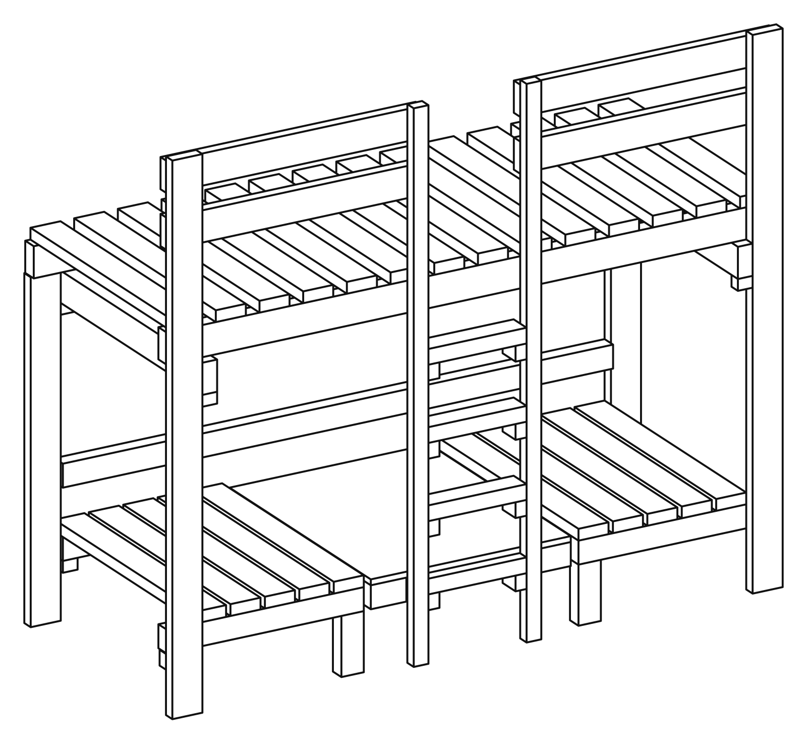

| Bredde | Dybde | Høyde |
|---:|---:|---:|
| **1990 mm** | **836 mm** | **1700 mm** |

69 deler · 11 steg · 2 personer · passer standard madrass 80 × 200 cm

Sengen står inntil bakveggen og inntil begge sidevegger, og skrus fast i bakveggen. **Bygg bakfra og utover.**

Ord og begrunnelser: [ASSEMBLY.md](ASSEMBLY.md). Full steg-for-steg-tekst: [byggesteg](generated/byggesteg.md).

---

# Før du begynner

**Svart strek** er delen du setter opp nå. **Grå strek** er det som allerede står.

**Festemidlene er tegnet, ikke antydet.** Hver skrue, bolt og hvert beslag på stegsidene er den samme kroppen som står i modellen, i sin egen lengde og langs sin egen akse — så en skrue som peker feil vei eller er for lang stopper byggingen av manualen, ikke først byggingen av sengen.

**Trukket ut av hullet:** på de fleste stegene er festemidlene tegnet et stykke ut langs sin egen akse, med en **prikket linje** ned i hullet de skal i og en **prikk** der hullet er. Den prikkede linjen betyr festemiddel og ingenting annet; **piler** brukes bare om tredeler som skal føres sammen. På de stegene som setter tjue-tretti like skruer — spilene — er de tegnet **der de havner** i stedet: hodet fylt, og den delen som ligger begravd i treet **stiplet**.

Står det **2×** ved et festemiddel, står det merket for to på samme sted — tegningen viser aldri færre festemidler enn steget bruker, og den slår aldri sammen på tvers av to ulike ledd. **Bokstaven i ringen** (Ⓐ, Ⓑ …) sier hvilken av stegets typer det er, og går igjen i tabellen under bildet. **Ruta i hjørnet** viser leddet i snitt, med delene i riktig innbyrdes størrelse, skravur på snittflatene og festemidlene i full lengde — hodet på skrusiden, spissen inne i mottakerdelen.

| Slik | Ikke slik | |
|:---:|:---:|---|
| 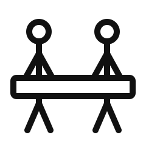  |   | **To personer.** Bakrammen veier mye og skal reises loddrett. |
| 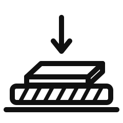  | 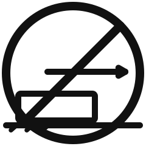  | **Mykt underlag.** Bygg rammene flatt på papp eller teppe. Ikke dra delene over gulvet. |
|   |  | **Sorter delene** etter kapplista, og merk hver del på en flate som blir skjult. |
|   |  | **Les steg 0 først.** All saging og all boring skjer før noe reises. |
| 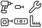  |  | **Verktøy:** drill med bor, torxbits, fastnøkkel 10 mm, tommestokk, vater og vinkelhake. |
| 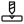  |  | **Forbor.** I bord, i den tynne bordbærelekta og i all endeved er forboring et krav. |
| 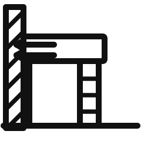  |   | **Sengen skal skrus fast i veggen.** Den er ikke beregnet på å stå fritt — veggen er sperren på baksiden. |

---

# Beslag

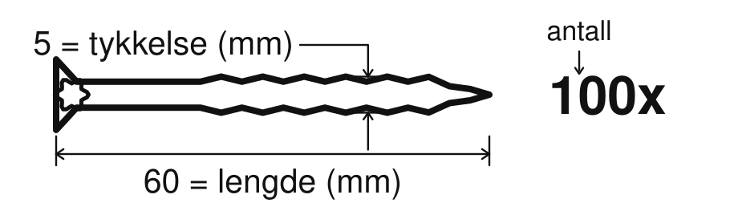

| | |
|:---:|---|
|  **92x** | Treskrue 5×60 forsenket Torx |
|  **20x** | Treskrue 5×40 forsenket Torx |
|  **18x** | Treskrue 6×90 forsenket Torx |
|  **14x** | Treskrue 6×80 forsenket Torx |
|  **12x** | Treskrue 6×120 forsenket Torx |
|  **8x** | Filtknott / møbeltapp ⌀40 |
|  **8x** | Senkhodeskrue M6×30 + skive M6 + låsemutter M6 |
| 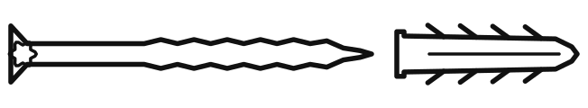 **6x** | Veggfeste etter veggtype (treskrue 8×100 i stender, eller plugg + skrue i mur) |
|  **4x** | Treskrue 5×70 forsenket Torx |
| 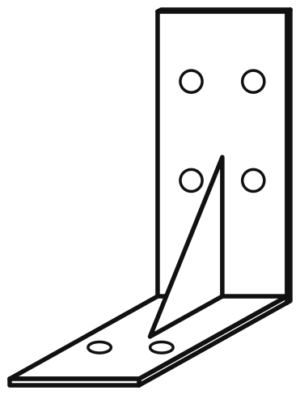 **4x** | Vinkelbeslag 90×90×40×2,5 varmforsinket |
| 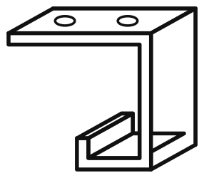 **2x** | Krokplate, bøyd av flattstål 30×4 |
|  **2x** | Treskrue 6×70 forsenket Torx |
| 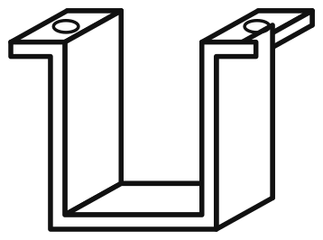 **2x** | U-brakett, bøyd av flattstål 30×4 |
| 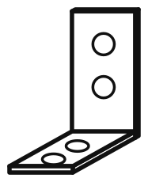 **2x** | Vinkelbeslag 40×40×20 |

Hvor hver enkelt går, og hva som forbores: [beslagliste](generated/beslagliste.md). Hvilken vei hver enkelt drives, og hvorfor: [skrueretninger](generated/skrueretninger.md).

---

# Delene

| Del | Dim. | Lengde | Ant. |
|---|---|---:|---:|
| Løs plate | 18 mm plate, 680 bred | 800 | **1** |
| Bordbærelekt, bak | 21×95 | 1794 | **1** |
| Stigevange | 36×48 | 1700 | **2** |
| Stigekloss | 36×48 | 73 | **8** |
| Bærekloss, benkevange (J9-B) | 36×48 | 48 | **4** |
| Bærekloss, endebjelke (J1-B) | 36×48 | 48 | **4** |
| Hjørnestolpe, front | 36×98 | 1700 | **2** |
| Hjørnestolpe, bak (veggside) | 36×98 | 1065 | **2** |
| Rekkverksbord, front | 36×98 | 832 | **4** |
| Benkespile | 36×98 | 800 | **10** |
| Køyespile | 36×98 | 800 | **14** |
| Stubbefot | 48×48 | 186 | **4** |
| Benkevange, bak (gjennomgående) | 48×73 | 1794 | **1** |
| Avstivningslekt under plate | 48×73 | 715 | **2** |
| Benkevange, front (bit) | 48×73 | 642 | **2** |
| Rungetrinn | 48×73 | 320 | **4** |
| Sidevange, øvre | 48×98 | 1984 | **2** |
| Endebjelke | 48×98 | 836 | **2** |

**69 deler.** **Ant.** er antallet — det samme tallet som står som `4×` på stegsidene. **Dim.** og **Lengde** er i millimeter.

Posisjoner: [kappliste](generated/kappliste.md). Hva du skal kjøpe: [innkjøpsliste](generated/innkjopsliste.md).

---

# 0

## Kapping, forboring og forsenking

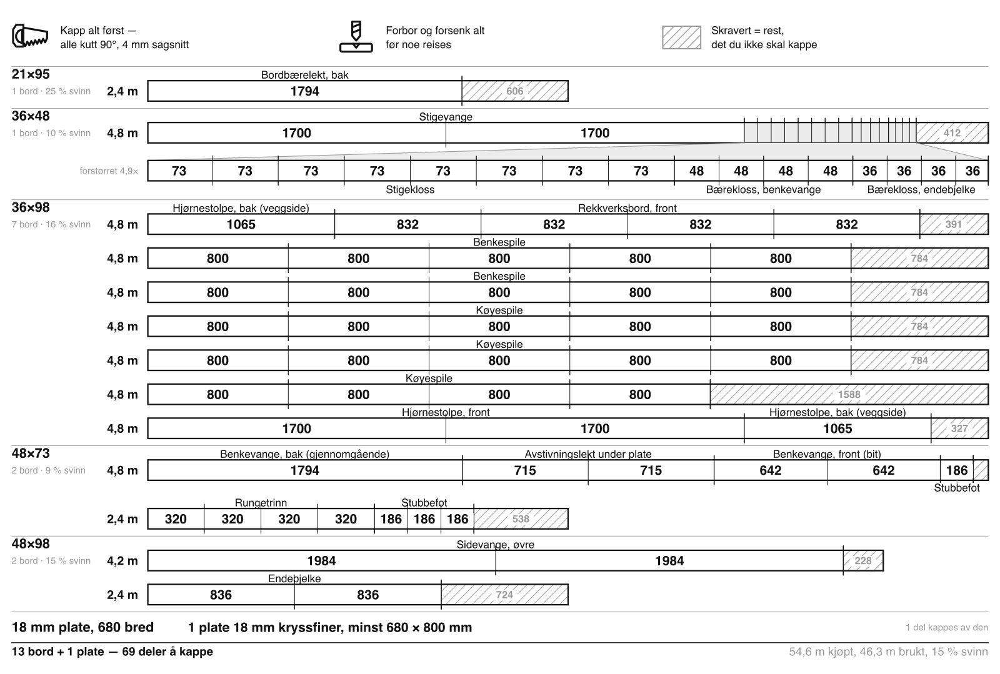

| | |
|:---:|---|
|  **8x** | Filtknott ⌀40 |

Ledd **J15** → [beslagliste](generated/beslagliste.md)

⚠️ Legg de to lengste delene — sidevangene — inn i rommet nå og sjekk at de går fritt forbi begge vegger. De er kappet kortere enn veggavstanden nettopp for dette.

[Steg 0 i ord](generated/byggesteg.md#steg-0--kapping-forboring-og-forsenking)

---

# 1

## Bakrammen — bygg den flatt på gulvet

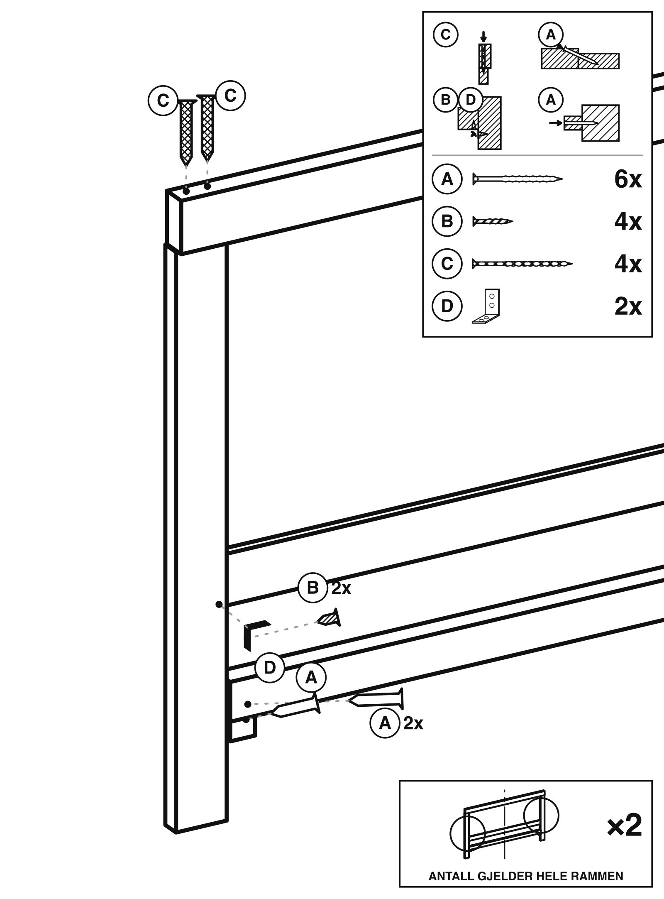

| Ant. | Del | Dim. | Lengde |
|---:|---|---|---:|
| **1×** | Benkevange, bak (gjennomgående) | 48×73 | 1794 |
| **1×** | Bordbærelekt, bak | 21×95 | 1794 |
| **2×** | Bærekloss, benkevange (J9-B) | 36×48 | 48 |
| **2×** | Hjørnestolpe, bak (veggside) | 36×98 | 1065 |
| **1×** | Sidevange, øvre | 48×98 | 1984 |

| | | |
|:---:|:---:|---|
|  |  **6x** | Treskrue 6×90 |
|  |  **4x** | Treskrue 5×40 |
|  |  **4x** | Treskrue 6×120 |
|  |  **2x** | Vinkelbeslag 40×40×20 |

Bokstavene viser hvor på tegningen hver type går.

Ledd **J2-B**, **J8-B**, **J9-B**, **J12** → [beslagliste](generated/beslagliste.md)

⚠️ Mål diagonalene i rammen — de skal være like.

[Steg 1 i ord](generated/byggesteg.md#steg-1--bakrammen--bygg-den-flatt-på-gulvet)

---

# 2

## Reis bakrammen og skru den fast i veggen

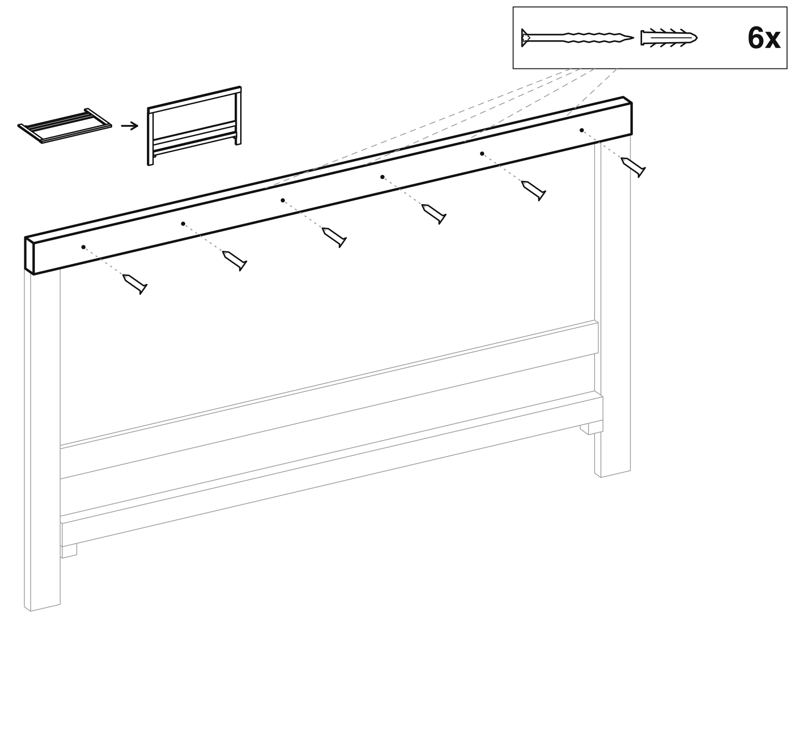

| | |
|:---:|---|
|  **6x** | Veggfeste |

Ledd **J14** → [beslagliste](generated/beslagliste.md)

⚠️ Vater langs sidevangen, og lodd på begge stolper.

[Steg 2 i ord](generated/byggesteg.md#steg-2--reis-bakrammen-og-skru-den-fast-i-veggen)

---

# 3

## Endebjelkene og de fremre stolpene

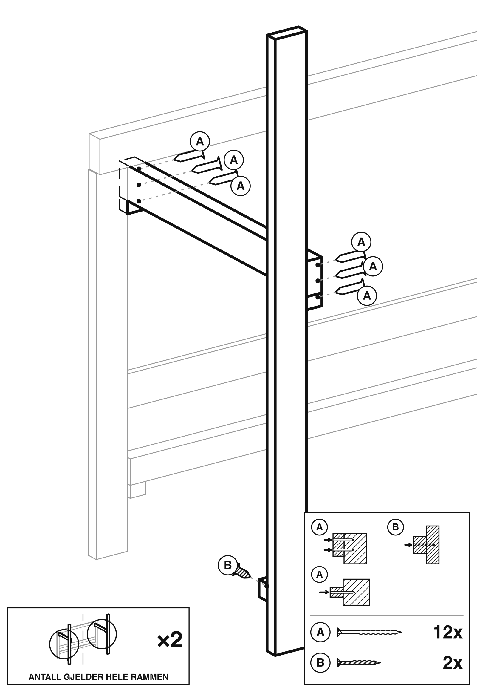

| Ant. | Del | Dim. | Lengde |
|---:|---|---|---:|
| **2×** | Bærekloss, benkevange (J9-B) | 36×48 | 48 |
| **4×** | Bærekloss, endebjelke (J1-B) | 36×48 | 48 |
| **2×** | Endebjelke | 48×98 | 836 |
| **2×** | Hjørnestolpe, front | 36×98 | 1700 |

| | | |
|:---:|:---:|---|
|  |  **12x** | Treskrue 6×90 |
|  |  **2x** | Treskrue 6×70 |

Bokstavene viser hvor på tegningen hver type går.

Ledd **J1**, **J1-B**, **J9-F** → [beslagliste](generated/beslagliste.md)

⚠️ Vater på begge endebjelker, og kontroller at de ligger i nøyaktig samme høyde.

[Steg 3 i ord](generated/byggesteg.md#steg-3--endebjelkene-og-de-fremre-stolpene)

---

# 4

## Fremre sidevange

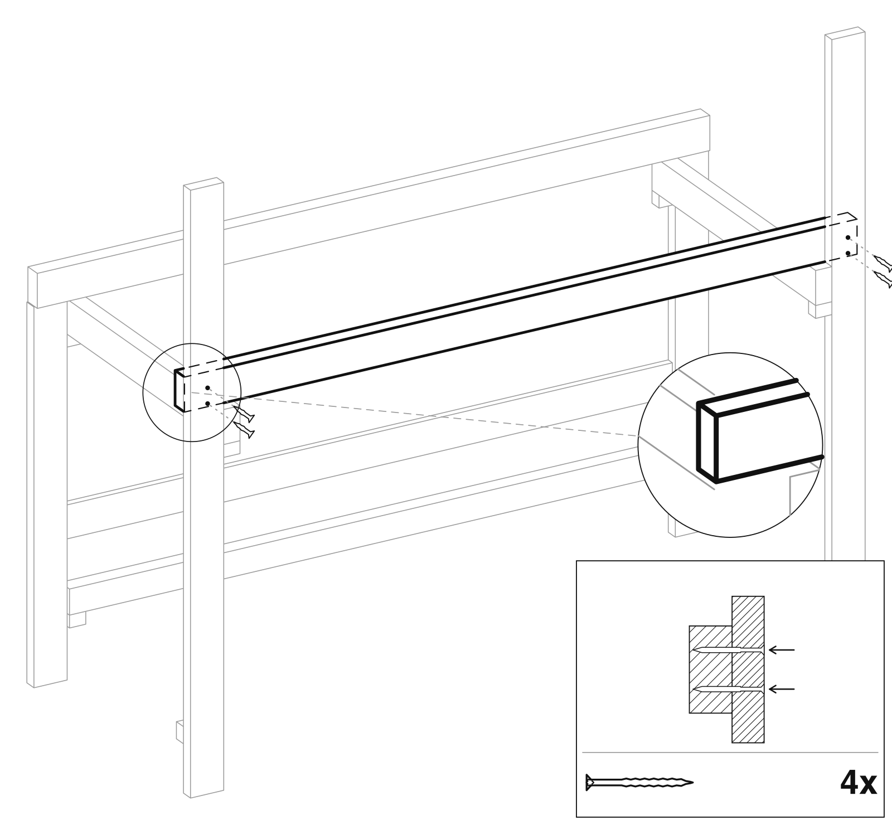

| Ant. | Del | Dim. | Lengde |
|---:|---|---|---:|
| **1×** | Sidevange, øvre | 48×98 | 1984 |

| | |
|:---:|---|
|  **4x** | Treskrue 6×80 |

Ledd **J2** → [beslagliste](generated/beslagliste.md)

⚠️ Mål avstanden mellom de to sidevangene i begge ender og på midten. Den skal være lik overalt — det er madrassbredden, og madrassen er kappet nøyaktig etter den.

[Steg 4 i ord](generated/byggesteg.md#steg-4--fremre-sidevange)

---

# 5

## Fremre benkevanger og alle fire stubbeføtter

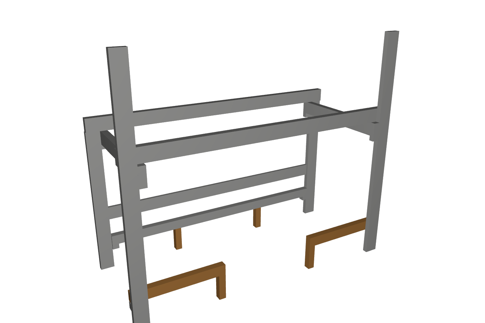

| Ant. | Del | Dim. | Lengde |
|---:|---|---|---:|
| **2×** | Benkevange, front (bit) | 48×73 | 642 |
| **4×** | Stubbefot | 48×48 | 186 |

| | | |
|:---:|:---:|---|
|  |  **16x** | Treskrue 5×40 |
|  |  **4x** | Treskrue 5×70 |
|  |  **4x** | Treskrue 6×80 |
|  |  **4x** | Vinkelbeslag 90×90×40×2,5 |

Bokstavene viser hvor på tegningen hver type går.

Ledd **J8**, **J10** → [beslagliste](generated/beslagliste.md)

⚠️ Ingenting skal krysse gulvet mellom de to benkene.

[Steg 5 i ord](generated/byggesteg.md#steg-5--fremre-benkevanger-og-alle-fire-stubbeføtter)

---

# 6

## Stigen

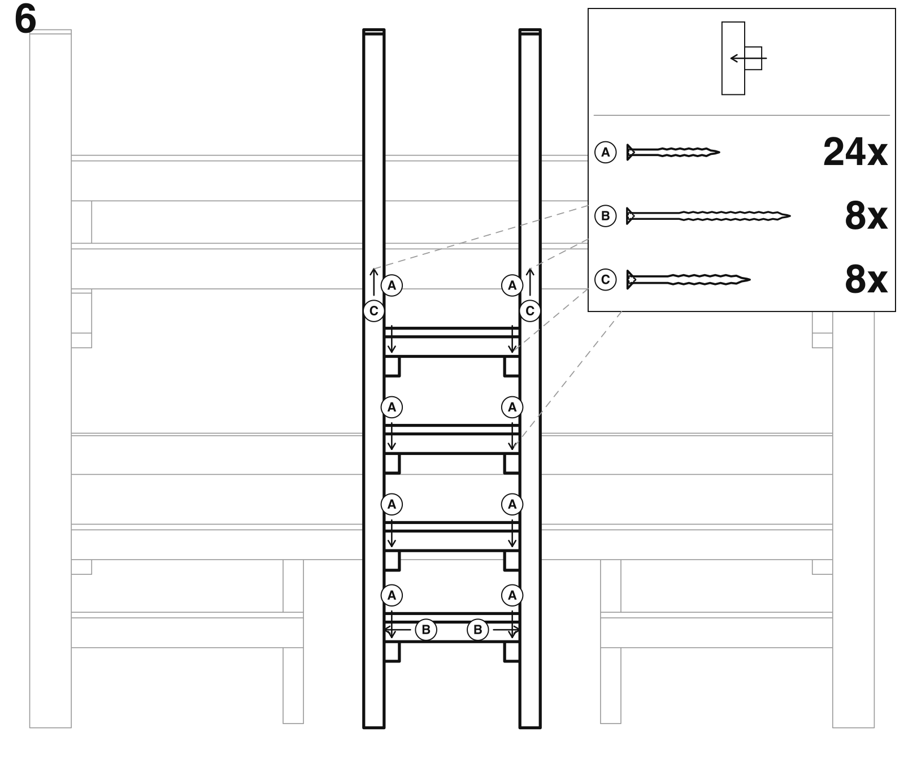

| Ant. | Del | Dim. | Lengde |
|---:|---|---|---:|
| **4×** | Rungetrinn | 48×73 | 320 |
| **8×** | Stigekloss | 36×48 | 73 |
| **2×** | Stigevange | 36×48 | 1700 |

| | | |
|:---:|:---:|---|
|  |  **16x** | Treskrue 5×60 |
|  |  **8x** | Treskrue 6×120 |
|  |  **6x** | Treskrue 6×80 |

Bokstavene viser hvor på tegningen hver type går.

Ledd **J3**, **J4**, **J5** → [beslagliste](generated/beslagliste.md)

⚠️ Mål lysåpningen mellom stigevangene øverst og nederst — den skal være lik.

[Steg 6 i ord](generated/byggesteg.md#steg-6--stigen)

---

# 7

## Benkespiler

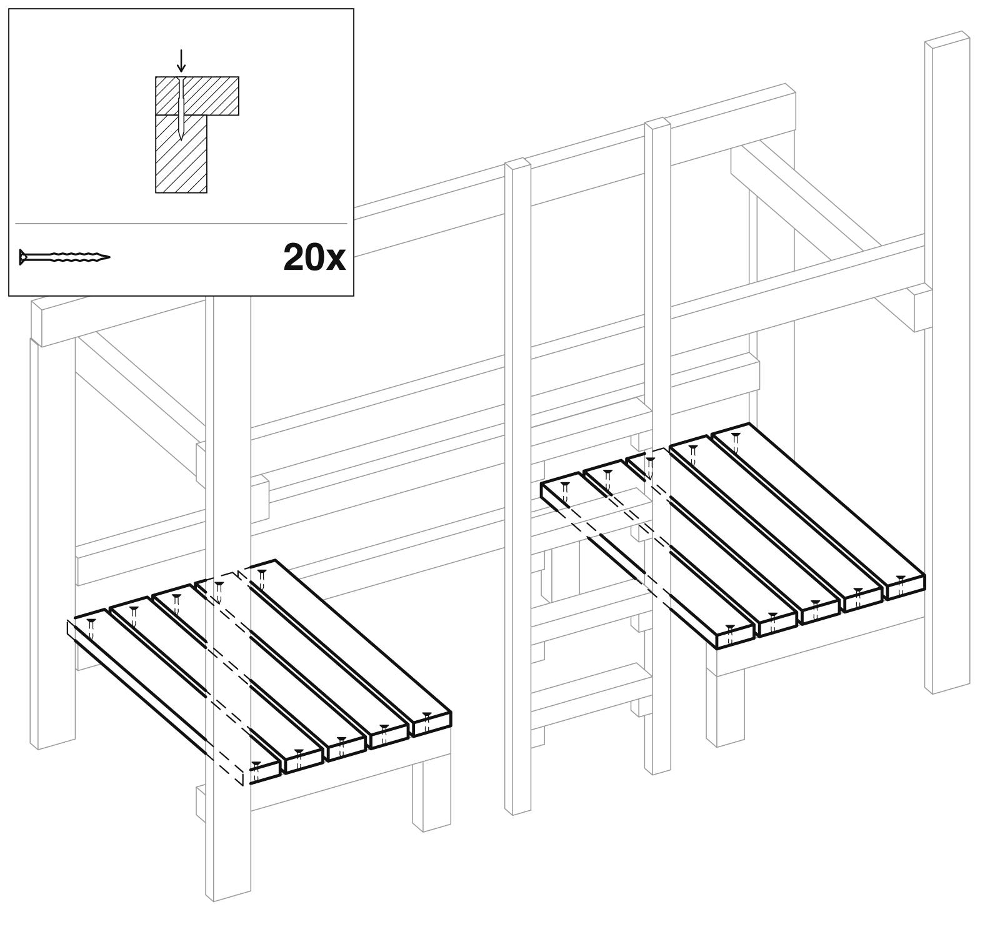

| Ant. | Del | Dim. | Lengde |
|---:|---|---|---:|
| **10×** | Benkespile | 36×98 | 800 |

| | |
|:---:|---|
|  **20x** | Treskrue 5×60 |

Ledd **J11** → [beslagliste](generated/beslagliste.md)

⚠️ Kjenn over hele benken med håndflaten: ingen skruehoder skal stikke opp.

[Steg 7 i ord](generated/byggesteg.md#steg-7--benkespiler)

---

# 8

## Køyespiler

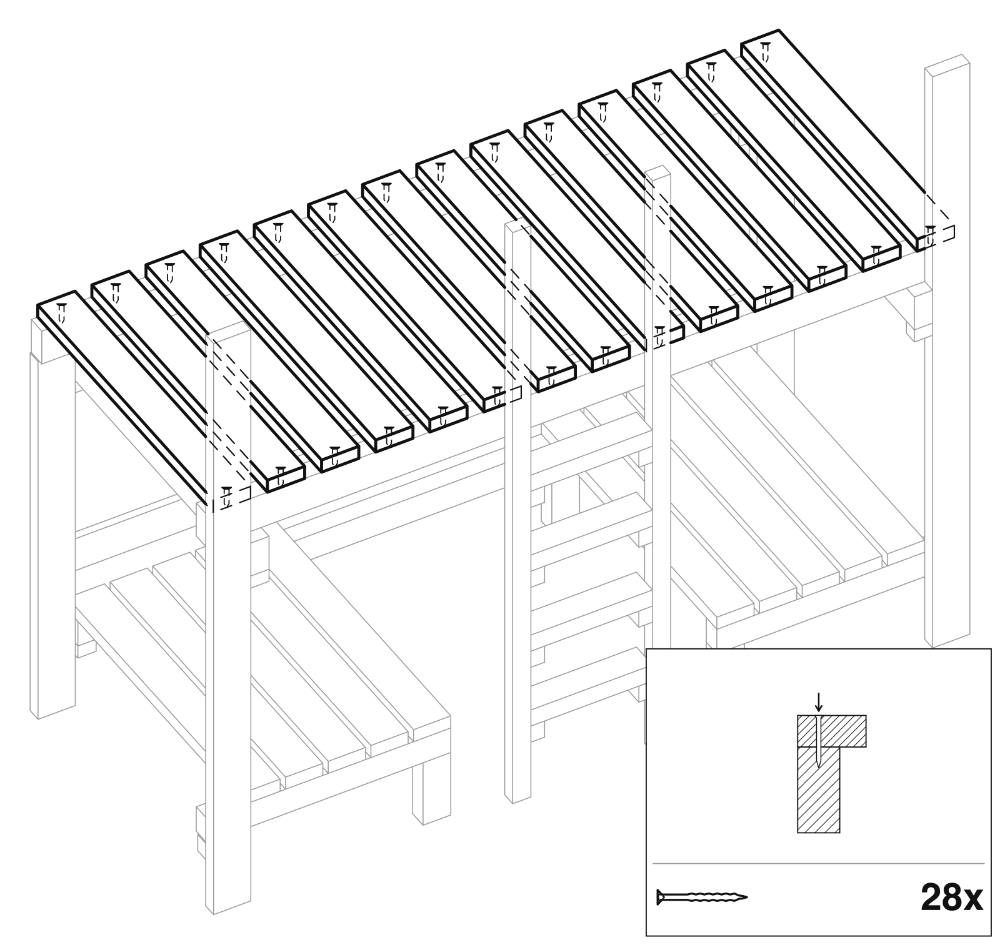

| Ant. | Del | Dim. | Lengde |
|---:|---|---|---:|
| **14×** | Køyespile | 36×98 | 800 |

| | |
|:---:|---|
|  **28x** | Treskrue 5×60 |

Ledd **J6** → [beslagliste](generated/beslagliste.md)

⚠️ Alle spiler skal dekke hele bredden av begge vanger. Ligger en spile bare halvveis på vangen, flytt den.

[Steg 8 i ord](generated/byggesteg.md#steg-8--køyespiler)

---

# 9

## Rekkverk foran

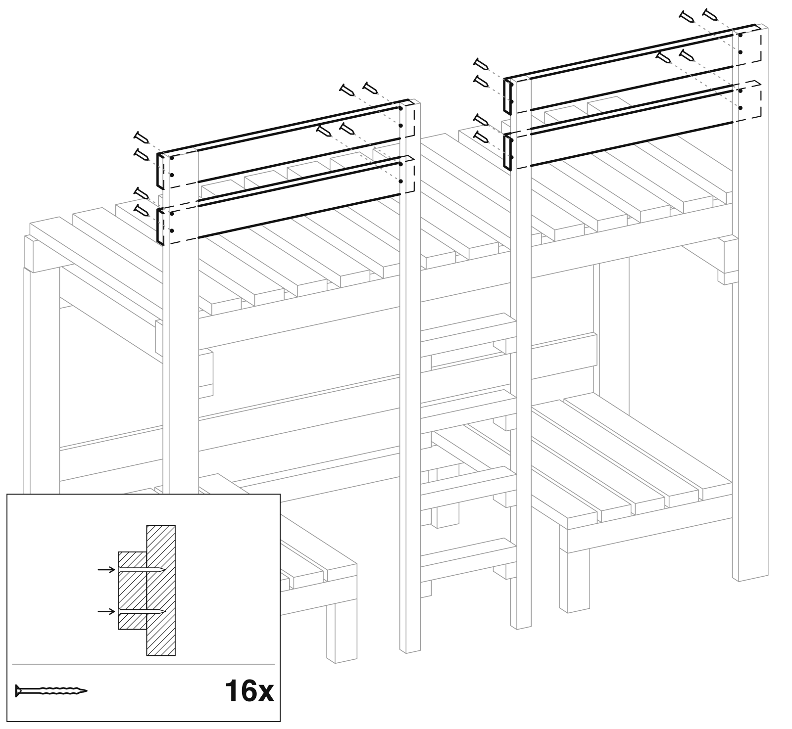

| Ant. | Del | Dim. | Lengde |
|---:|---|---|---:|
| **4×** | Rekkverksbord, front | 36×98 | 832 |

| | |
|:---:|---|
|  **16x** | Treskrue 5×60 |

Ledd **J7** → [beslagliste](generated/beslagliste.md)

⚠️ Mål åpningene over madrassoverflaten mot tallene i nøkkelmålene. De er sikkerhetskravet i denne sengen.

[Steg 9 i ord](generated/byggesteg.md#steg-9--rekkverk-foran)

---

# 10

## Løs plate med avstivningslekter og beslag

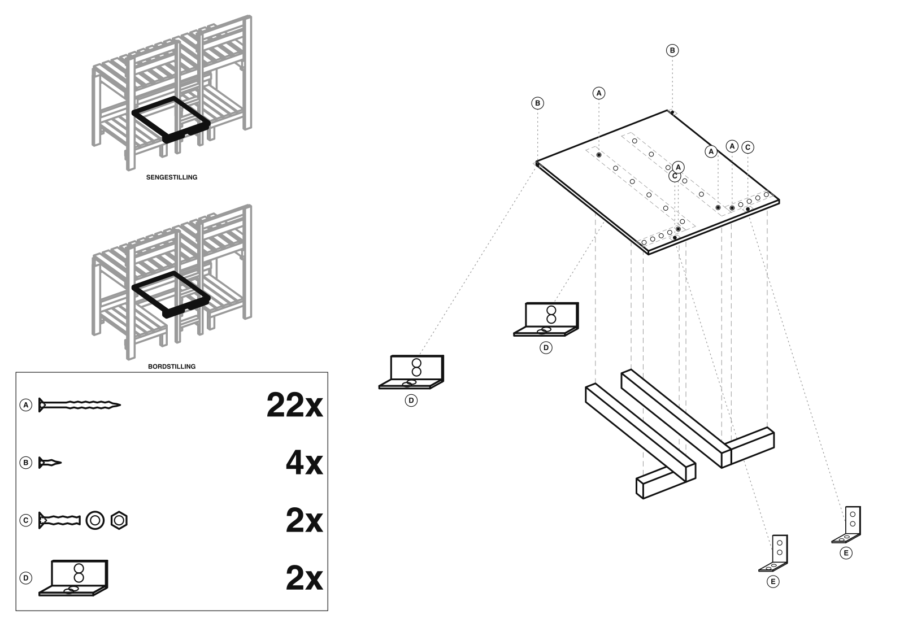

| Ant. | Del | Dim. | Lengde |
|---:|---|---|---:|
| **2×** | Avstivningslekt under plate | 48×73 | 715 |
| **1×** | Løs plate | 18 mm plate, 680 bred | 800 |

| | | |
|:---:|:---:|---|
|  |  **12x** | Treskrue 5×60 |
|  |  **8x** | Senkhodeskrue M6×30 + skive + mutter |
|  |  **2x** | Krokplate |
|  |  **2x** | U-brakett |

Bokstavene viser hvor på tegningen hver type går.

Ledd **J13a**, **J13b**, **J13c** → [beslagliste](generated/beslagliste.md)

⚠️ Løft i platens forkant. Den skal ikke kunne vippes opp — U-brakettene låser den til trinnet.

[Steg 10 i ord](generated/byggesteg.md#steg-10--løs-plate-med-avstivningslekter-og-beslag)

---

# 11

## Madrass og sluttsjekk

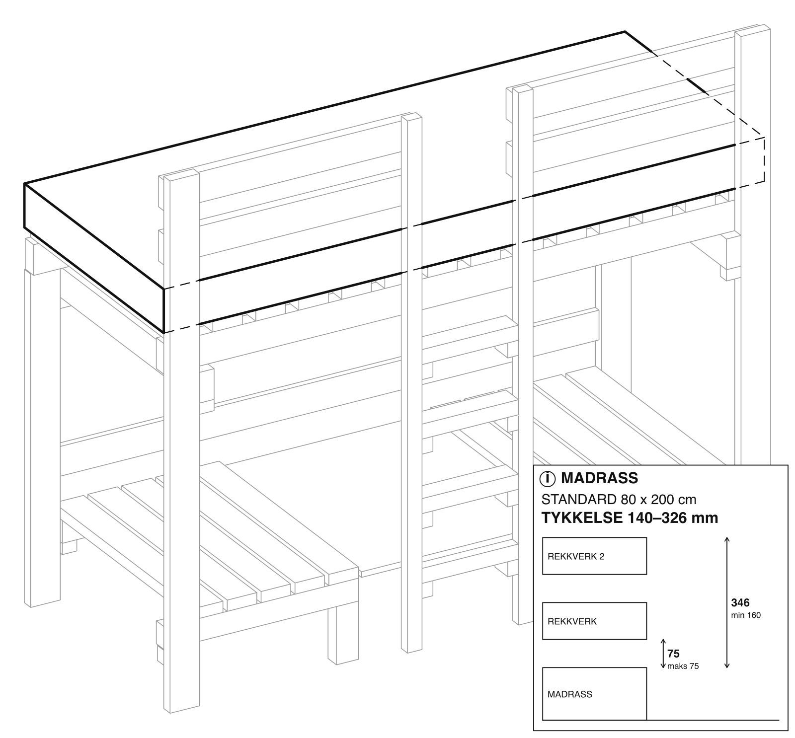

| Ant. | Del | Dim. | Lengde |
|---:|---|---|---:|
| **1×** | Madrass (se nøkkelmål) |  |  |

⚠️ Ettertrekk alle festemidler som kan ettertrekkes.

[Steg 11 i ord](generated/byggesteg.md#steg-11--madrass-og-sluttsjekk)

---

Tegningene i `docs/img/` er projisert ut av modellen og sjekket inn i git. De lages på nytt med `mise run montering`.
