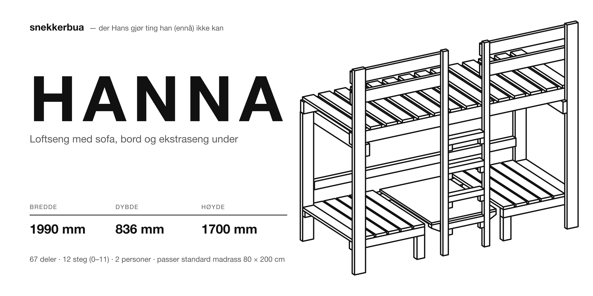
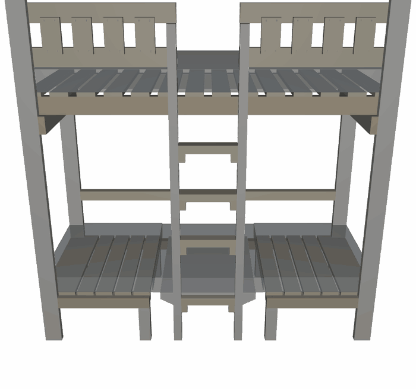
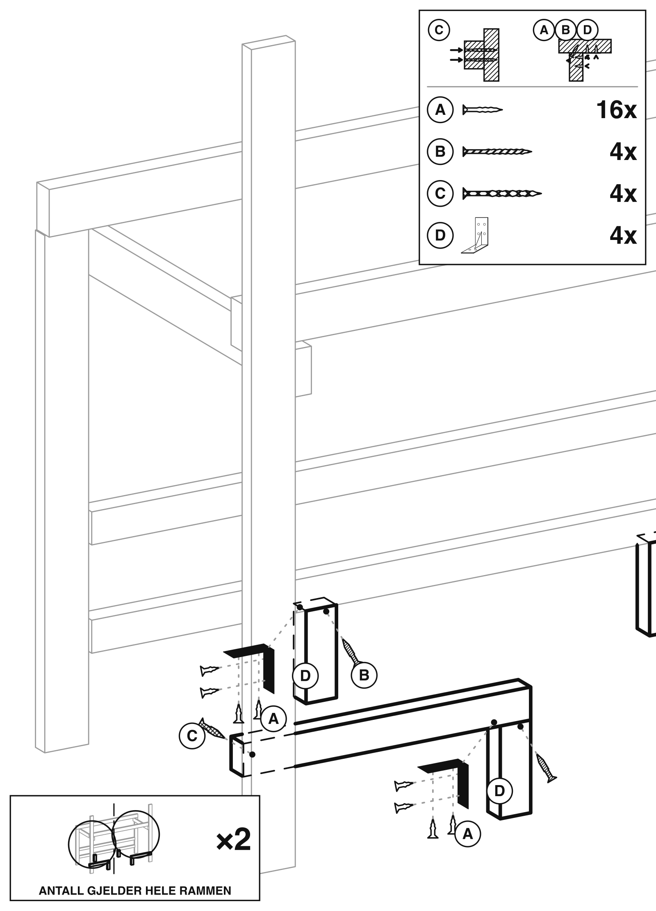
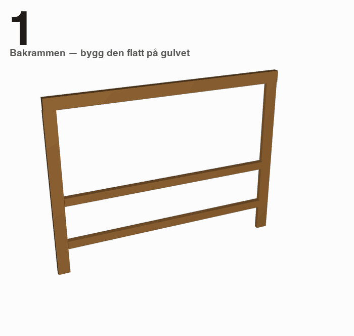
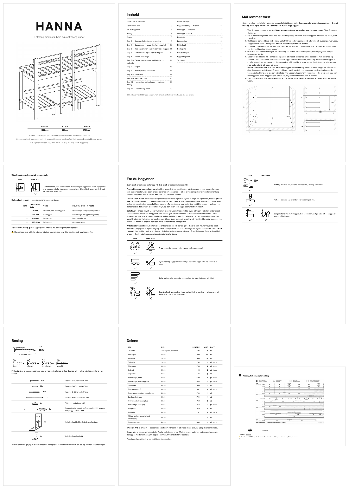

# HANNA — loftsengen der manualen kompileres, ikke skrives

[](https://github.com/Starefossen/snekkerbua/actions/workflows/check.yml)

*Det første prosjektet i [snekkerbua](../../README.md). Felles praksis:
[PRAKSIS.md](../../PRAKSIS.md) · verkstedets utstyr:
[UTSTYR.md](../../UTSTYR.md).*





*48 rammer av solidene, tatt opp med `usdrecord` og satt sammen av
`tools/render_animasjon.py`. Deterministisk: rammenummeret driver kameraet, så
samme modell gir samme bytes.*

En parametrisk loftseng i [build123d](https://github.com/gumyr/build123d) /
OpenCascade, bygd for én nisje på 199 cm mellom to vegger. Modellen er den
eneste kilden: **hver tegning, hver tabell og alle 94 sidene i den trykte
monteringsmanualen genereres av solidene og maskinsjekkes før de får finnes.**
Ikke ett mål er skrevet av. Unntaket er fire skjemaark i `docs/schematics/`,
som er tegnet for hånd — der et tall på et slikt ark er i strid med en
generert tabell, er det tabellen som gjelder.



*Steg 5, tegnet av `tools/render_lineart.py`. Sengen er en
skjult-linje-projeksjon av de virkelige B-rep-solidene. Hver skrue er en
modellert kropp, eksplodert langs sin egen drivakse, i sin sanne lengde.
Bokstavene, fyllkoden, antallene i innsettpanelet og halvsnittet er alle
utledet — og en assert som feller bygget måler det ferdige blekket og beviser at
hvert merke står på det festemiddelet det navngir.*

---

## Nøkkeltall

| | |
|---|---|
| **Ytre mål** | 1990 × 836 × 2037 mm — fyller nisjen fra vegg til vegg på 1990 mm, i et rom med 2450 mm takhøyde, og gir 1500 mm fri høyde under køya. Gjennomgående deler kappes 1984 mm, for et bord på 1990 mm lar seg ikke svinge inn i en åpning på 1990 mm |
| **Trevirke** | **72 stykker** i **5 dimensjoner** pluss én 18 mm kryssfinerplate — 51,23 løpemeter. Fordelingen: 23×98 26 stk. · 48×68 19 stk. · 36×48 14 stk. · 36×98 10 stk. · 48×98 2 stk. · plata 1 stk. 24 av de 72 stykkene er ett og samme stykke: spilen, 23×98 × 800 mm, kappet i én innstilling. Tallene telles av modellen og står nederst i [kapplista](docs/generated/kappliste.md) — `TOTAL 72 pcs 51.23 m in 5 timber profiles + 1 sheet` er det modellen skriver ut mens den bygger |
| **Stål** | **181 festemidler fordelt på 22 ledd**, **172 av dem modellert som solide kropper** — hode, forsenking, skaft og spiss, hver med sin egen drivvektor. De 9 som mangler er de to veggfestene, J14 og J12-V: de går rett inn i veggen og har ingen andre del å ende i, så de er plassert, men ikke modellert. **Ikke ett eneste hode står i en romvendt flate**, og det er en assert. Begge tallene skriver modellen ut selv — `181 festemidler plassert i 22 ledd` og `172 festemidler modellert som kropper` |
| **Kontroller** | **477 asserter i modellen** og 160 til i verktøyene, alle sammen stopper bygget — tallene er talt, ikke anslått, og de telles som `ast.Assert`-noder i syntakstreet, ikke med grep: en grep på linjer som begynner med ordet «assert» tar med brødtekst som gjør det samme, og gir 482 her. Metoden er `python -c "import ast,sys;print(sum(isinstance(n,ast.Assert) for n in ast.walk(ast.parse(open(sys.argv[1]).read()))))" generate_loftbed.py`, og den samme summen over `tools/*.py` (22 filer) — men ingen runde arver dem lenger: `tools/check_tall.py` teller dem på nytt i porten og feller bygget hvis denne tabellen sier noe annet enn det den finner. Skrueretningene er utledet av fysikk (6 av de 24 radene i [skrueretningene](docs/generated/skrueretninger.md) er tvunget av tykkelsene alene), og hver av dem har en plasseringslinje som sier hvor på delen hullet står — 25 linjer over 22 skrueretninger og alle 172 festemidlene, en bijeksjon som asserteres på det ferdige blekket. De to siste radene er veggfestene: de får hver sin egen plasseringslinje over 9 fester, satt etter stender og ikke etter mål, og telles derfor for seg; antall skruer må få plass på flaten de står på; hver del må røre resten av sengen og kollidere med ingenting |
| **Determinisme** | `mise run check` kjører hele kjeden to ganger og krever **136 byte-identiske artefakter** — de tre filmene inkludert, pluss et hash-stempel som feller porten hvis en film er eldre enn modellen den viser. 136 er ikke et anslag: det er `git ls-files` over nøyaktig de stiene `snap()` i `mise.toml` hasjer. Determinismen er en assert, ikke en forventning |
| **Ut av det** | En **trykkeklar PDF på 94 sider** med én kommando — `pdfinfo docs/hanna.pdf` sier hvor mange det ble — pluss en ren billedmanual, en skrevet byggeveiledning, sju skjemategninger, to bruksark og eksport til STEP / STL / GLB / USDZ |
| **Standarder** | Klaringer, rekkverkshøyder og vinduet for madrasstykkelse kommer av EN 747; kantavstander og skrueavstander av Eurokode 5 |
| **Menneskene** | **Fire referansekropper** — et barn på **1200 mm** bygget av 14 primitiver etter [AnthroKids](https://math.nist.gov/~SRessler/anthrokids/), to som sover og to som sitter, som ekte solider i modellen. De kappes ikke og bærer ingenting, men de **måler**: 426 mm over hodet på den som sitter rett opp, 902 mm over ansiktet til den som ligger nede — og de er grunnen til at bordplaten ble en pult: på 542 gikk et lår under den, men ikke et kne, og på 682 sitter begge barna med knærne inn under |

Sengens *funksjon* — en loftplate over en benk/bord/ekstraseng som stilles om
ved å flytte én plate mellom to høyder — er hentet fra en omstillbar loftseng
fra Hoppekids. Konstruksjonen, målene, hvert eneste ledd og all dokumentasjonen
her er egen.

---

## Sånn henger det sammen

```
generate_loftbed.py           modellen: mål, deler, festemidler, asserter
  ├─ tools/gen_doc_tables.py  → docs/generated/*.md, docs/MONTERING.md, byggesteg.json
  ├─ tools/render_lineart.py  → docs/img/steg-NN.svg/.png   (+ check_coverage)
  │    ├─ tools/render_cutpage.py   steg 0, kappeplanen
  │    ├─ tools/render_panel.py     steg 10, den løse platen
  │    ├─ tools/render_maalfigur.py forsteget, målefiguren av nisja
  │    └─ tools/render_maaltegning.py side 2, senga med sine seks mål
  ├─ tools/render_setedetalj.py → docs/schematics/setedetalj.svg
  ├─ tools/render_endelevation.py → docs/schematics/end-elevation.svg
  ├─ tools/render_spikerslag.py → docs/schematics/spikerslag.svg
  ├─ tools/gen_figurhode.py   → figurikonenes hoder + landemerkene i PRAKSIS §4
  ├─ tools/gen_glyphs.py      → skrueikoner og piktogrammer
  ├─ tools/render_animasjon.py → docs/img/hanna-*.gif  (de tre filmene)
  ├─ tools/check_tall.py      → skriver ingenting: måler README-ens talte tall
  │                             og sveiper håndprosaens tall mot modellen
  ├─ tools/falsifiser.py      → skriver ingenting: feilinjiserer vokterne og
  │                             krever at hver enkelt feller
  └─ tools/build_pdf.py       → docs/hanna.pdf
       └─ tools/render_pdf_matrix.py → docs/img/hanna-manual-sider.png
```



*De samme elleve stegene manualen er paginert av, lest rett ut av
`docs/generated/byggesteg.json`: delene i hvert steg flyr inn langs den
retningen stegteksten sier du skal føre dem, skruene kommer når treet har
landet, og tallet i hjørnet er nummeret på den trykte siden. Ingenting her er en
andre beskrivelse av byggingen — det er byggebeskrivelsen, animert.*

**Én kilde.** Ethvert tall som står i dokumentasjonen *kommer fra* modellen —
ikke «er kopiert fra». Verktøyene importerer `generate_loftbed.py`, leser
modulglobalene og skriver ut. Ingen av dem definerer geometri, og ingen av dem
utleder noe modellen allerede vet. Den ene håndskrevne teksten,
`docs/ASSEMBLY.md`, har lov til å navngi deler og sitere leddnumre, men den skal
aldri gjenta et mål som et generert fragment allerede bærer — den lenker til
fragmentet i stedet. Regelen bak det: **hvis to filer må være enige om et tall,
er tallet på feil sted.**

**Tegningene er projeksjoner, ikke illustrasjoner.** `render_lineart.py` kjører
de virkelige solidene gjennom OpenCascades skjult-linje-fjerning — ingen nett —
og setter sammen én side per byggesteg: det som allerede står, i tynt grått, det
du fester nå, i tykk svart, og den skjulte strekningen av en ny del stiplet. Det
er konvensjonen en ren billedmanual bruker, den slags som ligger i flatpakken,
og den brukes her fordi modellen kan innfri den helt.

**En layoutmotor på regler, ikke på innstilte koordinater.** `tools/layout.py`
vet ingenting om senger. Den svarer på de to spørsmålene enhver påskrift stiller
— *hvor stor* og *hvor er det plass* — av regler, ikke av tall noen syntes så
bra ut. Hver strekbredde, radius, marg og punktstørrelse på en stegside er et
multiplum av ett mål, `penn = bbox-diagonalen / 400`, så hele pennsettet følger
det som tegnes. Hvor et merke havner er et poengsatt søk i et opptattfelt, der
kontakt med kroppen merket navngir er priset over hvilken som helst mengde hvitt
papir.

**Manualen kan ikke lyve.** Assertene sier nesten aldri at et tall er det
tallet — de er forhold, utledet av noe utenfor tegningen, og de sier hvor man
retter det når de ryker. Fire familier:

* **Skruelengde.** En gjennomgående skrue må gå klar av delen den drives fra og
  ende inne i den andre: `t(fra) < lengde < t(fra) + t(inn i)`. Der bare én
  retning holder målene, er retningen *utledet*, og leddtabellen får bare være
  enig.
* **Passer på flaten.** En rad med `n` skruer trenger `(n-1)·4d + 2·3d` mm
  virkelig kontaktflate. Da denne ble slått på, strøk den fire skruetall som
  hadde stått uimotsagt.
* **Kompletthet.** Hver del i nøyaktig ett steg; hvert ledd til stede så mange
  ganger som tabellen sier; handlelista lik de festemidlene som faktisk er
  plassert; og hver stegside må *tegne* minst ett feste av hver type den lister
  opp, med tegnet antall lik trykt antall. Den siste fanger tause tegninger — en
  del som står i tabellen og aldri blir vist festet.
* **Orientering.** Et beslag som er skrudd fast i tre er ikke nødvendigvis
  riktig vei. Et beslag som *bærer* noe må ha den vannrette fliken skrudd rett
  opp, i undersiden av det den bærer.

**Og assertene prøves selv.** En assert som aldri har feilet er ikke en bevist
assert, den er en uprøvd en. `tools/falsifiser.py` tar de asserene som VOKTER —
de som måler ferdig blekk eller plasserte kropper på tvers av filer, der
«bestått» og «hadde ingenting å si» ser like ut — kjører dem først rene på
dagens innhold, og perturberer så én ting om gangen i minnet: bærer bakrammen
inn gjennom en åpning like bred som seg selv, tar et ledd ut av steg 0s
utsettelsesliste, gir et veggfeste et X-mål som fasit, lar README gjenfortelle
et tall som har flyttet seg. Hver eneste feilinjisering må felle sin assert.
Ingen av dem rører en fil på disk, og porten kjører dem.

Og siden alt utledet er sjekket inn — nettopp for at `git diff --stat` etter et
bygg *skal være* konsekvensanalysen — må kjeden selv være reproduserbar.
`mise run check` kjører den to ganger og sammenligner sjekksummer. Ryker den, er
det aldri en modellendring: det er en usortert `dict`, et tidsstempel, en
`id()`-sortering eller en flyttallssum som avhenger av rekkefølgen.

Den samme porten kjører på hver push til `main` — badgen øverst er
[`.github/workflows/check.yml`](../../.github/workflows/check.yml), som er
`build`, `montering` og `check` på en maskin som starter med ingenting. Vil du
kjøre den selv: **[Sjekk selv](../../README.md#sjekk-selv)**.

---

## Kom i gang

Krever [`mise`](https://mise.jdx.dev/). Resten er
`pip install -r requirements.txt` (build123d, markdown) pluss `rsvg-convert` til
PNG-ene. PDF-en vil i tillegg ha en headless Chrome å skrive ut med og poppler
til å lese resultatet tilbake med — sidetallene i innholdsfortegnelsen slås opp
i den ferdige PDF-en, de gjettes ikke: `brew install librsvg poppler` (eller
`apt install librsvg2-bin poppler-utils`).

Oppgavefila er `mise.toml` på rota av repoet, og hver oppgave kjører allerede i
denne katalogen, så disse virker uendret uansett hvor i treet du står:

```bash
mise run build      # modellen + alle genererte tabeller + docs/MONTERING.md
mise run montering  # tegn strektegningene i docs/img/ på nytt
mise run check      # kjør hele kjeden to ganger, krev byte-identisk resultat
mise run pdf        # docs/hanna.pdf, 94 sider, trykkeklar
```

| Oppgave | Hva den gjør |
|---|---|
| `build` | Bygger og validerer modellen, eksporterer den, skriver hvert fragment i `docs/generated/` og `docs/MONTERING.md` |
| `build-full` | Det samme pluss det tunge: `.glb` og skjult-linje-projeksjonene av hele modellen |
| `montering` | Tegner forsiden og én strektegning per byggesteg til `docs/img/` |
| `setedetalj` | Tegner detaljarket for skråskruesetene til `docs/schematics/setedetalj.svg` |
| `endelevation` | Tegner kortsnittet (sengen sett fra enden) til `docs/schematics/end-elevation.svg` |
| `spikerslag` | Tegner bakveggen som oppriss med sonene som skal ha spikerslag til `docs/schematics/spikerslag.svg` |
| `figurhode` | Regner hodet på konturfiguren inn i de fire figurikonene og skriver landemerketabellene i PRAKSIS §4 |
| `check` | Determinismeasserten: to fulle kjøringer, 136 artefakter, byte-identisk eller feil — og etterpå `check_tall` (README-ens talte tall + tallsveipet over håndprosaen) og `falsifiser` (feilinjisering av vokterne) |
| `pdf` | Setter sammen `docs/hanna.pdf` av de innsjekkede dokumentene (trenger ikke build123d) |
| `schematics` | Rendrer `docs/schematics/*.svg` til PNG for korrektur |
| `usdz` | Konverterer nettene til `.usdz` for Quick Look / Xcode / AR, ett materiale per fargegruppe |
| `render`, `render-validate` | Skyggelagte forhåndsvisninger og de fem designvalideringsbildene (macOS `usdrecord`) |
| `montering-skyggelagt` | Skyggelagte referansebilder av de samme byggestegene |
| `view`, `view-usdz` | Åpner modellen i FreeCAD / Quick Look |

---

## Kart over prosjektet

Alt under ligger i `prosjekter/hanna/`, og alle stier er relative til den.

| Sti | |
|---|---|
| `generate_loftbed.py` | Modellen. Mål, leddtabellen, festemidlene som solider, og assertene |
| `tools/` | Alt som leser modellen: dokumenttabeller, strektegninger, kappeside, plateside, ikoner, PDF, USD-hjelpere |
| `docs/generated/` | Maskinskrevet, aldri redigert for hånd: kappliste, innkjøpsliste, nøkkelmål, beslagliste, skrueretninger, stegtekst, `byggesteg.json` |
| `docs/img/`, `docs/schematics/` | De innsjekkede tegningene — så manualen kan leses og skrives ut på en maskin uten noe av denne verktøykjeden |
| `docs/hanna.pdf` | Manualen på 94 sider. Bevisst utenfor git — verktøyet ligger i repoet, og fila er én `mise run pdf` unna |
| `parts.tsv` | Innsjekket regresjonsavtrykk: navn, fargegruppe og omskrevet boks for hver del, i begge stillinger. En diff på den er diffen på modellen |
| `v1/` | Den første køyesengrammen for nisjen, beholdt som historikk |

---

## Byggedokumentene

Dette er det den som står ved sagen faktisk leser.



*De ni første av de 94 trykte sidene, lest rett tilbake ut av `docs/hanna.pdf`
av `tools/render_pdf_matrix.py`: forsiden, innholdet, senga med sine seks mål,
de to sidene om å måle rommet, de to sidene med konvensjoner og sikkerhet,
beslaglista og delelista. Hver eneste side på det arket er kompilert —
ingenting på det er satt opp for hånd. Den ferdige PDF-en henger ved
[releasen `hanna-v1.0`](https://github.com/Starefossen/snekkerbua/releases/tag/hanna-v1.0)
om du heller vil lese den enn å bygge den.*

* **[docs/MONTERING.md](docs/MONTERING.md)** — billedmanualen. Tolv steg (0–11),
  én tegning per steg, nesten ingen ord. Generert.
* **[docs/ASSEMBLY.md](docs/ASSEMBLY.md)** — begrunnelsene: verktøy, trevirke,
  hvert ledd J1…J17, byggerekkefølgen og hvorfor den må være slik, madrass og
  puter, sikkerhet, og tillegget om lastveiene. Den ene håndskrevne fila.
* **[docs/generated/](docs/generated/)** — kappliste, innkjøpsliste med
  kappeplan bord for bord, nøkkelmål, beslagliste og skrueretninger.
* `docs/hanna.pdf` — alt det over, satt opp for trykk. Ikke innsjekket; kjør
  `mise run pdf`, så kommer den, identisk, ut av de innsjekkede dokumentene.

## For den som skal endre modellen

To filer, ingen av dem en del av den trykte manualen.

* **[../../PRAKSIS.md](../../PRAKSIS.md)** — verkstedets felles praksis:
  én-kilde-regelen, hva som gjør en assert verdt å skrive, regler framfor
  tilfeller, tegnekonvensjonene som holder på tvers av prosjektene, og hvorfor
  determinismen er en assert.
* **[docs/PRAKSIS.md](docs/PRAKSIS.md)** — HANNAs egen: kjeden ut av
  `generate_loftbed.py`, de fire assertfamiliene og standardene de kommer av,
  boksinvarianten og dens ene kileformede unntak, hvor grensen mellom stål og
  tre går, og hver eneste konvensjon i billedspråket i denne manualen —
  fyllkoder, merkeregler, kjeden i et beslaghjørne, ikonspesifikasjonen — med
  grunnen bak hver av dem.

## Grenser

Dette er ett produkt, ikke et møbelrammeverk. Alt er akseparallelle bokser med
ett unntak: alle kutt er 90° «på to nær», som [kapplista](docs/generated/kappliste.md)
sier det — de to kilelektene under platens forkant sages i ett rett snitt på
langs, fra full 68 mm ved roten ned til 27 mm ved tuppen, altså 28,0°. Ellers
finnes verken gjæring eller kurve i sengen, og tegnemotoren går ut fra
rektangulære solider i en ortografisk projeksjon. Modellen er parametrisk
i den forstand at målene er konstanter som holdes sammen av asserter — endrer du
nisjebredden eller hoveddimensjonen på virket, sier kjeden tydelig fra om hva
som ikke lenger går opp — men den er ingen konfigurator, og sengen er laget for
én bestemt veggside og lar seg ikke snu.

## In English

**HANNA** is a parametric loft bed — a bed platform over a bench, table and
spare bed, built for one 199 cm alcove between two walls — modelled in build123d
/ OpenCascade. The model is the only source of truth: every drawing, every table
and all 94 pages of the printed assembly manual are generated from the solids
and machine-checked before they are allowed to exist, and no number is
hand-transcribed. Four schematic sheets in `docs/schematics/` are the one
exception: they are drawn by hand, and where one of them disagrees with a
generated table, the table wins. The documentation is in Norwegian, because
that is what someone standing at the saw actually reads. The proofs run in CI:
`mise run check` builds the whole chain twice and demands 136 byte-identical
artefacts, and the badge at the top of this page is that gate.
