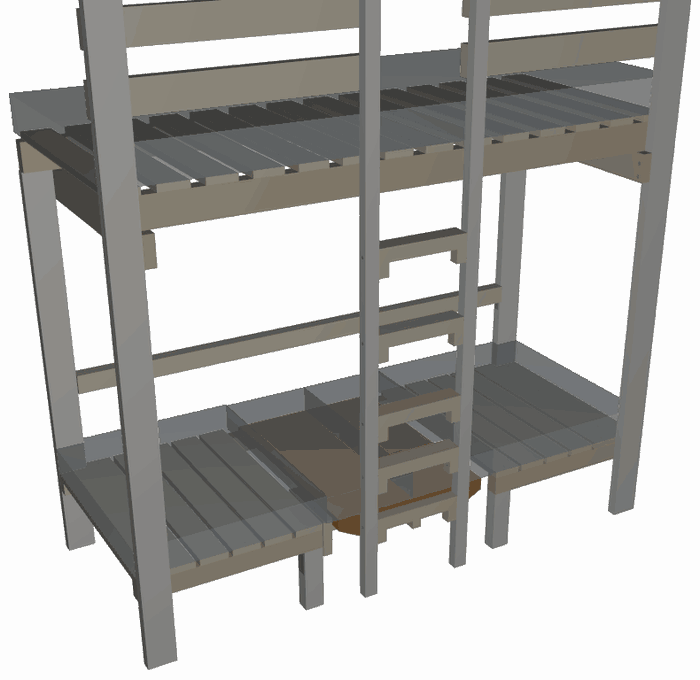

# HANNA — loftseng, byggeveiledning

HANNA er en loftseng med sofa, bord og ekstraseng under. Den er bygget på mål
for en nisje mellom to vegger og står **inntil bakveggen og inntil begge
sideveggene**. Den bygges på plass.

> **Denne sengen er ikke reversibel.** Den lange baksiden skal stå mot vegg og
> skal skrus fast i veggen. Det er ikke rekkverk på baksiden — der er veggen
> sperren. Snur du sengen, mangler den et rekkverk.

---

## Sånn henger papirene sammen

Alle mål er regnet ut fra modellen `generate_loftbed.py` og skrevet ut av
`mise run build`. Ingen mål er skrevet inn for hånd noe sted. Endrer du
modellen, endrer tabellene seg med den.

| Fil | Hva du finner der |
|---|---|
| [generated/kappliste.md](generated/kappliste.md) | Hver del: dimensjon, lengde, antall, hvor den sitter — og om den kappes ferdig nå eller med overmål og tilpasses i rommet |
| [generated/innkjopsliste.md](generated/innkjopsliste.md) | Hva du skal kjøpe, og hvilke deler som kappes av hvert bord |
| [generated/nokkelmal.md](generated/nokkelmal.md) | Ytre mål, alle høyder, alle dybdeplan, stige- og rekkverksmål, skruerader, madrassmål, sikkerhetsmål |
| [generated/beslagliste.md](generated/beslagliste.md) | Alle beslag og skruer, hvor de går, hva som forbores, hvilken side du driver fra |
| [generated/byggesteg.md](generated/byggesteg.md) | Steg for steg i tekst |
| [MONTERING.md](MONTERING.md) | Steg for steg i bilder, samme nummer |
| [schematics/](schematics/) | Tegninger |

**Denne fila gjentar ingen av de målene.** Står et mål i en tabell der, står
det ikke her. Her står det hvorfor, og hvordan. Der et tall likevel dukker opp i
teksten, er det fordi tallet *selv* er begrunnelsen — og da står det alltid med
en henvisning til fila som eier det. Regnedelen i vedlegg A henter spennene sine
fra kapplista og nøkkelmålene.

---

## 1. Verktøy

| Verktøy | Til hva |
|---|---|
| Batteridrill, 18 V eller mer | Rammen er skrudd, ikke boltet — men det er mange 6 mm skruer i heltre, og de vil ha moment |
| Trebor ⌀6 og ⌀4 | Rammeskruene: gjennomgangshull i den ene delen, styrehull i den andre. Se forboringskolonnen i [beslaglista](generated/beslagliste.md) |
| Trebor i flere små diametre til forboring | Se forboringskolonnen i beslaglista. Forbor **alltid** i bordbærelekta, i bordene og i all endeved |
| Forsenker (kjeglesenker) | Alle skruehoder i flater man tar på: benkespiler, køyespiler, trinn |
| Forstnerbor ⌀18 og ⌀12 | ⌀18: setet under hvert skråskruehode (J8-B og J10) — boret går ned i hullet i vinkelklossen, som er det som holder vinkelen; se J8-B og [setedetalj.svg](schematics/setedetalj.svg). ⌀12: kontraborene i lektene og kilene under platen (J13a/J13b) |
| Fres med V-spor eller avrundingsfres — eller høvel, blokkhøvel, pussekloss | Kantbrytningen, avsnitt 3. Ingenting her krever fres |
| Bits Torx T20 / T25 / T30 | Etter skruestørrelse |
| Sirkelsag eller håndsag + anlegg | Alle kutt er 90°, med ett unntak: de to kilelektene sages på skrå i ett langsgående snitt (J13b). Ingen gjæring i hele sengen |
| Vinkelhake, minst 300 mm | Rett vinkel i bakrammen og i sengeflaten — mål diagonalene |
| Vater, minst 600 mm | Endebjelker og vanger |
| Linjelaser, selvnivellerende kryss | Høyderisset rundt nisja og loddlinja midt i den. All oppmåling av rommet skjer fra risset — se avsnitt 3 |
| Tommestokk og målebånd | |
| To skrutvinger, minst 300 mm | Holder deler mens du borer gjennom begge samtidig |
| Blyant og syl | Merking av borsentre |
| Én person — to ved reisningen | Steg 2 (bakrammen tippes opp) og steg 4 (den fremre sidevangen løftes opp på begge endebjelker samtidig). Resten er skrevet for én mann med tvinger og hjelpelister |

---

## 2. Trevirke og beslag

Kjøp: [innkjøpsliste](generated/innkjopsliste.md).
Kapping: [kappliste](generated/kappliste.md).
Beslag og skruer: [beslagliste](generated/beslagliste.md).

Alt trevirke er høvlet konstruksjonsvirke C24. Alle beslag og skruer er
elforsinket eller varmforsinket.

**Det går ikke én bolt inn i en stolpe i denne sengen.** Stolpene er tynne på
tvers av rommet, og på den tykkelsen får en M8 ikke den kantavstanden en bolt
krever — den ville sprenge stolpen på langs. Hvert eneste ledd inn i en stolpe
er derfor **forborede treskruer i 6 mm** — det samme mønsteret som stigevangene
bruker. For en 6 mm skrue er kravet til kantavstand nøyaktig det en
stolpetykkelse gir på midtlinjen.

Det er ikke en nødløsning. **Tre bærer på tre der tre kan bære på tre.** Hver
eneste lange del hviler på noe: sidevangene på endebjelkene, den bakre
sidevangen rett på stolpetoppene, benkevangene på stubbeføttene. Ingen av *de*
skruene er opplegg.

Tre hjørner har ikke noe å hvile på, og der går den loddrette reaksjonen
gjennom stål. Det står her, rett ut, fordi det er der antallet skruer betyr
noe:

* **J1**, endebjelken mot stolpen: to 6×80 i skjær ≈ 4,0 kN mot ≤ 1 kN
  hjørnereaksjon — utnyttelse **0,25**.
* **J8**, den fremre benkevangebiten mot stolpen: to 6×80 ≈ 4,0 kN mot
  0,5 kN — **0,13**.
* **J8-B**, den bakre benkevangen mot stolpen: to skrå 6×80 ≈ 4,0 kN mot
  0,5 kN — **0,13**. Skruene står skrått i planet, men lasten står loddrett
  på dem uansett, så skråstillingen koster ingenting.

**Her sto det åtte bæreklosser før, og de er tatt bort.** Argumentet for dem
var at delen skulle *bære på tre* i stedet for å henge i skruer. Følg det ett
skritt til, og det spiser seg selv: klossen står ikke på noe heller. Den
henger på stolpen i **én** 6 mm skrue — 2,0 kN mot inntil 1 kN, utnyttelse
0,50, den høyeste skrueraden i hele sengen. Klossen tok ikke lasten ut av
stålet; den halverte stålet leddet ellers hadde hatt.

Sprekkfaren klossen ble kjøpt mot er også målt nå. Skruene i bjelkeenden står
18 mm (3 × skruediameteren) fra bjelkens ende langs fiberretningen og 19 mm
(3,2 ×) fra kanten i den retningen lasten virker, i 36 × 98 mm C24. Det er et
helt vanlig omlegg, med bedre kantavstand enn regelen krever — ikke en sprø
endeskjøt.

**Det klossen egentlig var, var en jigg:** en hylle å legge delen på mens du
skrudde den fast. Den jobben gjør nå hullene. Alle gjennomgangshull bores i
steg 0, gjennom begge deler samtidig med delene tvunget sammen, og et
hullmønster har nøyaktig én stilling der det står over seg selv. Delen kan
ikke settes i feil høyde.

Alt dette står i lasttabellen i vedlegg A, rad for rad. Bolten er fortsatt
borte, og det er fortsatt riktig.

**Og én ting til, som ikke er statikk:** ingen skruehoder står på sengens
front. Alt fra vangenes ytterflate og fram til stolpeplanet er den eneste
flaten noen ser på, og J2, J3 og J8 skrus derfor **innenfra og ut** — gjennom
den 48 mm tykke vangen og inn i den 36 mm tykke stolpen eller stigevangen, i
stedet for omvendt. Begge veier holder målene like godt (36 + 48 er det samme
som 48 + 36, og spissdekningen er 4 mm uansett vei), så det er utseendet som
avgjør, og modellen har en assert som sier det: ingen festemiddelhoder på en
romvendt flate. Rekkverksbordene har vært skrudd slik hele tiden.

**Og du kommer til.** Bak hvert eneste av de hodene står det over 700 mm åpen
luft — inn i den tomme sengerammen for J2 og J3, inn i det åpne benkerommet
for J8 — på det tidspunktet i rekkefølgen leddet skrus, og faktisk også i den
ferdige sengen. Alle tre skrus før spilene går på. En drill med bits er en
kvart meter.

**Én konsekvens til, og den er god:** ingenting i rammen festes lenger fra en
flate som ender mot vegg. Da finnes det heller ingen skruehoder som må senkes
ned under en monteringsflate — ingen forsenkte boltehoder, ingen store
forsenkingshull, og ingen deler som må boltes ferdig før de får møte veggen.

Stål brukes bare to steder: vinkelbeslagene under stubbeføttene og
vinkelbeslagene under bordbærelektas ender. Platemekanismen er ren tre —
lektene gjør hele jobben, se J13.

**Det står ingen lås i beslaglista, og det er ikke en glipp.** Låsen i
sengestilling var det siste åpne valget i platemekanismen. Valget er tatt: det
blir ingen lås. Begrunnelsen står i vedlegg B, avvik 4, og treverket den ville
tatt tak i står der det sto — se J13.

## 3. Byggerekkefølgen — og hvorfor den er som den er

Sengen står i en nisje. Tre av flatene er vegg. Det bestemmer alt.

**Hele baksiden av sengen er ett flatt lag.** Bakre sidevange, de to bakre
stolpene, bakre benkevange, bakre bordbærelekt, endene av begge endebjelker og
bakkanten på hver eneste spile ligger i ett og samme plan — og det planet er
monteringsflaten mot veggen. Ingenting stikker bak det.

Det gir to konsekvenser som styrer rekkefølgen:

* **Baksiden er en ramme, så bygg den som en ramme.** De bakre delene henger
  sammen i ett plan. Legg dem ut på gulvet, skru dem sammen der, og reis
  bakrammen som ett stykke. Da får du gjort alt som skal gjøres fra flater som
  senere ender mot vegg.
* **Veggfestet er den bakre sidevangen selv.** Vangen ligger flatt mot veggen i
  hele sin lengde, så sengen skrus fast rett gjennom den og inn i stenderne. Det
  trengs ingen brakett og ingen kloss. De samme skruene støtter dessuten vangen
  på midten, så det lange spennet den ser ut til å ha på papiret er ikke det
  spennet den faktisk får.

Og det som *ikke* går an, hvis du bygger i feil rekkefølge:

* **De bakre delene er fanget mellom stolpene.** Den bakre benkevangen og den
  bakre bordbærelekta er kappet til å fylle nøyaktig fra stolpe til stolpe. Står
  begge stolpene først, får du dem aldri inn — de er akkurat for lange til å
  vippes på plass, og det er meningen: det er slik de får endefeste i begge
  ender. De må legges inn mens rammen ligger flat.
* **Fronten stenger.** Alt som skal inn bakfra må være inne før den fremre
  sidevangen går på.

Derfor:

1. **Bakrammen bygges liggende, midt på gulvet** — to korte stolper og de tre
   vannrette bakre delene, som ikke kan settes inn senere.
2. **Bakrammen reises og skrus fast i veggen.** Nå står baksiden, i lodd og i
   vater, og resten bygges framover fra den.
3. **Endene bygges ut:** fremre stolpe, så endebjelke. Én ende av gangen.
   Det står ingen kloss under bjelkeenden — de forborede hullene er jiggen.
4. **Fronten lukkes:** fremre sidevange, så de to fremre benkevangene, alle
   fire stubbeføtter og de to endelistene — hele benkens bæreverk i samme
   kotehøyde.
5. **Resten kommer forfra og ovenfra:** stige, benkespiler, køyespiler,
   rekkverk, plate, madrass.

Den samme rekkefølgen, med sjekkpunkter for hvert steg:
**[byggesteg.md](generated/byggesteg.md)**. Med bilder:
**[MONTERING.md](MONTERING.md)**. Oversiktstegning:
[schematics/byggerekkefolge.svg](schematics/byggerekkefolge.svg).

**Og før steg 1: bryt kantene.** Det gjøres i steg 0, mens delene ennå er løse
på bukken. Kravet står under.

### Rommet først — før noe kappes

Nisja er ikke et rektangel. Vegger heller, gulv faller, og hjørner er sjelden
90°. Senga skal stå i vater og lodd likevel. Regelen er derfor:

**Senga er referansen, ikke rommet — bygg i vater og lodd, og ta skjevheten i
delene som møter vegg og gulv.**

Det deler kapplista i to, og delingen er en regel i modellen, ikke en
håndskrevet liste: en del som kommer inntil en endevegg, eller som står på
gulvet, får sluttmålet sitt av rommet. De delene står for seg selv i
[kapplista](generated/kappliste.md), med overmålet sitt i egen kolonne. Resten
kappes ferdig på bukken.

To ting må være på plass før kappingen:

* **Spikerslag i veggen.** Senga ligger flatt mot veggen i noen få
  høydebånd, ikke overalt. Sonene er regnet ut av modellen og står i
  [byggesteg](generated/byggesteg.md#før-steg-0--mål-rommet) — i **to
  notasjoner**: over ferdig gulv, og som fortegnstall fra høyderisset (minus
  er under laserlinja, pluss er over). Gulvet er skjevt og risset er ikke, så
  det er den andre kolonnen du setter sonene etter. Legg dem mens
  veggen er åpen — etterpå kommer du ikke til.
* **Et vannrett høyderiss rundt hele nisja.** Alt måles fra risset, aldri fra
  gulvet. Framgangsmåten — loddlinje midt i nisja, rutenett mot hver
  endevegg, minste sum er minste bredde — står samme sted.

Blir minste bredde et annet tall enn det modellen står på, er det ett tall som
skal endres: `WALL_SPAN` i `generate_loftbed.py`. Kjør `mise run build`, og
kapplista, innkjøpslista og nøkkelmålene følger etter.

**De fire hjørnestolpene har null klaring mot endeveggen.** Modellen setter dem
i selve veggplanet, så en bul i veggen har ingen luft å forsvinne i: enten går
den av treet, eller så skyver den hele rammen ut av lodd. Derfor er dette fast
framgangsmåte for hver av de fire, ikke et unntak ved store avvik: sett
stolpen på plass, hold den i lodd, strek opp veggsiden med avstandskloss —
meddrag — og høvle av til stolpen står i lodd inntil veggen. Det er materiale
som fjernes; det legges ingenting på i bredden, og den nominelle dimensjonen i
kapplista står. Stolpene bærer begge behandlingene i
[kapplista](generated/kappliste.md): overmål i bunn og oppstreking av siden.

Kanter som møter vegg eller gulv kappes med lite bakfall. Da er det bare den
synlige kanten som bestemmer fugen.

### Kantbrytning — alle kanter et barn kan nå

**Alle kanter et barn kan nå skal brytes.** Kravet er *brutt kant*, ikke én
bestemt metode: 45° fas eller avrunding (R6,35 eller R9,5), byggerens valg
kant for kant. Skarpkantet høvlet C24 er skarpt nok til å skjære, og det blir
ikke rundere av at noen maler det.

Tre steder er verdt å nevne ved navn:

* **Plateenhetens underside** — styrelektenes nedre kanter og kilelektenes kanter.
  Dette er kanten ingen ser: den sitter under bordplaten, i knehøyde for den
  som sitter ved bordet. Etter X9 er den knehøyden ikke lenger et bilde: platen
  er en pult med 262 mm under seg, og knærne står faktisk der inne. 68 mm
  skarpkantet lekt mot et kne er det eneste stedet i denne sengen der en kant
  treffer noen som ikke ser den komme.
* **Platens egne kanter, alle fire.** Den håndteres hver gang stillingen
  skiftes, og et kappet finérdekke gir flis.
* **Alt man allerede tar på:** stolper, rekkverksbord, trinn og
  stigevangenes kanter.

Verktøy: fres med V-spor eller avrundingsfres for den som har fres. Har du det
ikke, gjør en håndhøvel, en blokkhøvel eller en pussekloss nøyaktig samme
jobb. Det er noen millimeter tre som skal bort, ikke en profil som skal
lages — ingenting her krever fres.

Det er lettest mens delene er løse, altså i steg 0. En kant som bare er
tilgjengelig fra én side etter at delen står i rammen, tar dobbelt så lang tid
og blir halvparten så pen.

**Modellen tegner fortsatt hver del firkantet.** Kantbrytningen er en instruks,
ikke geometri, og den flytter ingen mål: ingen lengde, ingen klaring og ingen
skruerad endrer seg av at en kant er brutt.

### Tre ting du skal kontrollere hele veien

* **Vater.** Den bakre sidevangen først — den er referansen for alt annet. Så
  hver del etter hvert som den går inn. En vange som ikke er i vater tar du ikke
  igjen senere.
* **Vinkel og diagonal.** Mål diagonalene i bakrammen før den reises, og i
  sengeflaten når begge sidevanger står.
* **Veggklaringen.** De gjennomgående delene er med vilje kappet kortere enn
  veggavstanden, slik at de kan svinges inn. Klaringen er liten. Sjekk at ingen
  del blir stående i spenn mot en vegg, og at ingen spile eller skruehode
  stikker ut i veggplanet.

### Forboring — kort regel

* **Bor gjennomgående hull gjennom begge deler samtidig**, med delene tvunget
  sammen. Bores de hver for seg, treffer de ikke.
* **Forbor hver eneste treskrue.** Ingen unntak i bordbærelekta, i
  bordene og i endeved.
* **Ingenting i rammen er boltet.** Hele rammen er skrudd, med forborede
  6 mm treskruer. Se J1, J2, J3 og J8.
* Diameterne står i forboringskolonnen i
  [beslaglista](generated/beslagliste.md).

---

## 4. J — leddene

Antall, skruetype, forboring og hvilken side du driver fra står i
[beslaglista](generated/beslagliste.md). Skrueradenes høyder står i
[nøkkelmål](generated/nokkelmal.md). Her står hva leddet er og hva som er
poenget med det.

### J1 — Endebjelke → hjørnestolpe

Endebjelken støter mot stolpens innside og skrus gjennom bjelken og inn i
stolpen. Skruene går på tvers av fiberretningen i begge deler, ikke inn i
endeved.

**De to skruene er hele festet.** Det står ingen kloss under bjelkeenden — den
sto der til denne runden, og den er tatt bort, fordi en kloss som selv henger i
én skrue gir leddet halvparten så mye stål som bjelkens egne to. Se avsnitt 2
og lasttabellen: 4,0 kN mot en hjørnereaksjon på høyst 1 kN, utnyttelse 0,25.

Skruene står 18 mm fra bjelkens ende og 27 mm fra over- og underkant. Begge er
over minstekravet for en 6 mm skrue, og den som betyr mest her — kantavstanden
i lastretningen — har halvannen gang så mye.

**Hullene er jiggen.** Gjennomgangshullene i bjelken og styrehullene i stolpen
bores i steg 0, gjennom begge deler samtidig. Da har bjelken nøyaktig én høyde
der hullene står over hverandre, og du kan ikke montere den skjevt. Bygger du
alene: klem en list på stolpens innside i høyde med bjelkens underkant, legg
bjelken på den, skru, og ta listen av igjen.

Skruene drives inne fra sengen. Du kommer til dem når som helst, både under
byggingen og når du skal ettertrekke.

### J2 — Fremre sidevange → fremre hjørnestolpe

Vangen ligger flatt mot stolpen. **Skruene drives innenfra og ut:** du står
inne i sengerammen — den er tom, spilene kommer flere steg senere — og skrur
gjennom vangens innside, gjennom vangen og inn i stolpen.

Det er en utseendebeslutning, og den er tatt bevisst. Stolpens forside er en
av de flatene rommet faktisk ser, og der skal det ikke stå skruehoder. Begge
retninger holder målene like godt: 48 mm vange pluss 36 mm stolpe er det
samme stykket tre som 36 pluss 48, og spissen har 4 mm tre bak seg uansett vei
— så det er ikke statikken som velger. Se avsnitt 2.

Vangen bærer ikke i skruene — den ligger på begge endebjelker.

Merk skruelengden: skruen skal **ikke** komme ut på stolpens forside. Bruk
lengden som står i beslaglista, ikke den lengste du har i esken.

### J2-B — Bakre sidevange → bakre hjørnestolpe

Dette leddet er annerledes, og det er meningen. Den bakre stolpen står **i
vangens eget plan** og er kappet slik at den slutter akkurat under vangen.
Vangen **hviler rett på stolpens endeved**. Hjørnereaksjonen går vange → stolpe
→ gulv som ren trelagring, uten et eneste festemiddel i lastens vei.

Festet er derfor bare et bånd som holder de to sammen mot vridning og løft. To
kraftige skruer settes rett ned gjennom vangen i stolpens endeved, mens
bakrammen ennå ligger flatt på gulvet. Forsenk hodene godt — køyespilene skal
ligge flatt over dem.

Et rett beslag over skjøten ville vært det opplagte, og det går ikke: vangen er
dypere enn stolpen, så den står et lite stykke proud av stolpens romside, og en
rett plate ville bare ligget an mot den ene av dem. Skruer ned i endeveden er
svakere i uttrekk enn et beslag, men her holder de bare igjen — lasten står på
tre, og veggfestet sitter i den samme vangen noen centimeter unna.

**Ikke sett noe på veggsiden.** Den flaten skal være helt plan.

### J3 — Stigevange → fremre sidevange

Tre kraftige treskruer gjennom sidevangen og inn i stigevangen. Leddet er
skrudd, ikke boltet — samme mønster som resten av rammen bruker, se J1, J2
og J8. Tre og ikke fire: omlegget er 48 × 98 mm, og fire 6 mm skruer i én rad
ville krevd 108 mm der det er 98. Fire i to par ville krevd 60 mm på tvers der
det er 48.

**Retningen er innenfra og ut**, som J2 og av samme grunn: stigevangens
forside står i sengens front, og der skal det ikke stå skruehoder. Klem stigen
fast mot sidevangen først — du står på den andre siden når du skrur.

Stigevangen står med den tynne siden mot rommet, så skruene treffer den på
midtlinjen med akkurat den kantavstanden en 6 mm skrue skal ha.

Forbor gjennomgående i sidevangen, og forbor i stigevangen også. Skruene sitter
i én loddrett rad, én over og én under vangens midtlinje med den tredje midt
imellom, slik at leddet tar moment.

### J4 — Rungetrinn → stigekloss og stigevange

Trinnet ligger på klossen. Det er **ett** festemiddel i dette leddet, og det er
den kraftige skruen fra utsiden av stigevangen inn i trinnenden. Gjennom
trinnets overside går det ingenting.

Skruen i trinnenden bærer **ingen** vertikal last — den holder bare trinnet på
plass sideveis. Vekten din går rett ned i klossen og videre inn i vangen. Det er
riktig utformet, og det er grunnen til at trinnet ikke kan glippe selv om skruen
i endeveden skulle løsne.

**Her sto det en 5×60 ned gjennom trinnet og inn i klossen, og X10 strøk den —
fordi den ikke kunne eksistere.** Den hadde ingen lovlig plass å stå på: vangens
36 mm dybde låser hvor gjennomgangsskruen i trinnenden kan stå i dybden,
trinnets 48 mm låser hvor den kan stå i høyden, og en skrue som slippes ned fra
trinnets overside må krysse hele trinnet for å nå klossen — altså rett gjennom
6×120-ens egen kanal. Snus den, og drives opp nedenfra, klarerer den 6×120-en
med 12 mm og lander i stedet på J5, som sitter midt i klossens egen høyde og
heller ikke kan flytte seg. Klossen kan ikke ta en loddrett skrue så lenge
trinnet har en vannrett.

**Så jobben er lagt på treet i stedet, og det er en bedre begrunnelse enn den
strøkne skruen var.** Klossen er fanget mellom tre ting: vangeflaten den er
skrudd til, trinnet som ligger på 1296 mm² av oversiden hennes, og at det
trinnet selv er naglet til vangen 24 mm lenger opp av 6×120-en. Skal klossen
rotere om sin ene skrue (J5), må den løfte et trinn som er skrudd fast. Det er
lås av tre, ikke av stål — og det er den samme forskjellen som skiller
stigeklossen fra bordklossen i J5-B, der det ikke ligger noe trinn oppå og
klossen derfor må ha to skruer.

Trinnene stikker **bakover**, ikke framover: forkanten ligger i flukt med
stigevangens forkant, og det som blir liggende bak vangeplanet er hylla den løse
platen hviler på. Etter X9 gjelder den setningen bare **trinn 1**: i
bordstilling hviler platen ikke lenger på et trinn i det hele tatt, men på de
to bordklossene — se J5-B.

**Klossen følger ikke trinnet bakover.** Den er 36 mm dyp — nøyaktig så dyp som
stigevangen — og står i vangens eget dybdebånd, ikke i trinnets. Klossen har
aldri rørt mer av vangen enn de 36 millimeterne, så de 37 som er kappet vekk
(K1) bar ingenting; de sto derimot rett i veien for den løse platen når den
skal bæres fra det ene setet til det andre. Se J13. Det betyr også at trinnets
bakre 32 mm står **fritt** ved endene: trinnet er 68 mm dypt og vangeplanet tar
de fremste 36, så det er en 48 mm tykk kloss tre som stikker 32 mm ut, ikke et
spenn.

**Stigen er to løp, og det er X9 som gjorde den til det.** Trinnoverkantene
står på 297, 572, 848, 1073 og 1298, og stigningskjeden fra gulv til spilebunn
er 297 + 275 + 276 + 225 + 225 + 225. Fem trinn som før; det er ikke antallet
som er endret, det er fordelingen. Grunnen står i J13 og i 8.2: platen skulle
opp i pulthøyde, og da måtte trinn 3 opp av veien for løftet — nøyaktig 61 mm,
til 848. Til og med v15 sto trinnene på 297, 542, 787, 1032 og 1277, med
245 mm mellom hvert.

Det er verdt å si nøyaktig hva som ble gitt opp og hva som ikke ble det.
**Stigningsgrensen står urørt:** største klatretrinn er 276 mm mot 280 — og det
er **det** tallet EN 131s bånd 250–300 gjelder for i denne fila. De fem
klatretrinnene ligger på 275, 276, 225, 225 og 225: de to nederste er inne i
båndet, de tre øverste ligger under det. Å ta et kortere steg enn normen legger
opp til er ikke en fare, det er bare tettere trinn; det er den *lange*
stigningen grensen på 280 vokter, og den er ikke rørt. Det som ble gitt opp er
*jevnheten*,
som X1/X2 selv skrev ned som en utseendebeslutning — og den er ikke slakket,
den er **delt**: inne i hvert av de to løpene er stigen jevn til 1 mm (grensen
er 2), og forskjellen mellom de to løpene er 51 mm mot en ny og egen grense på
60. Den grensen er hevet fra 20, i åpent lende og med begrunnelse, og ingen
regel er fjernet. Det som skiller de to løpene er løftesjakten platen skal opp
gjennom, og den er en **inngangsverdi** til stigen nå: ingen trinnoverkant får
ligge i båndet 614..848, og stigen regnes ut av det kravet — færrest trinn,
så flatest, så lavest kryssing. Flytter platen seg igjen, regnes stigen om;
ingen setter et trinn for hånd.

Første steget, de 297 fra gulvet opp på benkevangen, er fortsatt en avsats du
trår opp på og ikke et klatretrinn — og trinn 1 står fortsatt på 297 og bærer
fortsatt sengemodus-platen. X9 rørte stigen **over** trinn 1 og ingenting
annet.

### J5 — Stigekloss → stigevange

Én skrue per kloss, inn i vangens innside. Klossen dekker bare 36 × 48 mm av
stigevangen, og to 5 mm skruer trenger 50 mm av de 48. Klosshøyden er
trinnhøyden. Mål to ganger.

**K1 endret ingenting i dette leddet.** Klossen ble kappet 73 → 36 mm, men de
36 × 48 millimeterne mot vangen er de samme — det var alt klossen noen gang
rørte, siden vangen bare er 36 mm dyp. Det ene som ble bedre er hvor skruen
lander: før satt den på Y 751,5, altså en halv millimeter **utenfor** vangens
bakplan, fordi den ble sentrert i en 73 mm lang kloss. Nå sitter den på Y 770,
midt i vangen.

Klossen er ikke overlatt til den ene skruen — men det som holder den er
**tre**, ikke en skrue til. Trinnet ligger på 1296 mm² av klossens overside, og
trinnenden er skrudd til stigevangen med en 6×120 gjennom vangen, 24 mm over
klossens egen skrue. De to festene deler samme hjørne, og skal klossen rotere om
skruen sin, må den løfte et trinn som er naglet fast. X10 strøk den loddrette
5×60-en ned gjennom trinnet som sto her før — se J4 for hvorfor den ikke kunne
stå noe sted.

### J5-B — Bordkloss → stigevange

**De to eneste nye delene i X9.** En **48×68**-lekt kappet **91 mm** og satt på
**høykant** — Z 614–682 — én på hver stigevanges innerflate, i stigeklossenes
egen X. Dette er hylla bordplatens forkant lander på i bordstilling — jobben
trinn 2 hadde til X9 tok platen opp i pulthøyde og la den i et høydebånd der det
ikke får stå et trinn. *X9 skrev denne klossen som en 36×48 × 108 av stigens
eget bord; X10 gjorde den om, og det er hele avsnittet under.*

**Klossen gjør to ting, og de deler de 91 millimeterne mellom seg.** De
**fremste 36 mm** (Y 752–788) ligger mot stigevangen og er innfestingen — 36 mm
er alt vangen har å tilby i dybden, og det tallet kan aldri endres. De
**bakerste 53 mm** (Y 697–750) stikker **bak** vangen, ut i det samme
dybdebåndet trinnenden ligger i, og *er* hylla platen lander på. De 2
millimeterne imellom er den samme innsettingsklaringen platens forkant har mot
vangen — de bærer ingenting og skal ikke bære noe.

**De 53 millimeterne er regnet ut, ikke valgt.** Kravet i modellen er 5000 mm²
bæreflate per bærelinje. Klossen er 48 mm bred, og det er to av dem, så hylla
må være 5000 / (2 × 48) = 52,1 mm dyp — rundet opp til 53. To ganger 48 × 53 er
**5088 mm²**. Blir kravet strengere, blir klossen lengre; ingen skrev 91.

**To skruer, og høyden er kjøpt for å få plass til dem:** to Treskruer 6×80
forsenket, **stablet i høyden**, fra stigevangens **utside** — altså fra
benkerommet — gjennom de 48 mm vangen og 32 mm inn i den 48 mm brede klossen.
Flaten klossen dekker av vangen er 36 × 68 mm. De 36 tar én skrue på tvers
(2 × 3d), akkurat som før; det nye er de **68 i høyden**, som er 2 × 3d + 4d =
60 med 8 mm til overs. Forbor gjennomgående i vangen og forbor i klossen.

**Og her er forskjellen fra stigeklossen, sagt rett ut — det er den som betaler
for den andre skruen.** Stigeklossen har et trinn liggende oppå seg, og det
trinnet er selv naglet til vangen: klossen kan ikke rotere om sin ene skrue uten
å løfte et trinn som er skrudd fast. Bordklossen har ingenting oppå seg — bare
platen, som *ligger* der og løftes vekk to ganger om dagen. Og platas last står
ikke over skruelinja: den står **46 mm foran** den, ute på hylla. Det er et
moment som ligger i selve innfestingsflaten, og med bare én skrue finnes det
ingen arm å ta det i — da bæres det i friksjon og bøyd skaft, som ingen rad i
lasttabellen kan regne på. To skruer stablet i høyden gjør momentet om til et
skruepar i motsatt skjær over 24 mm arm. Det er derfor klossen ble 68 mm høy:
**høyden er den eneste dimensjonen som var ledig.** De 36 er vangens egen dybde
og kan aldri vokse.

**Og profilen er ikke en ny profil.** 48×68 er dimensjonen sengen har fra før —
benkevangene, bordbærelekta, stubbeføttene og de fire platelektene — så
omleggingen koster ingenting nytt i hylla. Den tar til og med to biter *bort
fra* 36×48-bordet, som er den knappeste dimensjonen i sengen, og legger dem på
et 48×68-bord som hadde over fire meter rest.

**Overkanten er målet.** Begge klossene skal ha overkanten i nøyaktig samme
høyde som bordbærelektas overkant bak — platen hviler på de tre samtidig, og
står én av dem skjevt, vipper platen. Mål høyden fra stigefoten, ikke fra
gulvet. Klossene skrus på mens stigen ennå ligger flatt, før den reises.

**Og plateenheten kjenner ikke forskjell.** Klossen vokste **innover** i
stigeåpningen, ikke utover, så ytterflaten står i nøyaktig det planet trinnenden
sto i — X 835 og 1155 — og styrelektene finner den på samme måte og med samme 2 mm passing.
Det eneste som er annerledes er at sjakten er dypere: lekta lapper **53 mm** av
klossen i dybden der en trinnende ga den 30. Se J13a.

### J6 — Køyespile → sidevange

Spilene ligger **oppå** begge vanger, ikke i et spor og ikke på en lekt. Én skrue
ned i hver vange per spile. Forsenk hodet under flaten — det ligger madrass over.

Alle 14 køyespilene er nøyaktig like lange — 800 mm, samme stykke som
benkespilen. Den første ligger på X 20 og den siste på X 1970; delingen står i
[nøkkelmål](generated/nokkelmal.md).

### J7 — Rekkverksbord → hjørnestolpe og stigevange

Rekkverksbordene ligger på **innsiden** av stolpene og stigevangene, mot sengen.
Hvert bord tar tak i en hjørnestolpe i den ene enden og i en stigevange i den
andre, med full flate mot begge. Skruene drives fra sengesiden.

Bordene stopper i flukt med stigevangenes innside, slik at klatreåpningen
fortsetter rett opp forbi rekkverket. Man klatrer **gjennom**, ikke over.

Det er ikke rekkverk på baksiden. Se sikkerhetsavsnittet.

### J8 og J8-B — Benkevange → hjørnestolpe

To ulike ledd, ett foran og ett bak.

**J8, foran:** vangebiten ligger flatt mot stolpen, og skruene drives
**innenfra og ut**, fra vangens innside og inn i stolpen — samme detalj som
J2, og av samme grunn: stolpens forside skal stå uten skruehoder. Du kommer
til ovenfra så lenge benken er åpen, altså før benkespilene går på.

De to skruene er hele endefestet: 4,0 kN i skjær mot en endereaksjon på
0,5 kN. Det sto en bærekloss under denne enden til denne runden; se avsnitt 2
for hvorfor den er borte.

**J8-B, bak:** den bakre benkevangen går fra stolpe til stolpe og støter mot
stolpens sideflate med enden. Her går skruene **skrått** fra vangens forside inn
i stolpen. Forbor hele veien — en skråskrue nær en ende er den letteste måten å
sprekke en vange på.

**Hver skråskrue får et sete, og setet bores først.** Et 90° forsenk som møter
flaten i 25–30° kan ikke ligge i plan, og har aldri kunnet det. Det som ligger i
plan er et **flatbunnet sete boret langs skruens egen akse**: ⌀18 forstner.
Bunnen står vinkelrett på skruen, og dermed vinkelrett på hodet, så hodet legger
seg flatt og ender **helt under treet**. Alt om setene er tegnet opp på
[schematics/setedetalj.svg](schematics/setedetalj.svg) — snitt langs aksen,
munningen ovenfra, borjiggen og bruken av den.

**Dybden er 20 mm på J8-B og 18 mm på J10, og forskjellen har en grunn.** Et
forsenket hode i en flat bunn har to steder å lande. Det ene er bunnen. Det
andre er **kanten av forborhullet**: konusen går fra ⌀11,8 ned til ⌀6, og står
den på den kanten i stedet, ligger hodet 2,9 mm høyere enn tegningen sier. På en
skrue som står 25° på flaten spiser de 2,9 mm 1,23 mm av tredekket. Med 18 mm
sete ble regnestykket på J8-B:

| | hodet på bunnen | konusen på forborkanten |
|---|---:|---:|
| J8-B, 18 mm (før) | 2,26 mm | **1,03 mm** |
| J8-B, 20 mm (nå) | 3,11 mm | 1,88 mm |
| J10, 18 mm | 4,89 mm | 3,76 mm |

Kravet er 1,0 mm. En margin som forutsetter at skruen finner bunnen av sin egen
lomme er ingen margin, så J8-B er boret 2 mm dypere. J10 er ikke i nærheten og
står uendret. Alle tallene er målt på kroppene i modellen, og begge tilfellene
— hodet på bunnen og konusen på kanten — er egne asserter nå.

De 2 mm koster to ting og ingen av dem gjør vondt. Lommebunnen flytter seg
1,8 mm nærmere endeveden, fra 13,9 til 12,1 mm — men munningens egen nærmeste
kant har hele tiden ligget 12,7 mm fra enden og flytter seg ikke, så det er
bare hvem av dem som er nærmest som bytter plass. Og 20 mm av skruen går med i
lomma i stedet for 18, så J8-Bs 6×80 begraver 60 mm gjenger og J10s 5×60
begraver 42. Begge er kjørt gjennom de vanlige spiss-inne- og
spissdekningsasertene på nytt.

**Og treet MELLOM de to lommene er målt nå.** De to skråskruene i hver ende står
24 mm fra hverandre, som er rekkeregelen for en 6 mm skrue, men rekkeregelen
måler skruen og ikke hullet den ligger i: to ⌀18-lommer på 24 mm senteravstand
har 6 mm tre imellom. Det er nok her, og gulvet er skrevet ned til én
skruediameter slik at en senere endring ikke spiser det ubemerket.

**Vinkelklossen — borjiggen. To klosser, én per vinkel.** Et skrått hull startet
på frihånd vandrer, og det vandrer verst akkurat her: nær en ende, i en flate som
boret møter på skrå. Jiggen er derfor ikke en rampe boret hviler *på*, men et
hull det går *ned i*. Hver kloss er to biter av sengens egen 48×68, 200 mm
lange, skrudd flate mot flate. **⌀18 bores vinkelrett gjennom begge mens klossen
ennå er firkantet** — det er hele trikset — og først deretter kappes sålen av
under hullet på kappsag med bladet vippet **25° (J8-B)** hhv. **30° (J10)**.

Merk deg at vippen og flaten er komplementvinkler: 25° vipp gir en såle som står
**65°** på den borede flaten, og dermed 25° på hullaksen. Det er den vinkelen
leddet er regnet på. Kontrollmålet er munningen hullet etterlater i den ferdige
sålen — en ellipse på **42,6 × 18 mm** på 25°-klossen og **36 × 18 mm** på
30°-klossen. Mål den med tommestokken før klossen får røre sengen; er den for
kort, ble vippen satt på feil vinkel.

I bruk: klemt mot flaten med to tvinger, hullet over merket, offerkloss mot
endeveden, drill i gir 1 med slaget av. Både forstnerboret og forboret etterpå
går ned i det samme hullet. Klossene lages i steg 0 og er verkstedhjelpemidler,
ikke deler av sengen — de skal ikke bygges inn noe sted, og de går av restene
på 48×68-bordet.

I begge tilfeller er de to skruene hele endefestet. Det står ingen kloss under
noen av dem — de to skruene i hver ende tar reaksjonen i skjær med utnyttelse
0,13, og hullene fra steg 0 holder vangen i riktig høyde mens du skrur. Legg
gjerne en list eller en tvinge under enden hvis du er alene.

Vangen vipper ikke av at klossen er borte: den er festet i to punkter i hver
ende, over 68 mm høyde, og den andre enden står på en stubbefot.

### J10 — Benkevange → stubbefot

Foten står under vangen med hele endeflaten mot gulvet og hele toppflaten mot
vangen.

Vinkelbeslaget sitter i **hjørnet mellom fotens ytterside og vangens
underside**, og det er en ekte vinkel: den ene fliken ligger loddrett på foten
og skrus vannrett inn i den, den andre ligger vannrett under vangen og skrus
rett opp i den. To skruer i hver flik — det er det en 90 mm flik har lovlig
plass til. Beslaget er 40 mm bredt og ikke 65: en 65 mm flik ville stukket
17 mm ut av en 48 mm vange.

I tillegg går **én** skråskrue nedenfra opp gjennom foten og inn i vangen, fra
den fotsiden som vender inn mot benkeåpningen. Én og ikke to: foten er 48 mm
dyp — like dyp som vangen den bærer — og to 5 mm skråskruer ved siden av
hverandre trenger 50.

Skråskruen får **samme slags sete som J8-B**: ⌀18 forstner, 18 mm langs skruens
egen akse, boret med 30°-vinkelklossen. Hodet ligger flatt i en flat bunn og
står 4,89 mm under treet — 3,76 mm selv om konusen skulle stå på kanten av
forborhullet. Setet spiser 18 mm av lengden, så 5×60-skruen begraver 42 mm.
J10 er ikke i nærheten av grensen og er derfor ikke boret dypere slik J8-B er.
Se J8-B for hele detaljen og
[schematics/setedetalj.svg](schematics/setedetalj.svg) for tegningen; de står
bare ett sted.

De **fremre** føttene står akkurat der vangebiten slutter. Vangebiten skal ikke
stikke ut forbi foten i det hele tatt — den ender på den.

### J11 — Benkespile → benkevange

Én skrue i hver ende, ned i vangen. Forsenk. Dette er en sitteflate.

### J11-E, J16 og J17 — endespilen og endelisten

De tre leddene helt ute ved veggen. De finnes fordi soveflaten nede skal være
like lang som overkøyen, og fordi den bakre hjørnestolpen står i veien for en
vanlig benkespile der.

**J17 — endelist → bakre hjørnestolpe.** Listen er 36×48 × 98 mm og skrus
**flatt på stolpens forside**, med overkanten i flukt med benkevangens overkant
(297 mm over gulvet). To 5×60 ved siden av hverandre langs listen. Regn på
skruelengden før du bytter den ut: 36 mm går gjennom listen og 24 mm inn i en
stolpe som er 36 mm tykk, så det står 12 mm igjen til baksiden — og baksiden av
den stolpen **er veggflaten**. En 6×80 går tvers igjennom. Dette er det eneste
leddet i sengen som går inn i den bakre stolpens forside; flaten er 98 × 1402 mm
og helt ubrukt ellers.

**J16 — endespile → endelist** og **J11-E — endespile → fremre benkevange.**
Én 5×60 ned i hver ende, akkurat som J11. Endespilen er 764 mm og ikke 800: den
starter på stolpens forside. Legg den helt inntil naboen — spalten der skal være
null, ikke «omtrent null».

Listen henger i sine to skruer, uten kloss under, akkurat som J1, J8 og J8-B.
Lasttallet står i vedlegg A.

### J12 — Bordbærelekt → bakre hjørnestolpe

Lekta går fra stolpe til stolpe og støter mot stolpenes sideflater med endene,
akkurat som den bakre benkevangen. Men den bærer et bord, ikke bare seg selv,
og den skal kunne belastes rett ned uten å hvile på skruer i uttrekk — så hver
ende får et lite vinkelbeslag å hvile på. Beslaget står med den loddrette
fliken på stolpens innerflate og den vannrette fliken **under lektas ende** —
det er den veien rundt, og bare den veien: snudd andre veien ville den
vannrette fliken pekt ut i lufta over lekta og ikke båret noe som helst. Lekta
henger ikke i skruer — den ligger på beslaget.

Beslaget er 20 mm bredt, ikke 40. Stolpeflaten det ligger på er bare 36 mm
dyp; et 40 mm bredt beslag ville stukket ut av den — ut i **veggplanet**, som
skal være helt flatt. Én skrue i hver flik — en 40 mm flik har ikke lovlig
plass til to 5 mm skruer.

Lekta står **på høykant**. Legger du den flatt, ender overkanten 20 mm for
lavt, og platen når ikke det bakre opplegget sitt i bordstilling. Forbor.

Lekta må inn mens bakrammen ligger flat, av samme grunn som benkevangen: den er
kappet til å fylle nøyaktig mellom stolpene.

Lekta er det bakre opplegget for platen i bordstilling, og overkanten skal ligge
i nøyaktig samme høyde som de to bordklossene på stigevangene (J5-B). Da ligger
platen rett på alle tre, uten beslag og uten kile.

**X9 flyttet den 140 mm opp, og ingenting annet ved den.** Samme del, samme
lengde, samme to vinkelbeslag, samme ledd — den skrus bare høyere: underkanten
gikk fra 474 til **614** og overkanten fra 542 til **682**, som er bordplatens
nye underside. Det er den lette halvdelen av pulten; den vanskelige sto ved
stigen og heter J5-B. **Spikerslagsonen følger med:** sone 3 i veggen ligger nå
på 614–682 over ferdig gulv, altså −386..−318 fra høyderisset. Legger du
spikerslaget etter et gammelt ark, treffer skruene 140 mm for lavt. Sonene står
i [byggesteg](generated/byggesteg.md#før-steg-0--mål-rommet).

**X11 ga lekta et veggfeste også — J12-V, tre skruer inn i stenderne.** Sone 3
lå i veggen for lektas skyld, men fikk aldri en skrue: hele det bakre
opplegget for bordplaten hang i de to vinkelbeslagene i endene, med 1894 mm
fritt imellom. Nå går tre ⌀8 rett gjennom lekta og inn i veggen, midt i lektas
høyde, og spennvidden blir tre korte i stedet for én lang. Se J12-V nedenfor
for hvorfor det ikke rører noe av det som står over: beslagene bærer fortsatt
endene, skruen ligger vannrett og tar last i skjær — ikke i uttrekk — og
hodene forsenkes i lektas **forside**, så veggplanet er like flatt som før.

### J13 — Den løse platen

Platen er ikke et løst bord. Den er en liten enhet som **senkes rett ned** i den
stillingen den skal stå i, og løftes rett opp igjen. Alt annet i dette avsnittet
følger av den ene setningen: platen har null vandring i dybderetningen —
bakkanten *er* veggplanet og forkanten står 2 mm fra stigevangene — så den
eneste bevegelsen den har, er loddrett. Det gjelder platen **i setet**. Selve
byttet mellom de to setene er en annen sak, og den står nederst i avsnittet.

Vekten hviler på **tre**, ikke på stål: bakkanten på den bakre benkevangen
(sengestilling) eller på bordbærelekta (bordstilling), forkanten på **trinn 1**
i sengestilling og på **de to bordklossene** i bordstilling. Fram til X9 var
også den fremre bæringen i bordstilling et trinn — trinn 2 — men pulthøyden la
platen i et bånd der det ikke får stå et trinn, og da måtte forkanten få sitt
eget opplegg. Se J5-B.

**Og regelen om bæreflate ble generalisert i samme slengen.** Modellens
minstekrav på 5000 mm² gjaldt «per navngitt opplegg» så lenge hver bærelinje
var én del. Nå er forkanten i bordstilling **to** klosser i stedet for ett
trinn, så kravet er skrevet om til å gjelde **per bærelinje** — forkant og
bakkant, hver for seg, uansett hvor mange biter linja består av. Verdien er den
samme 5000, ingenting er unntatt, og de to bordklossene gir 5088.

**Og styringen er også tre.** Det står ikke ett vinkelbeslag i denne
mekanismen — den jobben gjør de to lange lektene — og det står ingen lås i den
(vedlegg B, avvik 4). Ikke én ståldel.

**J13a — avstivningslekter, som også er styrelekter.** To 48×68-lekter på
høykant under platen, fra det bakre opplegget og helt fram til platens egen
forkant (750 mm). To ting på én gang:

* **de gjør platen stiv.** Uten dem holder ikke den 18 mm plata når noen setter
  seg på den; med dem er platen to T-bjelker. Se lasttabellen i vedlegg A.
* **de er hele sidestyringen.** De ligger 77 mm inn fra hver sidekant, som er
  nøyaktig **2 mm utenfor trinnenden**. De siste 30 mm av hver lekt står i den
  frie sjakten ved siden av trinnet — 48 mm høy og 32 mm dyp, den biten av
  trinnet som stikker bak stigevangen — så det er 48 × 30 mm tre mot endeved
  som stopper platen sidelengs, ikke en 2 mm stålflik.

**Og i bordstilling er det bordklossen som styrer, i nøyaktig det samme
planet.** X9 tok trinnet vekk under platens forkant og satte to klosser der i
stedet (J5-B), men klossenes ytterflater står på X 835 og 1155 — der trinnendene
sto — med den samme 2 mm passingen. Det eneste som er annerledes er at sjakten er
romsligere: klossen står 68 mm høy der en trinnende gir 48, og lekta lapper
53 mm av den i dybden der et trinn ga den 30. **Plateenheten er uendret til
millimeteren**, og den kjenner ikke forskjell på de to.

Trinn 1 og bordklossene ender på nøyaktig samme sted i lengderetningen, så det
samme lektparet finner opplegget sitt i **begge** stillinger. De stopper platen
begge veier (den ene mot venstre, den andre mot høyre), og de stopper den i
å vri seg, fordi en vridning drar begge to samme vei — den ene kiler seg
uansett hvilken vei den vris. De 2 millimeterne er ikke slark: det er passingen
som gjør at platen kan senkes ned i det hele tatt.

**J13b — kilelektene under forkanten.** Trinnet er 320 mm langt og platen 574
bred, så 77 mm av forkanten utenfor hver styrelekt har ingenting under seg. To
korte kilelekter i flukt med forkanten bærer det hjørnet innover til
styrelekta.

**Hvorfor de finnes, og det er uendret:** dette er hjørnet et barn kneler på når
det klatrer opp fra benken, og det blir **ikke** bedre av at lektene flyttes
nærmere. En punktlast på et fritt platehjørne gir σ = 6P/t² = 18,5 MPa i 18 mm
plate uansett hvor nær nærmeste lekt står. Bare tre under hjørnet hjelper. Se
vedlegg A.

**Men de er kiler nå, ikke klosser.** Hver vinge er full 68 mm dyp ved **roten**,
der den støter mot styrelekta, og skråkappet i ett rett sagsnitt ned til **27 mm**
ved **spissen**, ute på platens egen ytterkant. Det lave ytterhjørnet — hele det
du så nedenfra — er borte, og det som står igjen følger momentet: en utkraging
har momentet sitt ved roten og ingenting ved spissen.

**Og kilen har TO skruer, ikke tre.** Det er K2 som gjorde det nødvendig, og
det er verdt å skjønne hvorfor, for det er ikke skruen som er problemet — det er
hullet den sitter i. Passer-på-flaten-regelen (`(n−1)·4d + 2·3d`) måler
**skaftet**: tre 5 mm skruer trenger 20 mm mellom seg og får plass på 77 mm. Men
hver av dem sitter i bunnen av et **⌀12 kontrabor**, og tre 12 mm hull med 20 mm
senteravstand står igjen med 8 mm tre imellom. På den gamle 116 mm-vingen kom
det aldri opp, fordi raden hadde 35,5 mm å spre seg på; på 77 mm faller den ned
på 4d-minimum og hullene møtes nesten. To skruer åpner den til 32 mm — 20 mm
tre — og lastsiden merker det ikke: oppskruene er tvinger for en limfuge, og
hele gruppa lå under 0,05. Modellen asserter det nå: **et kontrabor har sin egen
senteravstand, 24 mm, uavhengig av hva skaftet trenger.**

**27 er ikke et tall noen likte.** Det er oppskruens eget sete. Hver J13-skrue
har hodet 27 mm under platens underside — det er nøyaktig det «⌀12 kontrabor
41 mm opp i en 68 mm lekt» betyr — så vingen må være minst så dyp overalt der en
skrue går gjennom den. På akkurat 27 er kontraboret gått i null, og hodet ligger
i flukt med kilens egen underside. Boreregelen er derfor **den samme for alle
fire delene** og leses slik: *bor ⌀12 opp til det står 27 mm igjen.* I styrelekta
er det de 41 millimeterne; i kilen er det 29 og 12 mm ved de to hullene,
dypest ved roten.

**Tallene.** Kilen er 175 560 mm³ mot 251 328 for den hele klossen — 30 % mindre
tre, og hele det lave ytterhjørnet vekk. Det verste bøyesnittet er **ikke**
roten: når h(x) smalner mot spissen, topper σ seg 51 mm fra spissen, der
h = 54 mm — nøyaktig to ganger spisshøyden. Der er den 2,17 MPa mot
fm,d = 16,6 for C24, altså utnyttelse **0,13**; roten selv ligger på
2,08 MPa og 0,13. Skjæret sitter i den
andre enden: i 27 mm-spissen er τ = 1,73 MPa mot fv,d = 2,77 (med
sprekkfaktoren kcr = 0,67), altså **0,62**. Det er det høyeste tallet på delen, og det er det tallet som sier at
spissen ikke skal bli tynnere. *K2 gjorde kilen kortere (116 → 77 mm) da platen
ble smalere, og bøyningen falt med den; skjæret i spissen er uendret, og det er
fortsatt det som styrer.*

*Den elegante løsningen tapte på et tall:* **18 mm kryssfinér-doblere** limt
under hvert forkanthjørne — ingenting som henger ned, usynlig, og
innsettingsveien merker dem ikke engang. Med **fullt samvirke** over limfugen er
det en 36 mm laminat: 6·1000/36² = 4,63 MPa, utnyttelse 0,67. Den går. **Uten
samvirke** deler de to 18 mm platene lasten hver for seg: 6·500/18² = 9,26 MPa,
utnyttelse **1,33**. Den stryker. Limfugen selv er ikke problemet — den ligger i
nøytralaksen, der langsgående skjær er størst, og der er τ = 1,5·1000/(77·36) =
0,54 MPa. Det er under D3-limet med god margin, men bare så vidt under finérens
egen rullskjær (~0,6–0,8 MPa design) — kortere dobler, samme last, høyere skjær;
K2 gjorde den avviste løsningen dårligere, ikke bedre. Det som avgjør er at **ingenting kan sikre den limfugen**. Hver eneste
andre limte fuge i denne platen har skruer som klemmer; her finnes det ingen
skrue som passer. 18 mm dobler under 18 mm plate er 36 mm materiale, og den
korteste skruen i denne sengen er en 5×40 — 4 mm av den ville kommet ut gjennom
platens overside, den ene flaten som aldri skal brytes — og et kontrabor får ikke
plass i 18 mm og fortsatt la det stå kjøtt igjen. Doblerne ville altså vært lim
alene, med 1,33 som nedre grense. En detalj hvis fallback er 1,33 går ikke under
et barns kne.

*Slankere lekter, 48×48, ble veid og lagt bort:* utnyttelsen blir 0,37, som er
helt greit. Men 48×48 er en profil sengen brukte to revisjoner (W3 og U5) på å
bli kvitt, og hvert eneste kutt i denne sengen er 90° på kappsag. Et kløyvkutt
for to 77 mm biter er ikke verdt en foreldreløs profil.

**Ingen skruer i bordplata.** Platen er bordplate halve livet, og seksten
skruehoder — eller seksten propper — midt i den er seksten merker. Lektene **limes**
(D3) og skrus **nedenfra**: ⌀12 kontrabor 41 mm opp i lektas underside, så en
5×40 gjennom de siste 27 mm av lekta og 13 mm inn i den 18 mm plata, med 5 mm
plate igjen over spissen. Kontraboret er ikke pynt — det er den eneste måten å
sikte gjengelengden på: rett gjennom 68 mm lekt ville en 5×80 tatt 12 mm og en
5×90 alle atten. De 41 millimeterne er den samme regelen som gjelder i
kilene, bare i tykkere tre: bor opp til det står 27 mm igjen. Se J13b.

I bruk står fugen uansett i trykk: platen *hviler* på lektas overkant, så
2 kN-lasten går aldri gjennom et festemiddel. Skruene har én lastsituasjon —
at enheten løftes etter et hjørne — og der er 62 N egenvekt (6,3 kg,
regnet av kroppene) mot 16 skruer.

*De to alternativene, og hvorfor de tapte:* skråskruer gjennom lektas side
treffer bare 18/cos30 = 21 mm plate før spissen bryter ut i overflaten. Hodet
kunne fått et flatbunnet sete, slik J8-B og J10 nå får, men et sete gjør
ingenting med de 21 millimeterne. Proppede topskruer er det
klassiske svaret og nesten usynlig i massiv furu — men denne plata er
**kryssfiner**, og en propp i et finérdekke er en skive endeved i en ubrutt
flate.

*Og her har K2 tatt fra oss et argument uten å gi oss et nytt.* Fram til v12 var
platen 652 mm bred — bredere enn de 600 mm limtre furu stopper på i hylla — og
kryssfiner var rett og slett det eneste som fantes i den bredden. 574 går inn i
en 600 mm limtreplate. Materialet står likevel: lasttabellen, uttrekket for
oppskruene og propp-argumentet over er alle regnet på kryssfiner, og et
materialvalg tas ikke om i en komfortrunde. Men det er et **valg** nå, ikke en
tvang, og det er ført opp som åpent punkt i innkjøpslista i stedet for å bli
stilltiende stående på en begrunnelse som er utløpt.

**Det som IKKE er låst: platen kan løftes rett opp.** Det er meningen — det er
slik den skifter stilling. **Valget er tatt, og det er ingen lås.** Begrunnelsen
står i vedlegg B, avvik 4, og den skal leses før noen bygger dette.

Treverket en lås ville tatt tak i, står der det sto: **tre mot tre** —
kilelektas endeved mot enden av den fremre benkevangen, tvers over de 63 mm i
sideklaringen. De to flatene ligger side om side i sengestilling og i samme
høydebånd; i bordstilling står kilelekta **385 mm** høyere — X9 tok løftet
mellom de to setene fra 245 til 385 — så en lås ville ikke hatt noe å ta i.
Den kan altså ikke stå på i feil stilling, og det følger av
geometrien og ikke av en instruks. Alle tre alternativene i
`docs/preview/laasvalg.png` virker over nettopp de 63 millimeterne og passer det
treet uendret, så dette er et **ettermonteringspunkt**: skulle låsen komme, er
det en skrue som dukker opp, ikke en trebit som endres. Det arket er historikk,
ikke en bestilling — det lages for hånd med `mise run mekanisme` og er ikke med
i byggeporten.

**Innsettingsveien er målt, ikke antatt.** Modellen sveiper hele enheten — plate,
to styrelekter, to kiler og seksten skruer — rett opp fra begge seter og krever at
ingenting treffer noe: **209 mm** fri vei i sengestilling og **100 mm** i
bordstilling. Det skal **68 mm** til for å løfte styrelektenes underkant fri av
låsedelens overkant, så det er **3,1 ganger** så mye vei nede og **1,47 ganger**
oppe. Taket er **trinn 2** i sengestilling og **trinn 3** i bordstilling —
begge deler er tre som *må* være der.

*De 68 er ikke de 48 lekta lapper.* Fram til X10 sto det 48 her, og det er
lengden på **omfaret** — hvor mye av trinnenden eller bordklossen styrelekta
ligger utenpå i høyden. Løftet som skal til for å komme fri av den er noe annet:
låsedelens overkant *er* platens egen underside, så lekta må opp hele sin egen
høyde, 68 mm. To forskjellige mål på samme sted, og modellen holder dem fra
hverandre nå. Med det gamle tallet spurte innsettingsprøven etter 2 × 48 = 96 mm
mot bordstillingens 100 — riktig svar på feil spørsmål, og 4 mm fra å stryke på
et tall som aldri var tallet.

**De 100 er ikke en margin, de er kravet.** Modellen har hele tiden krevd
100 mm rett løft i begge stillinger, og etter X9 ligger bordstillingen
**nøyaktig** på den grensen: platetoppen står på 700 og trinn 3s underkant på
800. Pulten er kjøpt ved å løfte trinn 3 de 61 millimeterne som gjorde 700
lovlig — ikke én mer, og ikke ved å slakke kravet. Regnestykket er det samme
X8 brukte til å si nei; det som er endret er hvilken del som fikk lov til å
flytte seg. (Fram til X9 var tallene 159 og 179, med bordbærelekta som tak i
sengestilling; fram til K1 var det en stigekloss i begge tilfeller, med 109 og
124 mm — de klossene var 37 mm for lange og hang inn i veien uten å gjøre noen
nytte. Se K1 og X9 i modellen.)

**Men stillingsbyttet er ikke ett langt loddrett løft — og det er verdt å lese
før du prøver.** De to fri veiene over gjelder *setet*: hvordan platen kommer
ned i det og opp av det. Selve byttet mellom de to setene må utenom stigen, for
over sengesetet er det stigen som er taket. Veien er målt på solidene, ramme for
ramme (`mise run film-mekanisme`), og filmen under **er** den prøven — ikke en
tegning av den:

0. **Ta av alle fire putene først.** Dette er ikke ryddighet: enheten bæres
   sidelengs i sjakten mellom benkespilenes overkant (320) og trinn 2s
   underside (524), og den bæres midt i den — undersiden av enheten løper på
   379. En 100 mm pute som ligger på benken har overflaten sin på 420 og står
   altså 41 mm opp i det enheten skal gjennom. Med putene på er ombyggingen
   fysisk sperret.
1. **Løft rett opp**, ca. 15 cm, til enheten står midt i overføringssjakten.
2. **Skyv platen sidelengs** inn over benken, til den er klar av stigen —
   **vannrett hele veien**. Sjakten mellom benkespilenes overkant (320) og
   trinn 2s underside (524) er 204 mm høy og enheten er 86: det står 59 mm luft
   over og under den under hele bæringen. (Før X9 var sjakten 154 mm, med taket
   i bordbærelekta på 474; lekta gikk opp med bordplaten, og det som er igjen
   som tak er trinn 2.)
3. **Trekk den litt fram**, så bakkanten står av bordbærelekta.
4. **Løft den opp** forbi bordbærelekta og opp i kryssebåndet — ute over benken
   er banen fri.
5. **Skyv den inn igjen** til bakkanten står over setelinjen.
6. **Skyv den sidelengs tilbake** over stigen, nå i båndet mellom bordklossenes
   overkant (682) og trinn 3s underside (800).
7. **Senk den ned** i bordsetet.

Veien tilbake er den samme baklengs.

**Etappe 3 og 5 ser ut som fikling, og er det ikke.** Bordbærelekta går tvers
gjennom hele sengen på Y −48…0, altså akkurat der platens bakkant ligger, så
bakkanten *må* av linja dens før den kan gå opp — uansett hvor i lengden du
står. Alt det andre er ett løft, én bæring bort, én bæring tilbake og én
nedsenking.

**Etappe 6 er den X9 måtte betale for, og den er målt.** Bordklossene står i
det båndet enheten krysser stigen i — det er nettopp derfor de er klosser og
ikke et trinn — så enheten må gå **over** sitt eget fremre opplegg på veien
tilbake. Båndet er 682 (bordklossens overkant) til 800 (trinn 3s underkant) =
**118 mm**, enheten er 86, og det står **32 mm** klaring igjen mot et krav på
15. Det er dette båndet X8 regnet til å være 29 mm for lite, med trinn 3 der
det da sto.

*Slik var det ikke før.* Fram til K1 var sjakten 91 mm høy for en 91 mm høy
enhet — null klaring — og den eneste veien gjennom var å **vippe** den ene
langsiden tre grader opp og holde vippen gjennom hele bæringen, over en benk,
over hodehøyde. Det var ni grep og et to-personers løft. De 37 millimeterne som
ble kappet av hver stigekloss er hele forskjellen.

Den trangeste passeringen på hele veien er **2 mm** — nøyaktig den passingen
platen er tegnet med, mot stigevangen. Og platen kommer aldri *ut* av sengen:
den er bredere enn åpningene ved siden av stigen, så den blir i underetasjen
hele veien. Skal den helt ut, må den ut på høykant gjennom fronten.

*Stillingsbyttet, sju etapper, flatt. Ingen ramme i filmen har tre inne i tre —
det er en assert, ikke en påstand: `tools/render_animasjon.py` legger hver
stilling gjennom en separerende-akse-prøve mot hver eneste faste del i sengen og
nekter å lage filmen hvis noe kolliderer.*

### J14 — Veggfeste (obligatorisk)

**Sengen skal skrus fast i veggen. Dette er ikke valgfritt**, av tre grunner:
veggen er rekkverket på baksiden, stigefoten regner med at rammen ikke gynger,
og skruene bærer sin del av den bakre sidevangen.

Festet er så enkelt som det kan bli: **den bakre sidevangen ligger flatt mot
veggen i hele sin lengde**, så du skrur rett gjennom vangen og inn i veggen.
Ingen brakett, ingen kloss, ingen kile.

Finn stenderne og merk av senterlinjene på vangen før du skrur. Ta et feste i
hver stender du treffer, og minst i begge ender og på midten. Er veggen mur
eller betong, bruk plugg eller betongskrue.

**Treff noe som holder.** En plateplugg i gips er ikke et veggfeste for en seng
noen sover i.

### J12-V — Veggfeste gjennom bordbærelekta

Det andre veggfestet, og det er den samme skruen og den samme jobben en meter
lenger ned: **tre stykker gjennom bordbærelekta og inn i stenderne**, midt i
lektas høyde, 648 mm over ferdig gulv. Lekta ligger flatt mot veggen i hele
sin lengde akkurat som sidevangen gjør, så det trengs verken brakett eller
kloss her heller.

Fire innvendinger var verdt å svare på før leddet ble lagt, og ingen av dem
holdt:

* *«Lekta skal kunne belastes rett ned uten å hvile på skruer i uttrekk»* —
  det står fortsatt, og det er nettopp derfor beslagene i endene blir. Denne
  skruen ligger **vannrett**, så en last rett ned tar den i **skjær**, som er
  den sterke veien.
* *«Veggplanet skal være helt flatt»* — regelen gjelder alt som stikker ut
  **bak** Y −48, og det er derfor beslaget er 20 mm og ikke 40. En skrue som
  drives fra rommet, med hodet forsenket i lektas forside, legger ingenting
  til baksiden. Det er samme geometri som J14 alt har.
* *«Lekta må inn mens bakrammen ligger flat»* — den gjør fortsatt det, i steg
  1. **Disse hullene kan ikke bores i verkstedet**: stenderne finnes bare i
  rommet. De bores i steg 2, etter at rammen er reist inntil veggen, samtidig
  med J14.
* *«Senga er referansen, ikke rommet»* — bakrammen er ett stivt lag, og J14
  har allerede dratt hele det laget inntil veggen før disse skruene finnes.
  De bestemmer ikke hvor lekta står; de tar bare last ut av midten av et
  spenn på 1894 mm som ikke hadde noe der.

Forsenk hodene under lektas forside. Det er den flaten ryggputa lener seg mot.

### J15 — Filtknotter

Under alle fire hjørnestolper og alle fire stubbeføtter. Slå dem i før du reiser
noe.

---

## 5. Madrass og puter

Mål på madrass og puter: [nøkkelmål](generated/nokkelmal.md#madrass-og-puter).

### Overkøyen

**Sengen er dimensjonert rundt en standard madrass på 80 × 200 cm.** Det er
ikke et spesialmål, og madrassen skal ikke bestilles etter sengen — det er
sengen som er bygd etter madrassen. Rommet er noen millimeter smalere enn
200 cm, så madrassen presses de siste millimeterne inn mellom veggene. Det er
meningen: da ligger den i ro.

**Tykkelsen er 120 mm, og vinduet er smalt: 110–125.** Dette er ikke en
smakssak, og det er den ene grensen i sengen som er lett å bryte uten å vite
det. Spalten mellom madrassens overside og undersiden av det nederste
rekkverksbordet skal ligge i EN 747-båndet **60–75 mm**:

* **For tynn** madrass åpner spalten forbi 75 mm, og et barn kan gli ut.
* **For tykk** madrass lukker den ned under 60 mm — inn i det gapet et lem
  kiler seg fast i i stedet for å gå igjennom.

**En vanlig 150 mm madrass er ulovlig i denne sengen.** Den legger spalten på
35 mm. Kjøp 12 cm; da ligger den på 65, midt i båndet, med margin begge veier.
Hele resonnementet og det tekniske unntaket for svært tykke madrasser står i
avsnitt 7.3 og vedlegg B.

Tallene regnes ut av modellen av de to faste høydene — spilebunnen og
rekkverket — og står i [nøkkelmålene](generated/nokkelmal.md#madrass-og-puter).
**Maksmålet skal merkes permanent på sengen** (steg 11); EN 747 krever det, og
den som bytter madrass om ti år skal kunne lese grensen av sengen selv.

### Underetasjen — fire puter

Underetasjen er sofa, bord og ekstraseng i én, og **putene ER madrassen
nede**. Det er hele ideen bak nivået: det du sitter på om dagen er det du
sover på om natten, og de fire putene er derfor ikke fire løse gjenstander —
de er én seng, delt i fire.

**Soveflaten nede er 1990 × 800 mm — samme lengde som overkøyen.** Det ble den
i denne runden. Benkespilefeltet stoppet 98 mm fra veggen i hver ende, fordi en
vanlig benkespile går fra veggplanet og fram og ville skåret tvers gjennom den
bakre hjørnestolpen. Nå ligger det en kortere **endespile** der, 764 mm, som
starter på stolpens forside og hviler på en **endelist** skrudd flatt på den
samme stolpen. Listen settes i steg 5 sammen med resten av benkens bæreverk,
spilen i steg 7. Se J16/J17. Uten den er ikke dette en seng i full
lengde, og putekanten har ingenting under seg.

**Stolpen står i flaten.** Det er den ene tingen som ikke lot seg fjerne: de to
bakre hjørnestolpene tar et hjørne på 98 × 36 mm inne i soveflaten, helt ute ved
veggen i hver ende. Derfor skjæres et **hakk på 98 × 36 mm** i veggkanten på
hver av de to benkeputene. Brødkniv, ett minutt.

### Målene — dette er det du bestiller skum etter

| | Mål | Ant. |
|---|---|---:|
| **Benkepute** | **663 × 800 × 100 mm**, med hakk 98 × 36 mm i veggkanten | 2 |
| **Ryggpute** | **332 × 800 × 100 mm**, rent rektangel | 2 |

**Regnestykket er asserten.** Benkeputen er 1/3 av lengden og ryggputen 1/6, og
lagt etter hverandre dekker de fire nøyaktig hele flaten:

> 663 + 332 + 332 + 663 = **1990 mm**

1990 deler seg ikke på seks. Tredelen er derfor rundet ned og sjettedelen opp —
0,33 mm hver vei — og summen er eksakt. Det er summen som må stemme; ingen
kapper en tredels millimeter skum. Modellen sjekker dekningen som areal, ikke
som påstand: de fire puteflatene skal legge seg over soveflaten uten overlapp og
uten hull, ellers stopper `mise run build`.

**Alle fire er 100 mm tykke.** Lik tykkelse er ikke en forenkling, det er
kravet: fire like tykke puter er én flat seng, fire ulike er en seng med trinn i.
Valget av nettopp 100 mm står på fire tall:

* **Én skumplate dekker alt.** 80 × 200 cm er 800 × 2000 mm — 800 er nøyaktig
  flatens dybde og 2000 er 10 mm mer enn lengden. Fire tverrkapp, og du er
  ferdig. Det gjelder like godt for en billig skummadrass 80 × 200 som for en
  plate fra en skumforretning.
* **Sittehøyden** blir 320 + 100 = **420 mm**. Det er en voksen stolhøyde.
* **Bordplaten** ligger 280 mm over seteputen, undersiden 262 mm — et sittende
  kne står 135 mm over setet, så knærne går inn under platen med 127 mm luft.
  Går du til 120 mm skum blir de 260 og 242, og knærne går fortsatt inn. Dette
  var det strengeste av de fire tallene til og med v15, da platen lå 140 og 122
  over setet og bare et strakt lår kom under: 120 mm skum ville gjort de
  122 til 102 og stengt den. **X9 løste den bindingen** ved å flytte platen i
  stedet for puten, og skumtykkelsen står nå på de tre andre grunnene alene.
* **Hodehøyden** over soveflaten nede er 1080 mm opp til køyespilene (982 under
  sidevangene). Det er god sitte-opp-høyde for et barn.

120 mm skum finnes i samme handel og ville også virket — det er mykere å sitte
på, og det tar 20 mm av knerommet under pulten uten å stenge det. Da må **alle
fire** være 120.

### Midtsonen ligger 5 mm lavere, og putene er like tykke likevel

Platen i midten ligger 5 mm under benkeflaten (315 mot 320). Den gamle regelen
var at midtputen skulle være de 5 millimeterne tykkere. Den regelen er ute, av
to grunner: alle fire skal være like tykke, og **ingen puteskjøt ligger lenger
på en sonegrense** — skjøtene faller på 663 og 1327, mens sonene skifter på 645
og 1345. De 5 millimeterne tas av skummet, som er akkurat det V6 kappet
forsenkningen fra 18 til 5 for.

**Midtsonen er 700 mm bred, men platen er 574.** Etter K2 står det en **63 mm
åpen stripe** langs hver side av platen, hele 798 mm fra veggen og fram til
stigen. Den bygges nå ut av putene som ligger over den — benkeputen henger 18 mm
utenfor benkeenden og ryggputen tar resten. Skum bygger 63 mm ut uten videre:
sengens egen spilebunn over ligger på 44,5 mm mellom spilene, og benkene på
14,25. Stripene er der med hensikt: 63 mm ligger i EN 747-båndet 60–75 mm, der
hele lemmet går fritt, og de er prisen for at platen skal kunne senkes ned i
bordstillingen uten å treffe blindt. Se tabellen over lovlige platebredder i
[nøkkelmål](generated/nokkelmal.md#platebredden-er-kvantisert--lovlige-vinduer).

### Under benken er det et rom, og nå er det målt

Stubbeføttene bærer benkevangene på fire punkter i stedet for på en sokkel, og
det de lar bli igjen er et **kasserom under hver benk**: **229 mm høyt × 479
mm bredt × 800 mm dypt** — gulv til benkevangens underkant, bakre
hjørnestolpes innerside til stubbefotens ytterside, og vegg til fremre
benkevanges forside. Dybden er benkespilens egen lengde, for kassa skyves inn
**under** vangen og ikke forbi den. To slike rom, ett under hver benk; mellom
dem er gulvet åpent foran stigen, og der skal det ikke stå noe (D13). Både
rommet og innkjøringen foran det er målt tomme på solidene.

Høyden er et **minstemål**: rammen bygges i vater fra høyderisset over gulvets
høyeste punkt, så 229 mm er høyden akkurat der og mer overalt ellers. Tallene
står i [nøkkelmål](generated/nokkelmal.md#kasserommet-under-benkene).

### Hvor de ligger — og hvor de står

**Sengestilling:** alle fire flatt, etter hverandre. Benkepute, ryggpute,
ryggpute, benkepute, fra vegg til vegg.

**Sofastilling:** de to benkeputene ligger **nøyaktig der de lå** — de flyttes
aldri. De to ryggputene reises på høykant ytterst på hver benk, oppå seteputen,
med den 800 mm lange kanten inn i dybden: 100 mm tykke, 800 mm dype, 332 mm
høye, topp 752 mm over gulvet. Ombygging er altså **to puter, ikke fire**.

Ryggputen står der den står fordi det er det eneste stedet den får plass.
Ryggen mot bakveggen — det opplagte — går ikke: puten er 800 mm i sin andre
retning, og bak benken er det bare 645 mm vegg før gangbukta begynner, og fra
X 708 står bordplaten i veien. Stilt på høykant blir den 800 mm høy og rekker
til Z 1220 — det er ikke en sofarygg. Det ene stedet 800 mm står oppreist her, er
**på tvers av benken**, altså i enden — og da er svaret på hva denne sofaen er
også gitt: to seter som vender inn mot en pult, med ryggen i hver sin ende.
Benken er 800 mm dyp, ryggen er 800 mm bred, og det er plass til to i bredden.

To ting holder den: **bordbærelekta**, som går langs hele bakveggen på Z
**614–682** og som ryggputen lener seg mot over 100 × 68 mm, og hjørnestolpens
innerflate sideveis. X9 flyttet lekta 140 mm opp med bordplaten, og kontakten
flyttet seg oppover ryggen med den: den tok før i korsryggen, 54–122 mm over
setet, og tar nå midt på ryggen, 194–262. Det er de samme 68 millimeterne med
anlegg og de samme 100 × 68 mm kontaktflate — bare høyere oppe på ryggen.

Puten står derfor 48 mm fram fra veggplanet, og forkanten
lander 12 mm utenfor sengens forkant. Det er en løs skumpute i én stilling, ikke
sengens dybde — sengen er 836 mm dyp som før.

### Putene av FØR du bygger om

Plateenheten bæres **sidelengs inn over benken** i sjakten mellom benkespilenes
overkant (320) og trinn 2s underside (524) — 204 mm — og den bæres midt i den,
med undersiden på 379. En 100 mm pute som ligger på benken har overflaten på
420 og står 41 mm opp i den banen. Ombyggingen er altså fysisk sperret med
putene på, og modellen regner det ut selv. Første steg i begge retninger:
**ta av alle fire putene.**

*Sjakten var 154 mm til og med v15, med taket i bordbærelektas underside på
474. X9 tok lekta med opp i pulthøyde, og da er det trinn 2 som er igjen som
tak. Sjakten er blitt romsligere — 118 mm klaring rundt en 86 mm høy enhet mot
68 før — men putene skal av likevel, for puta står i den nederste halvdelen av
den.*

### Å skaffe skummet

| | Hva | Ca. pris | Merknad |
|---|---|---|---|
| **a** | Skummadrass 80 × 200 × 10 fra en møbelkjede, deles i fire | ≈ 450 kr | Klart billigst, og målet passer på millimeteren. Fastheten er i tynneste laget som sitteunderlag — legg en fastere topper på de to benkeputene |
| **b** | Industrisøm, skumplate 10 cm kvalitet 35P, 80 × 200, kappes til | ≈ 2 200 kr | Fastest og mest «møbelaktig». Du kapper selv, eller får det kappet |
| **c** | Kaldskum 39K, eller mål-tilpasset fra maaho.com | ≈ 4 300 kr | Dyrest, men du får riktig mål og riktig fasthet levert, uten å kappe |

**Alle tre trenger trekk.** Skum uten trekk smuldrer og blir skittent. Regn med
trekk som en egen post uansett hvilken vei du går — fem trekk, ett til
madrassen og fire til putene.

**Skjøt putene til hverandre** med borrelås eller trykknapper i trekkene. Ellers
sklir de fra hverandre den første natta noen sover der.

---

## 6. Notater til butikkturen

* **Hovedbordet må bestilles.** Ring før du drar. Det aller meste av sengen er
  det samme bordet, og butikken har sjelden nok av det på lager. Får du bare
  nærmeste nabo-dimensjon, er det mulig — men da er det én konstant i
  `generate_loftbed.py` som endres, og hele modellen må kjøres på nytt og
  kapplista regnes om. Ikke improviser på sagbenken.
* **Spilene er 23×98, ikke 36×98.** En spile ligger flatt, så tykkelsen er
  bæreretningen — og etter at spilekriteriet ble regnet på det en spile faktisk
  bærer (vedlegg A), er 23 mm nok med god margin. De 26 spilene er godt over en
  tredel av alle trebitene i sengen — 14 køyespiler og 10 benkespiler à 800 mm
  pluss de to endespilene à 764 — så valget tar 20,7 løpemeter ned fra det dyre bordet
  til det billige, sparer rundt 11 kg og gjør spilebunnen 13 mm lavere. 23×98
  justert er en hyllevare. Rekkverk, stolper og vanger står igjen på 36×98 og
  48×98 — de er belastet på høykant, og der er tykkelsen verdt å betale for.
* **Hovedbordet finnes bare i 4,8 m.** 36×98 C24 selges som fast lengde bare
  på 4800 mm; 4200 og 3600 finnes ikke i denne dimensjonen. Kappeplanen i
  innkjøpslista er lagt på 4,8 m-bord alene.
* **Kjøp alt konstruksjonsvirke som C24.** Det gjelder også lektdimensjonene
  36×48 og 48×68, som mange steder står i hylla bare som «klasse 1 lekt/rekke
  — ikke-bærende». Spør i skranken: stigevangene og stigeklossene (36×48),
  rungetrinnene, stubbeføttene og bordklossene (48×68) er alle bærende, og
  lasttabellen i vedlegg A regner C24.
* **36×48 er ett bord igjen, og det er X10 som ga det tilbake.** X9 la de to
  bordklossene på denne dimensjonen og skjøv dermed fire stigeklosser over på et
  bord nummer to som ellers sto tomt; svinnet gikk fra 2 % til 49 %. X10 gjorde
  klossene om til 48×68 × 91, og da falt de to bitene av 36×48 igjen: **4,80 m
  kjøpt, 4,68 m brukt, 2 % svinn** — ett eneste bord, med 68 mm rest. De to
  bitene havnet på 48×68-bordet, som har over fire meter rest å ta imot dem med.
  Se [innkjøpslista](generated/innkjopsliste.md).
* **Platen kappes av 18 mm kryssfiner.** Etter K2 er den 574 mm bred og ville
  gått inn i en 600 mm limtreplate — men lasttabellen, uttrekket for
  oppskruene og propp-argumentet i J13 er alle regnet på kryssfiner, så
  materialet står. Det er et valg nå, ikke en tvang; se innkjøpslista.
* **Vil du kunne bygge om til frittstående seng senere?** Da trenger du to
  rekkverksbord til på baksiden og to bakre stolper i full høyde. Kjøp dem gjerne
  nå, og — viktigst — **forbor de bakre stolpene for rekkverket mens de ligger på
  bukken**. Resten av sengen er uendret; det er bare de fire delene.
* Kjøp litt ekstra av alle skruestørrelsene. De koster ingenting, og en tur
  tilbake koster en kveld.

---

## 7. Sikkerhet

Kravene er fra **EN 747-1:2024 og EN 747-2:2024** (køyesenger og loftsenger). Tallene sengen faktisk
har, og kravet ved siden av, står i
[nøkkelmål](generated/nokkelmal.md#sikkerhetsmål-en-747). Alle er innenfor.

**7.1 Baksiden har ikke rekkverk — veggen er sperren.** Det er derfor sengen må
skrus fast i veggen (J14), og det er derfor den ikke kan snus. Madrassen er
**klemt fast** mellom veggen og de fremre stolpene: den fyller hele dybden, den
kan ikke skyve seg, og det står ingen spalte igjen langs noen av de to lange
kantene. Klemspalte-spørsmålet på den siden er dermed ikke i spill i det hele
tatt.

**7.2 Rekkverket foran har en klatreåpning.** Man klatrer gjennom, ikke over
toppbordet. Åpningen er like bred som stigen og ligger rett over den.

**7.3 Madrasstykkelsen skal være 110–125 mm, og 120 er anbefalt.** Dette er
den viktigste tallgrensen i hele sengen, og den er ikke et tak — den er et
**bånd**. EN 747-1 krever at åpningen mellom madrassens overflate og
undersiden av det nederste rekkverksbordet enten er **≤ 5 mm** eller ligger
i **60–75 mm**. Alt imellom er nettopp det gapet et lem kiler seg fast i i
stedet for å gå igjennom.

Madrassen er det eneste som styrer den åpningen:

| Madrass | Åpning | Dom |
|---:|---:|---|
| 110 mm | 75 mm | lovlig, men **nøyaktig på grensen** — ingen margin |
| **120 mm** | **65 mm** | ✓ **anbefalt, midt i båndet** |
| 125 mm | 60 mm | lovlig, på den andre grensen |
| 126–175 mm | 59–10 mm | ✗ **FORBUDT** — klemvinduet |
| 180 mm og over | ≤ 5 mm | teknisk lovlig, se vedlegg B |

**Kjøp 12 cm.** En helt vanlig 15 cm madrass er *ulovlig* i denne sengen — den
legger åpningen på 35 mm, midt i klemvinduet. Det er ikke opplagt, og det er
grunnen til at maksmålet skal merkes permanent på sengen (steg 11).

**7.4 Ikke sett hele vekten på én bar spile.** Å gå på bar spilebunn er greit —
en fotsåle rekker alltid over minst to spiler, og det er den lasten spilen er
regnet for. Det som ikke er greit, er å hoppe, eller å sette hele vekten på én
spile midt i spennet, uten madrass over. Legg madrassen på før noen går opp; da
er spørsmålet uansett ute av bildet.

**7.5 Den løse platen skal alltid ligge i.** Den står som en stiver mellom
veggen og stigevangene: med platen i kan ikke stigefoten gå bakover. Skal du ha
den ut, ta stigen med i vurderingen — og ikke la noen klatre mens platen er
ute. **Byttet mellom de to stillingene er sju håndgrep, ikke ett loddrett
løft** — men det er sju *flate* håndgrep etter K1: enheten bæres vannrett, med
59 mm luft over og under, og skal ikke vippes. Rekkefølgen og hvorfor den er
slik står i J13, med film.

**7.6 Ikke sett deg på platens kant, og ikke bruk den som trinn.** Den er
sikret mot å vippe, men den er ikke en avsats.

**7.7 Ettertrekk.** Ettertrekk rammeskruene etter fire uker og deretter en
gang i året. Sengen vibrerer hver gang noen snur seg.

**7.8 Aldersgrense.** Loftsenger og overkøyer anbefales ikke til barn under
**6 år**.

**7.9 Sjekk sengen når du flytter noe.** Blir sengen dratt ut fra veggen, mister
den både rekkverket sitt og stivheten sin.

**7.10 Alle kanter et barn kan nå skal være brutt.** Også de du ikke ser —
undersiden av plateenheten står i knehøyde for den som sitter ved pulten, og
etter X9 er knærne faktisk der inne og ikke oppe på benken. Kravet, stedene og
verktøyet står i avsnitt 3.

---

## 8. Kroppene i sengen

Modellen har fire **referansekropper**: et barn på **1200 mm**, bygget som én
solid av fjorten kuler, sylindre og bokser, med hvert segment som en brøkdel av
ståhøyden etter **AnthroKids** — de digitaliserte Snyder-studiene 1975/1977,
[math.nist.gov/~SRessler/anthrokids/](https://math.nist.gov/~SRessler/anthrokids/),
fri bruk. 1200 mm er 50-persentilen for omtrent 6–8 år, altså alderen EN 747
åpner overkøya i (7.8). To ligger i sengestilling, to sitter i bordstilling, og
begge stillingene har hver sin tegning: [sengestillingen i
bruk](img/bruk-sengestilling.svg) og [bordstillingen i
bruk](img/bruk-bordstilling.svg). **De to som sitter, sitter alminnelig
nå** — med beina ned og knærne inn under platen. Til og med v15 satt de i
skredderstilling, fordi det var den eneste måten å komme til et bord i
fanghøyde på; X9 gjorde bordet til en pult, og da forsvant den stillingen.

En kropp er **ikke en del**. Den kappes ikke, bærer ingenting, står i ingen
liste og er tatt ut av alle kontakt-, sammenhengs- og overlappskontroller. Det
eneste som er assertert om den, er at ingen av de fire ligger inne i noe tre
eller stål. Skummet er unntatt: en pute på 100 mm tar rumpa 12 mm inn og hodet
22 mm ned i soveflaten, som er hva skum gjør.

Det de er til for, er tallene. Alle er **målt på solidene**, ikke skrevet inn,
og hele lista står i [nøkkelmål](generated/nokkelmal.md#referansekroppen--hva-sengen-er-til-for).

**8.1 Man kan sitte helt rett opp i sofaen.** Kronen står i Z 1074 — seteflaten
420 pluss sittehøyden 654 — og køyespilenes underside i 1500. **426 mm** over
hodet. Det er rikelig, og det er målt på en kropp og ikke på en påstand.

**8.2 Knærne går inn under platen. Den er en pult.** Platen ligger **280 mm**
over seteflaten og har **262 mm** under seg. Et sittende barnekne står 135 mm
over setet, så kneet går inn med **127 mm** luft over seg. Nærmeste punkt på
kroppen står 71 mm fra platen. Man sitter ved denne flaten slik man sitter ved
et bord: beina ned, knærne under — og hoftene FRAM fra ryggputen, for det er
det å sitte *ved* noe betyr. Figurene er flyttet dit: hofteleddet står på X 472
mot 288 før, én lårlengde bak et kne som stikker en lårradius inn under
platekanten. Sålene henger fritt; se den siste bolken i dette avsnittet.

**Slik var det ikke før X9, og det er verdt å vite hvorfor tegningene så ut som
de gjorde.** Til og med v15 lå platen 140 mm over setet med 122 under seg, og
til og med v13 var det 118 og 100. Et barnelår er 115 mm tykt: 122 slapp inn et
**strakt lår** og ikke et bøyd kne. Bordet var da beskrevet som en lekeflate i
fanghøyde mellom to sofahalvdeler, og figurene satt i skredderstilling med
beina oppe på benken, fordi det var den eneste stillingen flaten tillot. Den
beskrivelsen og den stillingen er borte. De var sanne på 560 og er usanne på
700.

**Hva som ble kjøpt, og med hva.** X8 ba om nettopp denne pulten — platetopp
700, 280 over puten, med IKEA SMÅSTAD-pulten på 730 som referansen byggherren
kan peke på i en butikk — og fikk **nei**. Regnestykket i det neiet var riktig
og står fortsatt: platens forkant ligger alltid *under* et trinn, i
bordstilling var det trinn 3, og med trinn 3 der det da sto (underkant 739) ga
700 bare 39 mm fri vei opp mot de 100 modellen krever. Taket var 639.

Det neiet hvilte på én forutsetning ingen hadde skrevet ned: at **stigen var
fast og bordet måtte passe under den**. X9 er byggherren som overprøver sitt
eget vedtak, med syv ord — «700, og juster trinnene / evt. antall trinn» — og
da snur regnestykket. Trinn 3 er løftet **61 mm**, til 848, og da står
underkanten på 800: nøyaktig 100 over en platetopp på 700. Pulten ligger ikke
under taket sitt, den ligger **på** det. Ingen regel ble slakket for å få den
dit.

**Prisen står i stigen, og den er reell.** X1/X2 skrev ned den jevne stigen som
en utseendebeslutning og slo fast at «stigen bestemmer og bordet følger». X9 er
den beslutningen solgt tilbake, av den som tok den, for det han ville ha mer.
Stigen er nå to løp om løftesjakten, med 51 mm forskjell mellom dem. Se J4 for
hva som ble beholdt: stigningsgrensen, jevnheten inne i hvert løp, og
trinnantallet.

**Og det som er ærlig å si om høyden, står her.** 280 mm over puta er **92 mm
over albuen** til et sittende barn på 1200 mm. Det er en pulthøyde regnet for
en **stol**, brukt fra en **sofa**. Barnet legger underarmene oppå plata — de
ligger 6 mm over den i modellen — og har albuene i været. Referansen gjør
nøyaktig det samme: SMÅSTAD-pulten står 730 over gulvet og stolen som selges
til den 430, altså de samme 300 millimeterne. Byggherren valgte butikken, og
det er et gyldig valg, men det er ikke det samme som at høyden er ideell.

**Det er heller ingen fotskammel.** Sålene henger **134 mm** over gulvet når
barnet sitter. Det er ført opp som et **åpent punkt**, ikke tegnet bort — den
er ikke tegnet, ikke målt og står ikke i noen liste. Kommer den, kommer den som
en egen del, og da må den først finne seg et sted: gulvet foran stigen skal stå
fritt (D13), og under benken står kasserommet.

Tallene over er målt på solidene og står i
[nøkkelmål](generated/nokkelmal.md#referansekroppen--hva-sengen-er-til-for).
Hele resonnementet — både X8s nei og X9s ja, som står ved siden av hverandre —
er øverst i `generate_loftbed.py`.

**8.3 Fri høyde over ansiktet til den som ligger nede: 902 mm.** Målt fra
hodets overside til køyespilenes underside.

**8.4 Over den som ligger i køya står ingenting.** Køya er åpen oppover — det
er en assert. Rekkverket står **93 mm** over kroppens høyeste punkt og **158
mm** over ansiktet, og barrieren er 336 mm over madrassen (7. avsnitt).

**8.5 Plassen å vokse i.** Et barn på 1200 mm legger beslag på 1402 av de 1990
millimeterne madrassen er lang. **588 mm igjen bak føttene.**

---

## Vedlegg A — lastbane

Regnedelen. Du trenger ikke lese dette for å bygge sengen.

**Radene under regnes av modellen (X13).** Fram til denne runden var vedlegg A
det ene stedet i prosjektet der tall var *regnet for hånd og skrevet inn*, og
tallsveipet i `tools/check_tall.py` måtte hvitliste dem ett for ett. Nå står
C24-arket og hver rad i `generate_loftbed.py` — søk `X13` — og byggeloggen
skriver dem ut på hver kjøring. Fire tall flyttet seg da regnestykket ble
maskinelt, og de er rettet her: lagerkapasiteten under trinnet delte på den
**karakteristiske** 2,5 der alle andre lagerrader delte på designverdien 2,31
(3,2 → 3,0 kN); endespilen var skalert med spennforholdet **i annen**, som er
måten en nedbøying skalerer og ikke en spenning (0,46 → 0,48);
spile-mot-vange-raden sto på 0,05 der 0,7 kN på 4704 mm² er 0,06; og
stolpen mot gulvet var avrundet til 45 der 3528 mm² endeved er 45,6 kN. A.6 sa
dessuten 0,15 om trinnet, som er 1 kN-tallet, mens A.2 for lengst hadde flyttet
raden til EN 747-2s 1,2 kN. Ingenting i sengen er rørt av dette — det er
regnestykkene som har byttet hånd.

Spennene i tabellene er delenes frie spenn, som følger av kapplista og
nøkkelmålene.

**Materiale:** C24 gran. fm,k = 24, fc,0,k = 21,
fc,90,k = 2,5, fv,k = 4,0 MPa, Emean = 11 000
MPa. γM = 1,3. Bøyningen regnes med kmod = 0,9
(korttids- og dynamisk last).

**Størrelsesfaktoren kh er med.** Eurokode 5 lar heltre under 150 mm
bøyehøyde regnes med kh = (150/h)0,2, oppad begrenset til
1,3 — små tverrsnitt har færre svakheter per volum. Hvert eneste bærende
medlem i denne sengen er under 150 mm, så faktoren gjelder overalt, og
fm,d avhenger av bøyehøyden:

| Bøyehøyde h | 23 | 36 | 48 | 68 | 98 |
|---|---:|---:|---:|---:|---:|
| kh | 1,30 | 1,30 | 1,26 | 1,17 | 1,09 |
| **fm,d (MPa)** | **21,6** | **21,6** | **20,9** | **19,5** | **18,1** |

**Systemfaktoren ksys er IKKE med, og det er et valg.** Eurokode 5
tillater 1,1 for lastfordelende systemer, og spilefeltet kvalifiserer. Den står
ubrukt av én grunn: lastfordelingen er allerede kreditert på **lastsiden**, der
spilelasten deles på det antallet spiler foten eller madrassen faktisk dekker.
Å ta den en gang til på motstandssiden ville vært å telle samme fysikk to
ganger. Den ligger som reserve.

**Hvorfor kmod = 0,9 og ikke 1,1.** Eurokode 5 har en høyere klasse,
«øyeblikks», på 1,1 — men den er for vind og ulykkeslast, ikke for et barn som
setter seg ned. Lasttilfellet her er en kortvarig topplast, og 0,9 er klassen
for det. Kombinasjonen som styrer er 2 kN med kmod = 0,9, ikke 1 kN
vedvarende med 0,8. Vi bruker altså ikke 1,1 noe sted, og det er et bevisst
valg og ikke en forglemmelse.

**Knekkeradene er likevel regnet med kmod = 0,8, og det er den
konservative siden.** Alle knekketall i A.1–A.3 kommer av
fc,0,d = 21 · 0,8 / 1,3 = 12,92 N/mm², som er tallet modellen har
regnet knekking på i hele sin historie. Å sette 0,9 inn der ville hevet
fc,0,d til 14,5 og senket hver utnyttelse med 11 % — stigevangen fra
0,26 til 0,23. Vi lar 0,8 stå, både for å slippe to sett knekketall som ikke
er enige, og fordi det er den strenge av de to. Modellen skriver begge tall i
byggeloggen (EC5 6.3.2-blokken), så ingen trenger å regne det om for å se hva
valget koster.

**Skjær regnes med sprekkfaktoren kcr = 0,67.** Eurokode 5 krever at
skjærbredden reduseres for opptørkingssprekker: τ = 1,5·V/(kcr·b·h).
Den lå ikke inne før, og den flytter det ene skjærtallet i sengen som betyr
noe — kilelektas spiss, se A.4.

**Trykket** regnes med kmod = 0,8 (middels lang lastvarighet
— egenvekt og vedvarende opplegg), så fc,0,d = 21 × 0,8 / 1,3 =
**12,92 MPa** og fc,90,d = 2,5 × 0,8 / 1,3 = **1,54 MPa**. Trykk på
tvers av fiberretningen med kc,90 = 1,5 gir **2,31 MPa**.

**Festemidler**, erfaringstall: treskrue 5 mm i skjær ≈ **1,5 kN**, 6 mm ≈
**2,0 kN**. Disse tallene **forutsetter taueffekt** — at skruens gjenger holder
de to delene sammen mens leddet lastes, slik at friksjonen i fugen bærer sin
del. Ren Johansen-teori uten taueffekt gir **1,15 kN** og **1,56 kN**. Begge
settene står her fordi raden skal være ærlig: bruker man de rene tallene, går
den høyeste skrueraden i sengen fra 0,33 til 0,43, og ingen rad passerer 1,0
med noen av dem. Forutsetningen er reell — alle skruene er forborede og trekker
delene sammen — men den er en forutsetning. Det finnes ikke en bolt i denne sengen — alt er forborede
treskruer og to slags vinkelbeslag.

**Designlaster:** overkøye 100 kg + madrass, dynamisk faktor 2 → **2 kN**
punktlast. Trinn **1 kN**. Benk **1 kN**. Plate **2 kN** dynamisk (noen setter
seg eller kneler på den). Rekkverk **0,5 kN** vannrett.

**Spilelasten regnes per spile, ikke per person, og det er et valg.** En spile
bærer aldri en hel person alene. Feltet er tett — 98 mm brede spiler med 44,5 mm
åpning oppe og 14,25 mm nede — og både madrassen og foten er bredere enn én
spile. Kriteriet er derfor forankret i det som lar seg måle på tegningen:

* **Bar spilebunn, én fot.** En fotsåle er rundt 250 mm lang. Med delingen
  142,46 mm oppe rekker den alltid over **minst to** spiler, og over benken med
  delingen 112,25 mm alltid over minst tre. En person på 100 kg som står på bar
  bunn gir da høyst **0,5 kN på den hardest belastede spilen**. Dette er
  tilfellet som dimensjonerer spilen.

**Spennet er 752 mm, ikke 800.** Spilen er 800 mm lang, men den *hviler* på to
48 mm brede vanger, og et spenn regnes fra opplegg til opplegg: senter til
senter er 752 mm, fri åpning mellom vangene er 704. De 800 er kappmålet.
* **Med madrass, slik sengen skal brukes.** Madrassen kan bare spre lasten
  videre, aldri smalere, så per-spile-lasten er nødvendigvis **lavere** enn i
  tilfellet over. Ligger man, fordeles kroppen over nesten hele feltet; regnet
  med spredning over sju spiler er lasten 0,3 kN og utnyttelsen 0,42. Tallet
  står som illustrasjon — det er 0,5 kN-raden som er kravet.

Til sammenligning: en ribbebunn fra møbelhandelen er sjiktlimt bjørkefiner på
rundt 8 mm, og en hel 90 × 200-bunn veier under 7 kg. Per-spile-kapasiteten der
ligger langt under det en 23 × 98 C24-spile har (W = 8 640 mm³). Sammenligningen
er kontekst for at kriteriet er realistisk, ikke et bevis for at det er riktig —
beviset er radene under.

Det som IKKE er dekket, er å sette hele vekten på **én** bar spile midt i
spennet. Det er en bruksregel, ikke en beregning: se 7.4.

### A.1 Overkøyen

| Ledd | Bæremåte | Spenn / flate | Last | Utn. | Dom |
|---|---|---|---|---:|---|
| Køyespile 23×98, **bar bunn** | Bøyning, én fot over minst to spiler | 752 mm c/c | 0,5 kN på én spile | **0,50** | ✓ σ ≈ 10,9 MPa mot fm,d 21,6; nedbøying 4,1 mm |
| Køyespile 23×98, **med madrass** | Bøyning, kroppen spredt over feltet | 752 mm c/c | 0,3 kN på én spile | **0,30** | ✓ σ ≈ 6,5 MPa |
| Køyespile, **hele vekten på én bar spile** | Bøyning | 752 mm c/c | 1 kN på én spile | **1,01** | ✗ Nøyaktig på grensen. Se 7.4 — ikke en byggemåte, en bruksregel |
| Spile → sidevange | Trelagring, full vangebredde under hver spile | 48 mm opplegg | 0,7 kN | 0,06 | ✓ |
| Bakre sidevange, regnet som fritt spenn mellom hjørnestolpene | Bøyning | 1794 mm | 2 kN | **0,65** | ✓ Konservativt — se raden under |
| Bakre sidevange **som bygget** | Bøyning, men vangen er skrudd til veggen i hver stender den treffer, så den er understøttet flere ganger på veien | ≈ 331 mm mellom veggfestene (6 fester over 1984 mm, 165 mm inn fra hver vegg) | 2 kN | ≈ **0,08** | ✓ Dette er grunnen til at veggfestet ikke er valgfritt |
| Fremre sidevange 48×98 | Bøyning, avstivet av de to stigevangene | 1794 mm | 2 kN | < 0,65 | ✓ σ ≈ 11,7 MPa mot 18,1 |
| Vange → endebjelke | **Trelagring** 48 × 36 | ≈ 4,0 kN | ≤ 1 kN | 0,25 | ✓ Vangen hviler, den henger ikke |
| Bakre vange → bakre stolpetopp | **Trelagring** på stolpens endeved, 95 × 36 mm | ≈ 7,9 kN | < 1 kN | 0,13 | ✓ Ingen festemidler i lastens vei. Hele stolpetoppens endeved er opplegg |
| Endebjelke 36×98 | Bøyning. **Rammebinderen i hver ende:** begge sidevanger lander på den, så den tar reaksjonen deres tvers over enden. Regnet konservativt som hele designlasten midt på det frie spennet mellom stolpene | 836 mm | 2 kN | **0,40** | ✓ σ ≈ 7,3 MPa mot 18,1. W = 57 624 mm³ — 98 mm er bæreretningen uansett tykkelse, de 12 mm koster bare bredden |
| Endebjelke → hjørnestolpe (J1) | Skruskjær, 2 × 6 mm — hele endefestet, det står ingen kloss under | 4,0 kN | ≤ 1 kN | **0,25** | ✓ Med hele designlasten stående rett over hjørnet: 0,50 |
| Samme ledd, **kantavstander** | 18 mm (3d) til bjelkens ende langs fiberretningen, 19 mm (3,2d) til kanten i lastretningen, i 36 × 98 C24 | krav 3d = 18 mm | — | — | ✓ Et vanlig omlegg, ikke en sprø endeskjøt. Målt på modellen |
| Fremre hjørnestolpe 36×98 | Knekking om svak akse, verste frie lengde 1007 mm — X1 la hele løftet inn i det ene spennet benkevange → endebjelke | λ = 97, kc = 0,32 → Nc,Rd ≈ **14,7 kN** | ≈ 1,5 kN | **0,10** | ✓ Svak akse er dimensjonerende, og margin er likevel god |
| Bakre hjørnestolpe 36×98 | Knekking, kortere stolpe, avstivet av benkevange og bordbærelekt. Fri lengde 1304 mm regnet konservativt, som om bare endebjelken holder | λ = 126, kc = 0,20 → Nc,Rd ≈ **9,1 kN** | ≈ 1,5 kN | **0,16** | ✓ |
| Stolpe → gulv | Endeved mot gulv | 45,6 kN i treet | 1 kN | 0,02 | ✓ |

### A.2 Stigen

| Ledd | Bæremåte | Spenn / flate | Last | Utn. | Dom |
|---|---|---|---|---:|---|
| Rungetrinn 48×68 | Bøyning | 320 mm | **1,2 kN** | **0,18** | ✓ σ ≈ 3,7 MPa mot 20,9. Lasten er EN 747-2s prøvenivå for et trinn, ikke vårt eget anslag. Trinnet kjennes helt stivt |
| Trinn → stigekloss | **Trelagring** 36 × 36 | 1296 mm² → 3,0 kN | 0,5 kN | 0,17 | ✓ K1 kappet klossen 73 → 36 mm; flaten halveres, tallet fordobles og ligger fortsatt lavt |
| Stigekloss → stigevange | Skruskjær, 1 × 5 mm — klossflaten 36 × 48 mm tar ikke to | 1,5 kN | 0,5 kN | **0,33** | ✓ |
| Samme hjørne, **kombinert skjærvei** | Klossens skrue + trinnendens 6×120 gjennom stigevangen | 3,5 kN | 0,5 kN | 0,14 | ✓ Trinnet låser også klossen mot å rotere om sin ene skrue |
| Skrue i trinnenden | Bærer ingen vertikal last | — | ≈ 0 | — | ✓ Riktig utformet |
| Stigevange → gulv | Ren søyle helt ned til gulvet | — | 1 kN | — | ✓ Ingen festemiddel i klatrelastens vei nedover |
| Stigevange, knekking **ut av planet** | Fri lengde gulv → fremre sidevange, 1402 mm etter X1 | λ ≈ 135, kc ≈ 0,17 → 3,9 kN | 1 kN | **0,26** | ✓ men se vedlegg B, avvik 2. Vangen står med den tynne siden ut av planet |
| Stigevange → fremre sidevange (J3) | Skruskjær, 3 × 6 mm — 98 mm omlegg tar ikke fire i rad | 6,0 kN | < 1 kN | 0,17 | ✓ Samme detalj som hele rammen bruker |
| **Bordkloss → stigevange (J5-B)** | Skruskjær, 2 × 6 mm — hele festet, det står ingen kloss under | 4,0 kN | 0,5 kN | **0,12** | ✓ Med hele platelasten stående over den ene klossen: 0,25. Klosskravet V5 stiller til hvert klossløst hjørne i sengen, og X10 satte J5-B inn på den lista |
| Samme ledd, **eksentrisiteten** | Platen står ute på hylla, **46 mm foran skruelinja**, så lasten og festet ikke ligger i samme plan. Momentet ligger *i* innfestingsflaten og bæres som et skruepar i motsatt skjær, med skrueavstanden som arm | Par 0,97 kN over 24 mm arm, pluss sin del av skjæret = 1,09 kN mot 2,0 | 0,5 kN per kloss | **0,55** | ✓ Grense 0,8. **Dette er raden som kjøpte den andre skruen:** med én skrue finnes ikke armen, og momentet bæres i friksjon og bøyd skaft — som ingen rad i denne fila kan regne på |
| Stigens stivhet i eget plan | Rammevirkning: to vanger + fem trinn | — | — | — | ✓ |

**Bordklossene (J5-B) fikk sine egne rader her i X10, og de sto ikke der før.**
X9 skrev dem opp som en ren bæreflate og ingen ny lastbane — 5000 mm² per
bærelinje, ferdig med det — og det var galt to ganger: klossen er et klossløst
hjørne av nøyaktig den typen V5 skrev regelen for, og lasten på den står ikke
over festet sitt. Bæreflaten er der fortsatt og holder: 2 × 48 × 53 =
**5088 mm²** mot filas krav på 5000. De 91 millimeterne er 53 mm hylle + 36 mm
innfesting + de 2 platen har i klaring mot vangen; lengden følger av kravet og
er ikke et tall noen valgte.

### A.3 Underetasjen

| Ledd | Bæremåte | Spenn / flate | Last | Utn. | Dom |
|---|---|---|---|---:|---|
| Benkespile 23×98 | Bøyning — samme stykke som køyespilen | 752 mm c/c | 0,5 kN på én spile | **0,50** | ✓ Delingen er tettere her, 112,25 mm, så en fot tar minst tre spiler |
| Endespile 23×98 (V13) | Bøyning — samme stykke, kortere spenn | 722 mm c/c | 0,5 kN på én spile | **0,48** | ✓ Spennet er 30 mm kortere enn feltets, så raden over er den strenge |
| Endespile → endelist | Trelagring 98 × 36 | 3528 mm² → 8,2 kN | 0,25 kN | 0,03 | ✓ |
| Endelist → bakre stolpe (J17) | Skruskjær, 2 × 5 mm — hele festet, ingen kloss under | 3,0 kN | 0,25 kN | **0,08** | ✓ Med hele spilelasten stående rett over listen: 0,17 |
| Spile → benkevange | Trelagring 48 × 98 | 4704 mm² → 10,9 kN | 0,5 kN | 0,05 | ✓ |
| Bakre benkevange 48×68 | Bøyning over åpningen mellom stubbeføttene | 700 mm | 0,5 kN | **0,12** | ✓ Ved 1 kN: 0,24 |
| Fremre benkevangebit 48×68 | Bøyning, to opplegg, ingen utkraging | 584 mm | 0,5 kN | < 0,12 | ✓ Innerenden lander helt på stubbefoten — rent endeopplegg, null utkraging |
| Benkevange → stubbefot | **Trelagring** 48 × 68 | 3264 mm² → 7,5 kN | 0,5 kN | 0,07 | ✓ |
| Bakre benkevange → bakre stolpe (J8-B) | Skruskjær, 2 × 6 mm skråskruer — hele endefestet. Skruene står skrått i planet, lasten står loddrett på dem uansett | 4,0 kN | 0,5 kN | **0,13** | ✓ Ytre spenn stolpe → stubbefot ≈ 510 mm. Med hele kilonewtonen rett over hjørnet: 0,25 |
| Fremre benkevangebit → fremre stolpe (J8) | Skruskjær, 2 × 6 mm — hele endefestet | 4,0 kN | 0,5 kN | **0,13** | ✓ Samme sak, og med samme verste tall 0,25 |
| Stubbefot 48×68 | Knekking over 229 mm | λ ≈ 17 | 0,5 kN | ≈ 0 | ✓ Ikke en søyle, et opplegg |

### A.4 Plate og rekkverk

| Ledd | Bæremåte | Spenn / flate | Last | Utn. | Dom |
|---|---|---|---|---:|---|
| Plate 18 mm, **bar** | Bøyning over to opplegg | 750 mm | 2 kN dynamisk | **1,40** | ✗ Holder ikke alene. Denne raden er kalibrert på fm,d ≈ **6,95 MPa** for plata, og alle plateradene under bruker samme tall |
| Plate 18 mm **med to avstivningslekter 48×68 på høykant** | Lekta regnet alene — platen er ikke kreditert som flens, se J13a | 750 mm | 1 kN på hver | **0,26** | ✓ σ ≈ 5,1 MPa mot 19,5. Dette er hele grunnen til at lektene finnes |
| Samme lekt, **hele lasten over ÉN av dem** | Et kne lander like gjerne rett over en lekt som midt imellom | 750 mm | 2 kN dynamisk | **0,52** | ✓ Dette er jobben reserven i lekta gjør, og grunnen til at den ikke kan krympes |
| **Styrelektas forende → trinnet, gjennom plata** (V3) | Lekta står 2 mm utenfor trinnenden, så forenden har ikke opplegg under seg: reaksjonen går 26 mm sideveis gjennom plata (lektas senterlinje X 809 → trinnets opplegskant X 835; i bordstilling er det bordklossens kant, samme X 835, så raden gjelder begge stillinger) | 26 mm arm, 100 mm effektiv bredde (konservativt) | 1 kN | **0,69** | ✓ σ ≈ 4,8 MPa. Dette er platas dimensjonerende rad nå — prisen for å legge styringen der styringen må skje |
| **Platas frie forkant, flat hånd** (X10) | I bordstilling bærer to klosser forkanten, ikke et helt trinn, så det står 224 mm bart 18 mm ark mellom dem. Fritt opplagt stripe, M = P·L/4 = 56 000 Nmm. bef er avtrykket pluss det lasten sprer seg til — ved en **fri kant** sprer den seg bare én vei | 224 mm spenn, 80 mm avtrykk → bef 140 mm | 1 kN | **0,43** | ✓ σ = 7,41 MPa mot 17,4 **langs** fiberretningen. På tvers er den 1,07 mot 6,95 og stryker — se raden under |
| **Platas frie forkant, kne** (X10) | Samme spenn, mindre avtrykk: et kne mobiliserer mindre av arket enn en flat hånd, og det er derfor kneet og ikke hånden er dimensjonerende | 224 mm spenn, 40 mm avtrykk → bef 100 mm | 1 kN | **0,60** | ✓ σ = 10,37 MPa mot 17,4 langs. På tvers: **1,49**, en klar stryk. **Dette er hele begrunnelsen for fiberkravet:** dekkfineren SKAL ligge langs sengens lengderetning, og modellen asserter begge veier — at raden går langs og at den ikke går på tvers |
| **Fritt platehjørne, bar 18 mm plate** (V3, kontrollregning) | Punktlast på et fritt hjørne: utkraget stripe med effektiv bredde = egen lengde, så σ = P·a/(a·t²/6) = **6P/t²** og lengden faller ut | uavhengig av avstand | 1 kN kne | **2,66** | ✗ σ = 18,5 MPa. Gjelder like fullt om lekta står 213, 116 eller 77 mm unna — **derfor ble kilelektene ikke fjernet** |
| **Kilelekt (vinge) under hjørnet, bøyning** (M5/V4/K2, 77 mm, 68 → 27 mm) | Utkraging fra styrelekta, med lasten på kilen selv. Med h(x) avtakende topper σ seg der h = 2 × spissen, altså 51 mm fra spissen — inne i delen, ikke ved roten | 77 mm, kritisk snitt h = 54 mm | 1 kN kne | **0,13** | ✓ σ = 2,17 MPa mot fm,d 16,6 i C24. Roten selv: 2,08 MPa, 0,13. K2 gjorde vingen kortere og tallet falt med den (var 0,18 på 116 mm) |
| **Kilelekt (vinge), skjær i spissen** (M5/V4) | Tverrskjær i delens tynneste snitt, 48 × 27 mm, med sprekkfaktoren: τ = 1,5·1000/(0,67·48·27) | 27 mm spisshøyde | 1 kN kne | **0,62** | ✓ 1,73 MPa mot fv,d = 2,77. Delens dimensjonerende tall, og det som sier at spissen ikke skal bli tynnere |
| Lekt → plate (J13a/J13b) | Limt fuge 48 × 750 mm + 6 skruer 5×40 opp fra kontrabor i hver styrelekt, 2 i hver kile, 13 mm gjenge i plata | uttrekk ≈ 0,27 kN per skrue (halvert for kryssfiner) | 0,12 kN, enheten (6,3 kg) løftet etter ett hjørne med faktor 2 | **< 0,05** | ✓ I bruk står fugen i trykk — platen hviler på lekta, lasten går ikke gjennom et festemiddel |
| Bordbærelekt 48×68 **på høykant** | Bøyning om sterk akse. **Dette er lekta som spenner fritt, ikke benkevangen:** i bordstilling hviler platen bak på bordbærelekta og foran på de to bordklossene (X9 — det var trinn 2 før), og lekta går post til post uten støtte under | 1794 mm | 0,55 kN bordlast | **0,34** | ✓ σ ≈ 6,7 MPa mot 19,5 |
| Samme lekt, **noen lener seg tungt på bordet** | Halve den dynamiske designlasten havner på det bakre opplegget | 1794 mm | 1 kN | **0,62** | ✓ σ ≈ 12,1 MPa. Lektas dimensjonerende rad, og grunnen til at den ikke kan bli tynnere |
| Bordbærelekt → stolpe | Skruskjær, 1 × 5 mm per beslagflik — 40 mm flik tar ikke to | 1,5 kN | 0,13 kN | 0,09 | ✓ Lekta ligger dessuten PÅ den vannrette fliken; skruen holder den bare nede |
| Rekkverksbord 36×98 | Bøyning om svak akse, vannrett last, innspent i begge ender | ≈ 760 mm | 0,5 kN | **0,10** | ✓ σ ≈ 2,2 MPa mot 21,6 |
| Rekkverksbord → stolpe | Skruskjær, 2 × 5 mm per omlegg | 3,0 kN | 0,25 kN | 0,08 | ✓ |

### A.5 Global stabilitet

| Retning | Hva som holder igjen | Dom |
|---|---|---|
| Langs rommet | De to sideveggene, og de fire hjørnestolpene som står inntil dem | ✓ |
| I dybden, øvre nivå | Portalramme i hver ende — to stolper og en endebjelke, festet i begge hjørner — pluss veggfestet J14, som binder hele den bakre sidevangen til veggen | ✓ Veggfestet fjerner all gynging |
| I dybden, nedre nivå | Den gjennomgående bakre benkevangen, de tolv benkespilene (ti pluss de to endespilene) og platen danner en vannrett skive som binder alle stolper og føtter sammen | ✓ |
| Vipping forover | Fotavtrykket er grunnere enn sengen er høy, men tyngdepunktet ligger godt innenfor det. Veggfestet er uansett det som avgjør | ✓ |

### A.6 De høyeste utnyttelsene

| Ledd | Utn. |
|---|---:|
| Plate, styrelektas forende gjennom plata inn i trinnet (V3) | **0,69** |
| Bakre sidevange regnet uten veggfestet | 0,65 |
| Bordbærelekt, noen lener seg tungt på bordet | **0,62** |
| Kilelekt under platehjørnet, skjær i 27 mm-spissen (med kcr) | **0,62** |
| Platas frie forkant, 1 kN kne midt på de 224 mm (fiberretningen **langs**) | **0,60** |
| Bordkloss → stigevange, platas eksentriske last i skrueparet (J5-B) | **0,55** |
| Avstivningslekt under platen, hele lasten over én av dem | **0,52** |
| Køyespile og benkespile, 0,5 kN på én bar spile | **0,50** |
| Endespile (V13), 0,5 kN på én bar spile | 0,48 |
| Platas frie forkant, 1 kN flat hånd (fiberretningen **langs**) | 0,43 |
| Endebjelke (36×98) | 0,40 |
| Bordbærelekt på høykant, ren bordlast | 0,34 |
| Stigekloss → stigevange, klossens ene skrue regnet alene | **0,33** |
| Avstivningslekt under platen, 1 kN på hver | 0,26 |
| Stigevange, knekking ut av planet | **0,26** |
| Endebjelke → hjørnestolpe (J1), to skruer i skjær | **0,25** |
| Vange → endebjelke (trelagring) | 0,25 |
| Rungetrinn, bøyning (EN 747-2s 1,2 kN) | **0,18** |
| Stigevange → fremre sidevange (J3) | 0,17 |
| Trinn → stigekloss (trelagring) | 0,17 |
| Bakre hjørnestolpe, knekking | 0,16 |
| Kilelekt under platehjørnet, bøyning i det kritiske snittet | 0,13 |
| Benkevangeendene → stolpe (J8, J8-B), to skruer i skjær | 0,13 |
| Bakre benkevange over åpningen mellom stubbeføttene | 0,12 |
| Rekkverksbord, vannrett last | 0,10 |
| Alle andre ledd | ≤ 0,10 |

De øverste er forskjellige slags ledd — en plate i to helt ulike lastbaner, en
vange uten sitt veggfeste, to lekter og et skruepar i en kloss — og det er slik
det skal se ut. Ingen enkelt delfamilie er verken flaskehalsen eller den
overdimensjonerte.

### A.7 Kilder

Tallene over er regnet etter Eurokode 5 (NS-EN 1995-1-1) med materialverdier
fra NS-EN 338. Kravene i avsnitt 7 er fra EN 747:

* EN 747-1:2007 §4.3 og EN 747-1:2012 §4.2.2 — åpningsbåndene. 2012-utgaven
  gir oppsamlingsregelen ≤ 7 / 12–25 / 60–75 / ≥ 200 mm, 2007-utgaven
  rekkverksregelen ≤ 5 eller 60–75 mm med probe-prøve (⌀60 skal passere fritt,
  ⌀75 skal ikke passere med 100 N).
  <https://cdn.standards.iteh.ai/samples/23918/> · <https://cdn.standards.iteh.ai/samples/34675/>
* EN 747-1:2024 — gjeldende utgave, som innfører «completely bound» og
  «partially bound opening» (def. 3.8/3.9). <https://cdn.standards.iteh.ai/samples/75666/>
* Prøveprotokoll for køyesenger, med lastnivåene EN 747-2 bruker:
  <https://quality.bluerock.hk/wp-content/uploads/2021/04/tests-protocole-for-Bunk-bedV3.pdf>

**Et ærlig forbehold om utgaven.** Den fritt tilgjengelige samplen av
EN 747-1:2024 stopper før kravkapitlet, så de eksakte millimeterne i
2024-utgaven er **ikke** verifisert her. Madrassvinduet 110–125 mm er valgt
fordi det er lovlig under begge utgavene vi *kan* lese, og fordi det er den
strengeste av de to lesningene. Skulle 2024-teksten vise seg å være mildere,
er sengen fortsatt riktig bygget; er den strengere, er dette stedet å se etter.

**Kilelekta under platehjørnet er den ene delen i sengen der skjær, ikke bøyning, er
dimensjonerende:** 0,62 i spissen mot 0,13 i det verste bøyesnittet. Det er
skjærtallet som holder spissen på 27 mm, ikke utseendet.

**Den høyeste skrueraden i sengen er nå stigeklossens ene 5 mm skrue, 0,33** —
og den er regnet uten hjelp fra trinnet som ligger på klossen og er skrudd ned
i den, og uten hjelp fra trinnendens egen 6×120 gjennom stigevangen. Med den
kombinerte skjærveien er den 0,14.

Forrige utgave hadde 0,50 øverst blant skrueradene: bæreklossen J1-B, som
hang på én 6 mm skrue. De åtte bæreklossene er borte, og de tre hjørnene de
sto i tar reaksjonen på delenes egne endefester i stedet — 0,25 og to ganger
0,13. Å fjerne klossene senket altså den høyeste skrueutnyttelsen i sengen.

Ingen ledd i den ferdige sengen har utnyttelse over 1,0. De to tilfellene som
gjør det, er begge dekket av bruksreglene: bar spilebunn under hopping (7.4) og
platen uten avstivningslekter — som ikke er en tillatt byggemåte, lektene skal
monteres.

---

## Vedlegg B — aksepterte avvik

Her står de bevisste valgene som ikke er det lærebokrene, med begrunnelsen,
slik at den som bygger vet hva han går med på.

**Avvik 0 — de 58 mm over rekkverket er ikke en åpning, og her er hvorfor.**
De fire loddrette delene i fronten — to hjørnestolper og to stigevanger — går
til 2037, og det øverste rekkverksbordet slutter på 1979. Mellom dem står det
58 mm, og det tallet ligger i klemvinduet. Det er likevel ikke en åpning i
standardens forstand, og påstanden er målt og ikke antatt: **det finnes ingen
del i hele sengen i høydebåndet 1979–2037 utenom de fire stolpeendene selv.**
Rommet er avgrenset nedenfra av rekkverksbordet og på sidene av stolpene, og
**ikke av noe som helst ovenfra** — det er åpent rett opp i rommet.

En åpning som kan klemme, må være omsluttet. EN 747-1:2024 skiller uttrykkelig
mellom «completely bound» og «partially bound» åpninger (def. 3.8/3.9), og
dette er ikke engang delvis omsluttet oppover. Et lem som føres inn der er ikke
fanget; det er over rekkverket, i fri luft. Det som faktisk står der, er at
**stolpene rager 58 mm over rekkverket** — en kantbrytingssak (avsnitt 3), ikke
en klemsak. Derfor står de 58 millimeterne ikke i åpningstabellen i
nøkkelmålene.

**Avvik 4b — den tykke madrassen er teknisk lovlig, og frarådes likevel.**
Åpningen mellom madrass og nederste rekkverksbord er lovlig både i 60–75-båndet
og når den er lukket til ≤ 5 mm. Det siste inntreffer ved madrasser fra 180 mm
og oppover, der madrassen rekker opp til bordets underkant. Det er en gyldig
lesning av kravet, men den er ikke tegnet, ikke målt på en bygget seng, og den
flytter liggeflaten 60 mm opp med det rekkverkshøyden det koster. **Bygg etter
110–125 mm.** Det øvre vinduet står her fordi det er sant, ikke fordi det er en
anbefaling, og det er med vilje holdt ute av billedmanualen.

**Avvik 1 — veggen erstatter det bakre rekkverket.**
Sengen har rekkverk bare på framsiden. På baksiden er veggen sperren. Madrassen
ligger klemt mellom veggen og de fremre stolpene, uten spalte langs noen av de
lange kantene, så den klassiske seng/vegg-klemspalten finnes ikke her.
*Betingelser:* sengen **skal** stå inntil vegg og **skal** være skrudd fast i
den (J14). Sengen kan ikke snus og kan ikke stå fritt i rommet. Vil du gjøre den
frittstående, må to rekkverksbord og to fulle bakre stolper på plass — se
butikknotatene, og regn med at hele lastbanen på baksiden må sjekkes på nytt:
det er den bakre sidevangen som deler lasten med veggskruene.

**Avvik 2 — stigefoten er ikke bundet i dybderetningen.**
Gulvet foran stigen er med vilje helt fritt, og den fremre benkevangen krysser
det ikke. Prisen er at stigevangene ikke har noe hold i dybderetningen nede ved
gulvet. *Det som erstatter det:* den løse platen, som en **stiver** — den fyller
klaringen mellom veggplanet og stigevangenes bakside med 2 mm til overs, så
stigefoten ikke kan gå bakover. Veggfestet (J14) holder resten av rammen i ro.

*Det er fortsatt en énveis stivning, og det er uendret.* Den gamle U-braketten
omsluttet trinnet og bandt platen til stigen i **strekk**, altså begge veier;
den er borte, fordi et beslag som griper om baksiden av en del ikke lar seg
senke ned — se J13. Stigefoten er dermed bare holdt framover av skruene opp i
den fremre sidevangen (J3).

*Og nå er det målt hvorfor det ikke står en kloss der.* Avviket har siden V2
pekt på «et eget bånd fra stigefoten til rammen» som svaret. Denne runden lette
etter et sted å sette det. Modellen svarer nå, retning for retning ut av
stigevangens eget fotavtrykk (Z 0..297), med avstanden til nærmeste faste del
og hva som ligger imellom:

* **utover: 689 mm** til den fremre hjørnestolpen. Mellomrommet er D13s
  gangpassasje, som skal stå fri for fast tre i 142 mm bredde fra gulvet og
  helt opp til **Z 682**. Til og med v15 sto det tallet skrevet som «trinn 2»,
  fordi platen lå på trinn 2 i bordstilling. X9 skilte de to, og da følger
  passasjen **platen** og ikke et trinn: det er pultflaten du går under. Kravet
  ble 140 mm høyere av den grunn alene.
* **innover: 1057 mm** til den andre fremre hjørnestolpen. Mellomrommet er
  stigeåpningen, 320 mm fri mot EN 747s minimum på 300. (Å binde de to
  stigevangene til hverandre gir dessuten ingenting i dybden — de er én ramme
  og flytter seg sammen.)
* **bakover: 752 mm** til den bakre benkevangen. Mellomrommet er D11s åpne bod,
  som skal stå fri opp til Z 297 — og over Z 229 er den samme søylen platens
  egen innsettingssjakt.
* **framover: INGENTING.** Det står ingen del foran stigen i det hele tatt, og
  det kan ikke stå noen: U3 fester forflaten i Y = 788, asserter at Y 788..800
  er tom, og spikrer den totale dybden til 836.

Grunnen til at det ikke er en avstivning der, er altså ikke at ingen har sett
etter. Det er at alle fire retningene ut av foten er volumer en annen regel
krever **tomme**. Skal båndet komme, må en av de reglene vike, og prisen er
kjent på forhånd:

* **(i) En terskelkloss tvers over gangpassasjen ved gulvet.** 48×68 lagt flatt,
  142 mm, fra stubbefotens innerende til stigevangens utside. Koster at
  gangpassasjen ikke lenger er fri fra gulvet: du får en 48 mm terskel å tråkke
  over, og D13 må endres.
* **(ii) En kloss i benkevangens eget plan og høydebånd** (Y 704..752,
  Z 229..297) som fortsetter den fremre benkevangen de siste 142 mm inn til
  stigen. Tåspalten under (Z 0..229) er urørt, men døråpningen inn i boden ved
  gulvnivå smalner fra 700 mm til stigeåpningens 320.
* **(iii) La den være** — dagens tilstand: platen som énveis stiver, J3
  framover, og veggfestet som holder rammen.

Måtte modellen velge mellom de to som faktisk binder foten, ville den tatt
**(ii)**: den tar ingen fri gulvflate der noen går, og den legger ingenting å
snuble i tvers over en passasje. Den koster bredde i en åpning som allerede er
320 mm ved stigen. Men dette er byggerens valg, ikke modellens, og nå er det et
valg som kan tas med ett ord.

**Valget er tatt (aug. 2026): (iii) — åpent, med plan.** Ingen av treklossene
bygges. I stedet er dette merket som *krokpunktet*: den riktige
løsningen er en **metallkrok ved stigefoten som låser i fremover-retningen** —
en del som griper uten å okkupere noen av de fire fredede volumene, senkes på
plass sammen med platen, og gir stigefoten toveis hold uten terskler eller
smalere åpninger. Den bygges inn den dagen riktig beslag er funnet (kravene:
låser +Y, monterbar ovenfra, bryter ikke platens innsettingsbane — se J13 og
V2-loggen i modellen; *krokpunktet* er navnet på stedet, ikke en
revisjonskode). Frem til da: platen som énveis stiver, J3 framover,
veggfestet for rammen — som målt over.

*Betingelse:* platen **skal** alltid ligge i, i en av de to stillingene. Se 7.5.

**Avvik 3 — bar spilebunn tåler ikke dynamisk last.**
Én spile alene under full hoppelast er overbelastet. Med madrass på fordeles
lasten over flere spiler og utnyttelsen halveres. *Betingelse:* madrassen legges
på før noen går opp. Se 7.4.

**Avvik 4 — ingen lås i sengestilling.**
EN 747 4.1.1 vil ha at omstilling mellom to stillinger krever verktøy. En plate
som kan løftes rett opp gjør ikke det. Det er avviket, og det er tatt bevisst:
det står ingen lås i beslaglista, og det skal det ikke gjøre.
*Det som erstatter det:* tre ting, og de virker sammen.

* **Madrassen ligger oppå platen** og må fjernes før platen kan løftes. Det er
  en de-facto forrigling: du kommer ikke til platen uten først å ta av det
  barnet ligger på.
* **Dette er underetasjen.** Fallhøyden fra platens overside (315 mm) til gulvet
  er ~32 cm. Det er ikke fra køyehøyde.
* **Platen er en enhet på 6,3 kg** (4,1 kg plate + 2,2 kg lekt, regnet av
  kroppene i modellen, ikke sitert), og styrelektene tar alle sidelengs
  frihetsgrader. Den kan bare gå rett opp, og den går ikke rett opp av seg selv.

*Betingelse:* platen **skal** alltid ligge i, i en av de to stillingene. Se 7.5.
Ettermontering av lås er mulig uten å endre en eneste trebit — se J13.

---

## Tegninger

| Tegning | Innhold |
|---|---|
| [byggerekkefolge.svg](schematics/byggerekkefolge.svg) | Oversikt over byggerekkefølgen, med samme nummer som byggesteg og MONTERING |
| [spikerslag.svg](schematics/spikerslag.svg) | Bakveggen som oppriss, X langs veggen og Z opp fra ferdig gulv: sonene som skal ha spikerslag, skravert i sin fulle bredde og høyde, høyderisset som tynn strek, og de ni veggfestene i to rader der de lander. Hver høyde står to ganger — over ferdig gulv, og i parentes som fortegnstall fra høyderisset, som er den du faktisk måler fra på en skjev gulvflate. Det eneste arket som ikke tegner sengen, men veggen — og det eneste som må leses før veggen lukkes. Sonene er modellens `WALL_ZONES` |
| [end-elevation.svg](schematics/end-elevation.svg) | Kortsiden: snitt A–A gjennom endebjelken, med veggen inntegnet. Hele dybden i ett bilde, hver etasje fra gulv til rekkverkstopp, og det arket som viser at sengen er usymmetrisk — bakre stolpe stopper i sengeflaten, fremre går helt opp til rekkverket |
| [ladder-detail.svg](schematics/ladder-detail.svg) | Stigen: vanger, stigeklosser, trinn, J3-skruene, hylla bak trinnet som platen hviler på i sengestilling, og sjaktene ved siden av trinnendene der avstivningslektene løper. Etter X9 også de to **bordklossene** med J5-B-skruene, og løftesjakten som er det trinnhøydene er regnet ut av — arket sier «stigningen er to løp» og viser hvorfor |
| [bench-detail.svg](schematics/bench-detail.svg) | Benken: vangeenden mot hjørnestolpen uten kloss, vangebiten som ender på stubbefoten, benkespilene og platekanten. Egen plan gjennom J8-Bs sete og skruevinkel |
| [setedetalj.svg](schematics/setedetalj.svg) | Skråskruesetene: snitt langs skrueaksen for begge vinkler, munningen ovenfra med veggen mellom lommene, vinkelklossen eksplodert og klossen i bruk |
| [panel-detail.svg](schematics/panel-detail.svg) | Plateenheten i begge stillinger: plate, to avstivningslekter, to kilelekter, glidesjakten ved trinnenden og skruen nedenfra ut av kontraboret. Ingen ståldel. Etter X9 er bordstillingen tegnet som **pult** — begge opplegg på 682, de to bordklossene med J5-B, og de 100 millimeterne rett løft opp til trinn 3 |
| [bruk-sengestilling.svg](img/bruk-sengestilling.svg) | Sengestillingen i bruk: én som sover i køya og én på nedre soveflate, med rekkverket over kroppen, fri høyde over ansiktet nede og madrassen som er igjen bak føttene. Rett oppriss av langsiden — stolper, stigevanger og trinn, sidevange, begge rekkverksbånd, benkevanger og stubbeføtter står der som de står i modellen, og hver målpil er differansen mellom to Z |
| [bruk-bordstilling.svg](img/bruk-bordstilling.svg) | Bordstillingen i bruk: to sittende på hver sin benkepute, vendt mot pulten, med knærne under platen. Fri høyde over hodet, sittehøyde, plate over sete og kne til platekant |

**Arkene er tegnet om mot V14-geometrien.** De viser 574×798-platen, 750 mm
avstivningslekter, de to skråkappede kilelektene, bordbærelekta som 48×68 på
høykant, navnene sengestilling/bordstilling — og ingen bæreklosser under
bjelke- og vangeender, ingen U-brakett, ingen krokplate og ikke én M6, fordi
ingen av delene finnes. J2, J3
og J8 er tegnet med hodet på vangens innside, slik de skrus.

**Og de er ført videre til X9.** Det er fem ting å se etter, og de står på
arkene nå: bordbærelekta på Z 614–682 og ikke 474–542, bordplaten på 700 og
ikke 560, trinnoverkantene på 297 / 572 / 848 / 1073 / 1298 og ikke
297 / 542 / 787 / 1032 / 1277, de **to bordklossene** ved stigen — som ikke
fantes før — og de to figurene i `bruk-bordstilling.svg`, som sitter
alminnelig med knærne under platen der de før satt i skredderstilling. Har du
skrevet ut et ark før denne runden, er alle fem feil på det.

**Tre av arkene regenereres av modellen: `setedetalj.svg`, `end-elevation.svg`
og `spikerslag.svg`.** De fire andre er håndtegnet. De er gått gjennom mot
`docs/generated/` og stemmer nå — spilene 23×98, lektene og vangene 48×68,
endebjelken 36×98, kontraboret 41 mm, endespiler og endelister inntegnet, fire
puter à 100 mm — men de har ingen port som holder dem der. Regelen står
derfor: **er et tall på et håndtegnet ark i strid med `docs/generated/`, er det
den genererte tabellen som gjelder.**
